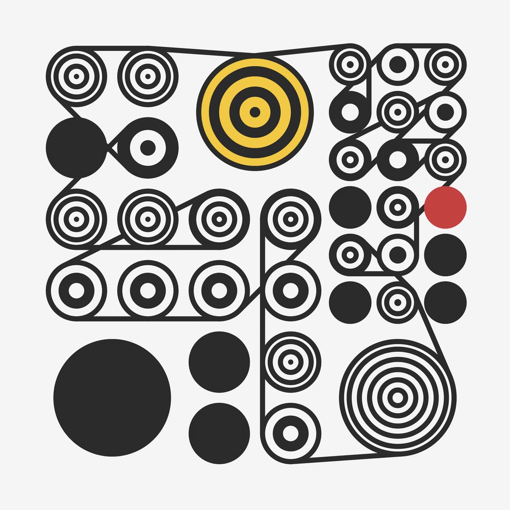

# 生成式藝術概論

## 什麼是生成式藝術？

*Ringers #109 by Dmitri Cherniak*

無論是在畫廊中欣賞藝術品，還是瀏覽網絡上的藝術作品，你可能已經注意到一些令人驚豔的作品，它們在視覺上具有獨特的魅力，但卻被難以置信的生成方式創造出來。這正是生成式藝術的傑作，它們以自主性和創新性的方式嶄露頭角，引起了廣泛的討論和讚賞。

近期，一些最引人注目的生成式藝術作品在拍賣會上成交，掀起了一波藝術市場的轟動。其中之一是一幅由神秘的生成式藝術家創作的畫作，它通過機器學習生成，展現了令人難以置信的細節和複雜性。儘管這位藝術家的身份仍然是一個謎，但其作品的售價卻在拍賣會上達到了驚人的數百萬美元，突破了生成式藝術作品在市場上的價值壁壘。

*Edmond de Belamy by Obvious (collective)*

生成式藝術家Dmitri Cherniak的作品《Ringers #879》在蘇富比拍賣行的現場拍賣中以540萬美元的錘價和620萬美元的全價（包括蘇富比買家佣金）成交，超出了市場預期。這幅作品常被稱為「The Goose」，因其類似一隻鵝而聞名。但這件作品其實是生成式藝術家 Cherniak's 在Art Blocks平台上的一個生成式作品，整個系列稱為 "Ringers"。由於生成藝術的隨機性和無窮的可能性，大部分的生成藝術作品往往是抽象的，因為算法通常不會產生具象的圖像。然而，在這種情況下，"Ringer #879" 顯然生成了一個可識別的具象主題，即 "The Goose"，這讓它成為了該生成藝術系列作品中最具標誌性的作品之一。

*Ringers #879 by Dmitri Cherniak*

它是蘇富比最近一次從破產的加密對沖基金Three Arrows Capital（3AC）的「Grails」收藏中拍賣的頂級作品。原先估計這幅作品的售價在200-300萬美元之間。這個案例強烈證明了生成式藝術作品在市場上的價值和吸引力。這種創作形式的獨特性和藝術家的技術結合，使得生成式藝術作品成為藝術收藏家和投資者關注的焦點。這一成功的拍賣成果也反映了市場對生成式藝術的不斷增長的興趣和需求。

這樣的案例有助於展示生成式藝術作為一種引人注目的藝術形式，其獨特性和市場價值為藝術界帶來了新的可能性和挑戰。它們不僅彰顯了生成式藝術家的才華，同時也驗證了這一新興領域的重要性。這只是最近生成式藝術在藝術界引起轟動的一個例子。這種新興藝術形式正迅速吸引著藝術愛好者、收藏家和投資者的目光。它們以其獨特的視覺效果和前所未有的創作方式，將藝術領域推向了新的領域。本章旨在深入探討生成式藝術的本質和其受到廣泛關注的原因，以幫助讀者理解這個引人入勝的創作形式。

## 生成藝術的歷史背景和發展

生成藝術，或稱為算法藝術、程式藝術，是一種藝術形式，其創作過程主要依賴於某種自動或半自動的系統。這些系統可能包括數學公式、電腦算法、或者甚至生物、物理過程等。生成藝術的創作過程通常涉及到一定程度的隨機性。

### 當代藝術與生成藝術

生成藝術的歷史可以追溯到20世紀中期，當時有一些藝術家開始嘗試將系統和隨機性引入他們的工作。早期的生成藝術往往使用機械或類比電子設備創作。例如，20世紀中後期活躍的荷蘭藝術家狄克·萊特（Dick Raaijmakers）和法國藝術家如皮耶·哈傑克（Pierre Huyghe）。

*Dick Raaijmaker*

狄克·萊特（Dick Raaijmakers）是一位荷蘭藝術家，作曲家，劇場導演，並以其在電子音樂和生成藝術中的開創性工作而著名。萊特於1930年出生在荷蘭，他的職業生涯始於皇家飛利浦公司，他在那裡作為一名音響工程師工作，並進行了早期的電子音樂創作。他在飛利浦創作了一系列的實驗性音樂作品，這些作品以其對於新的音樂形式和表現手法的探索而聞名。在1960年代，萊特開始探索視覺藝術和劇場，他的許多作品結合了音樂、視覺藝術和表演藝術。他的作品通常包含一種生成元素，例如使用算法或其他自動化的過程來創作聲音和影像。狄克·萊特在其生涯中獲得了多項榮譽和獎勵，包括荷蘭皇家藝術和科學學會的成員。他的作品對電子音樂和生成藝術的發展有著深遠的影響。

*Pierre Huyghe*

皮耶·哈傑克（Pierre Huyghe）是一位法國當代藝術家，以其對多媒體裝置、電影和實驗劇場的工作而著稱。他的作品經常涉及到社會、生物學和環境等議題，並探索現實與虛構之間的邊界。哈傑克的作品多種多樣，包括錄像裝置、雕塑、實地考察和實驗劇場等。他的許多作品都以社會或生物系統作為其創作的核心，並採用了一種高度概念化的方法。

Pierre Huyghe的一個著名的作品是“Untitled (Human Mask)”。這是一部短片，故事圍繞著一隻穿著女性面具、在一家被放棄的日本餐館裡獨自行走的猴子。這個作品以模糊界線、隨機性和不確定性的主題來呈現。猴子的行為是基於其本能和訓練，但由於猴子身穿女性面具，觀眾常會被引導去理解其行為為人類的行為，進一步探索了人類與動物、本能與文化訓練之間的界線。更深層的隨機性和不確定性表現在觀眾對於影片真實性的質疑。影片的場景是真實的，取自於福島核災後被放棄的餐館，而猴子也是真實的，它曾被訓練在餐館裡工作。但是，當這些元素被拼接在一起，在Huyghe的作品中，它們形成了一個既熟悉又陌生的世界，使觀眾在認知和解釋上產生困惑，強調了不確定性和隨機性的主題。

*Untitled (Human Mask) by Pierre Huyghe*

此外，在20世紀當代藝術中，有許多藝術家都善於使用隨機性與觀眾參與的元素，尤其是在行為藝術、裝置藝術和互動藝術領域中。

Yoko Ono：Ono 的許多作品都強調觀眾參與和隨機性，例如她的“Cut Piece”（剪切作品）就要求觀眾自由地從她身上剪下一片衣物。

John Cage：這位20世紀後半的作曲家和藝術家經常使用隨機性在他的作品中。例如，他的作品“4'33"”實際上是一段沒有預定音樂的時間，取決於演奏者和觀眾在場的隨機聲音。

Marina Abramović：這位塞爾維亞行為藝術家的作品強調觀眾參與和情感體驗，如她的作品“藝術家在現場”（The Artist is Present）要求觀眾與她面對面坐著，與她進行無言的對話。

### 電腦時代的生成式藝術

隨著電腦技術的發展，生成藝術也進入了一個新的階段。自從電腦發明及普及之後，藝術家開始使用電腦程式來生成藝術作品。此時期的代表人物包括藝術家哈洛德·科恩（Harold Cohen）、曼弗雷德·莫爾（Manfred Mohr）、維拉·莫爾納爾（Vera Molnar）及羅曼·維羅斯特科（Roman Verostko）。

*Harold Cohen and AARON*

哈洛德·科恩（Harold Cohen）是一位英國藝術家，最為人所知的是他在電腦藝術領域的開創性工作。他被譽為是全球第一位創造出能自我創作藝術作品的電腦系統的藝術家。科恩在1928年出生於倫敦，原本是一位傳統的畫家，並在1960年代在倫敦藝術圈中獲得了一定的聲譽。然而，他在1970年代初開始對電腦藝術產生了興趣，並投入到了這個全新的領域。他最知名的創作是名為"AARON"的電腦程式，這個程式可以創造出具有獨特風格和主題的繪畫作品。AARON不僅能生成靜態的圖像，還能控制一台機器人臂來繪畫大型壁畫。這種將藝術和人工智能結合的先驅性工作，在當時引起了廣泛的討論，尤其是關於藝術創作過程中的人性和機器性的問題。哈洛德·科恩的工作對電腦藝術和生成藝術的發展有著重要的影響，他的研究和創作一直持續到他在2016年去世。

*Manfred Mohr*

曼弗雷德·莫爾（Manfred Mohr）是一位德國出生的數位和電腦藝術家。他在1938年出生於德國的帕德爾博恩。在1960年代初，莫爾開始使用電腦作為他創作的工具。他是最早使用電腦創作藝術的藝術家之一，他的作品深深地影響了數位藝術的發展。莫爾的藝術作品主要集中在探索幾何形狀和結構，他的作品以他對幾何規則和演算法的創新使用而聞名。他的許多作品都是在電腦上生成的，使用自己設計的演算法來生成複雜的幾何圖形。他的作品曾在全球範圍內的許多畫廊和博物館展出，包括巴黎現代藝術博物館、紐約的惠特尼博物館和倫敦的維多利亞和阿爾伯特博物館。他的創作對數位和電腦藝術的發展有著重大影響，他被譽為這一藝術形式的先驅之一。

*Vera Molnar*

維拉·莫爾納爾（Vera Molnar）是一位來自匈牙利的數位藝術家，她於1924年出生。莫爾納爾在巴黎學習繪畫和藝術歷史，之後她成為了一位畫家和圖形設計師。在1950年代末和1960年代初，她開始使用電腦作為她創作的工具。莫爾納爾的作品以其對形狀、線條和幾何結構的精確探索而聞名，尤其是她的許多作品都是用電腦創作的，透過程式語言控制線條與形狀的排列，以創造出各種獨特的視覺效果。她的許多作品，如"Disorderly Order" 和 "Interruptions" 等，都展示了她如何使用數位工具來研究視覺規律與結構，以及其背後的數學原理。莫爾納爾的創新實踐使她在電腦藝術領域中獲得了國際知名度。她的作品在世界各地的許多重要博物館和畫廊中展出，並對後來的數位藝術家產生了重大影響。

*Roman Verostko (Photos by JOEL KOYAMA)*

羅曼·維羅斯特科（Roman Verostko）是一位美國的數位藝術家，也是演算法藝術的先驅之一。他在1929年出生於美國賓夕法尼亞州，原本是一位本尼狄克會修道士，後來在1970年代中期轉向藝術創作。維羅斯特科在1980年代開始將他的畫作和算法融合，他開發了自己的軟體和硬體來創造他的藝術作品。他的作品以其獨特的視覺風格和深度的理論基礎而聞名，他的許多作品都包含有複雜的幾何形狀和色彩豐富的抽象圖案。他最為人所知的藝術實踐可能是他的“筆劃算法”，這是一種他創造的方法，使用程式碼來生成線條和形狀，然後再用繪圖機器來把這些形狀轉化成實物的繪畫。羅曼·維羅斯特科的創新方法和視覺語言對於數字藝術的發展具有重大影響。他的作品在全球各地的畫廊和博物館中展出，並對後來的數位藝術家產生了深遠的影響。

### 21世紀的生成式藝術

生成藝術在21世紀初的數位藝術革命中獲得了更廣泛的認同。今天，隨著電腦圖形技術和機器學習等技術的發展，生成藝術已經成為數位藝術領域的重要部分。現代生成藝術家使用各種複雜的算法，如神經網絡、遺傳算法等，來創作出越來越複雜和精緻的作品。

在2010到2020年間，生成式藝術見證了顯著的發展，特別是在技術、平台和觀眾接受度等方面。首先，新的技術如人工智能和機器學習，已被越來越多地用於生成式藝術中。例如，深度學習的方法（如對抗生成網路，GAN）被用來創造一些驚人的作品，這些作品能夠生成非常逼真的人臉、風景畫或其他圖像。其次，區塊鏈技術的出現和流行，特別是非同質化代幣（NFT）的出現，使得生成式藝術家能夠將他們的作品直接售予收藏家，而無需透過傳統的藝術經銷商或畫廊。這對生成式藝術的發展來說是一個重要的推動力。

此外，公眾對於生成式藝術的接受度也在這個十年間顯著提高。一部分原因是這種藝術形式的無窮無盡的可能性和新穎性吸引了人們，另一部分原因是數字藝術和科技藝術已經成為主流文化的一部分。

在這個期間的著名生成式藝術家包括Rafael Lozano-Hemmer、Casey Reas、Golan Levin及Jared Tarbell等人。這些藝術家利用新的工具和平台，創造了一些獨特且具有影響力的作品。

凱西·瑞斯(Casey Reas)：他是一位美國藝術家和教育家，也是Processing程式語言的共同創始人。他的創作主要專注於使用軟體和數位技術來創造動態、生成式的視覺作品。他在洛杉磯工作和居住，也在加州大學洛杉磯分校（UCLA）的設計媒體藝術部門任教。Reas是生成藝術領域的重要人物，他與Ben Fry共同開發了Processing程式語言。Processing是一種開源的程式語言和環境，專為藝術和視覺設計社群設計，使其能以程式方式創造圖像、動畫和互動作品。他的創作常融合了數學、機器學習、人工生命等元素，並探索著軟體和視覺藝術的交界。Reas的作品曾在全球的博物館、藝術機構及畫廊展出，包括紐約的現代藝術博物館（MoMA）、倫敦的維多利亞和艾伯特博物館等地。

*Casey Reas*

拉斐爾·洛薩諾-海默（Rafael Lozano-Hemmer）是一位墨西哥和加拿大的電子藝術家，他的作品主要集中在互動裝置和數字藝術，並深深地將公眾融入他的創作之中。Lozano-Hemmer的作品以其雄心壯志和技術上的創新而聞名，他經常使用投影、聲音、網路和生物指標等技術來創作充滿張力和挑戰的藝術裝置。他的創作通常需要公眾的參與，透過與觀眾的互動，藝術作品會產生出不斷變化的效果。他的一個著名作品是 "Pulse Room"（2006年），在這個裝置裡，觀眾的脈搏會被用來控制一個由200個燈泡組成的照明系統，形成一種極具觸覺和視覺吸引力的效果。Lozano-Hemmer的作品在全球各地都有展出，包括威尼斯雙年展、悉尼雙年展、倫敦的維多利亞和阿爾伯特博物館等地。他的創新和對互動藝術的貢獻也獲得了廣泛的認可和讚譽。

*Rafael Lozano-Hemmer*

戈蘭·萊文（Golan Levin）是一位美國的新媒體藝術家、作曲家、表演者和工程師，他的作品主要集中在互動藝術和生成藝術。他的作品通常以音樂和視覺藝術的形式呈現，並採用了許多先進的數位技術，包括實時動畫、機器學習和電腦視覺。Levin的作品以其創新的形式和主題而知名，這些作品探索了人類與機器的互動、視覺化聲音和創造新的表達方式等主題。他的作品在全世界的藝術館和節目中展出，如紐約的現代藝術博物館、巴黎的龐畢度中心和巴塞羅那的索尼塔節等。除了他的藝術實踐外，Levin也是一位教育者，他在卡內基梅隆大學教授電腦科學、藝術和設計。他的研究和教學工作都集中在新的表達形式和互動技術上。

*Golan Levin*

賈瑞德·塔爾布(Jared Tarbell)是一位重要的當代藝術家，他的作品主要探索電腦程式和數位藝術的交匯點。他被認為是一位傑出的數位藝術家和創意編碼者(Creative Coder)。他以在創作過程中使用複雜系統和數學規則而聞名，從而生成豐富而奇妙的視覺效果。

他的作品經常探索自然世界的模式，如葉脈、雪花和樹木的分枝模式，並利用電腦算法來模擬和再創作這些模式。他的作品通常以隨機生成的形式展現，從而每次觀看都會產生獨特的視覺體驗。

除了他的藝術創作，Jared Tarbell還是程式開發平台Processing的共同創建者之一。Processing是一個開源程式語言和開發環境，專為視覺設計師和藝術家設計，以便在其作品中使用程式和數位媒材。

*Jared Tarbell*

### 生成式藝術平台

#### Art Blocks

Art Blocks是一個創新的區塊鏈藝術平台，由Erick Calderon在2021年創立。Art Blocks基於以太坊區塊鏈，專注於提供一個空間，讓藝術家和創造者能夠將其生成式藝術作品轉化為非同質化代幣（NFT）。在Art Blocks平台上，藝術作品是直接在以太坊(Ethereum)區塊鏈上鑄造，藝術家創作的程式碼嵌入到每一個NFT中。當一個NFT被購買或「鑄造」時，便會生成一個鏈上的代碼，並透過代碼產生一個獨一無二的藝術品。這種方法確保了每一個Art Blocks藝術品都是原創的和不可複製的。Art Blocks的創新之處在於它結合了生成式藝術的創新性和區塊鏈技術的透明性和去中心化的特性。這個平台已經吸引了許多世界級的生成式藝術家，如Tyler Hobbs和Pak，並且已經成為數位 ㄍ藝術和生成式藝術的重要平台。

*Art Blocks 生成式藝術平台*

在Art Blocks上，藝術家創造並上傳他們的生成式藝術作品，這些作品是由程式碼（通常是JavaScript或其他腳本語言）所生成，程式碼本身則嵌入在區塊鏈上的帳本，並以NFT型態（非同質化代幣）發行。當收藏家在Art Blocks購買一件藝術作品時，該藝術作品的創造原始碼將使用區塊鏈上的一個隨機數（可以稱為哈希數）作為輸入，生成一個獨特的視覺藝術作品。因為這種方法可以生成無數的獨特作品，每一件作品都是對應於特定的NFT，這使得每一件Art Blocks的藝術作品都是獨一無二的。Art Blocks平台的創新在於它將生成式藝術與區塊鏈技術結合起來，開創了一種全新的藝術收藏和交易方式。這種模式對藝術家來說有著極大的吸引力，因為它提供了一種創新的方式來創作和分發他們的作品，並能夠直接與收藏家進行交易。

Art Blocks平台上有許多知名的作品，其中最著名的包括以下幾個：

"Fidenza"：由Tyler Hobbs創作，這是一系列由1024件作品組成的NFT。每件作品都是由一個複雜的生成器創建的，該生成器使用視覺元素（如線條和顏色塊）來生成具有特殊屬性和細節的圖像。由於其豐富的視覺語言和藝術深度，"Fidenza"系列在Art Blocks社群中獲得了廣大的關注和高度評價。

*Fidenza #313 By Tyler Hobbs*

"Ringers"：由藝術家Dmitri Cherniak創作，"Ringers"是一種由繩子形成的獨特幾何形狀的藝術作品。每件作品都是由一個專門編程的生成器生成的，這種生成器能夠創造出既有機又有幾何美感的形狀。

*Ringers By Dmitri Cherniak*

這些作品只是Art Blocks平台上無數生成式藝術作品的一部分，這個平台已經成為了生成式藝術家展示創新和獨特作品的重要舞台。目前台灣藝術家有王新仁、吳哲宇、林經堯以及林逸文有成功登上Art Blocks舞台。

#### Fxhash

近年來，生成藝術一直是NFT市場的主要部分，從算法產生的大量PFP到AI的合作創作，區塊鏈上最有影響力的藝術家和項目都在使用生成技術進行創作。考慮到生成藝術的受歡迎程度，像Art Blocks、Gen.Art這樣的社群驅動平台在乙太坊區塊鏈上保持著領導地位。然而，在Tezos的區塊鏈上，出現了一個挑戰者—fxhash，它引起了NFT社區的關注，並在生成藝術領域中掀起風暴。

fxhash是一個於2021年11月啟動的生成藝術平台和市場，它是一個開放的生態系統，藝術家可以在這裡鑄造生成NFT，而不需要經過傳統生成平台的繁瑣程序。該平台由多才多藝的藝術家ciphrd創建，他將fxhash的理念定義為“無策展，人人皆可參與”。fxhash的一個顯著特點可能是其無策展，這與像Art Blocks或Nifty Gateway這樣的平台形成了對比。像SuperRare和前述平台這樣的策展平台的等待名單可能會延長數月，並且對申請人來說要獲得一席之地非常困難。

然而，儘管藝術家可以很容易加入fxhash並直接開始鑄造他們的作品，但平台有時似乎是詐騙者和其他惡意人士的完美目標。fxhash社群因此實施了各種安全措施來保護收藏家。有了如報告、審核、標記和鑄造鎖定系統等保護措施，fxhash被視為一個相對安全的進行生成NFT交易的地方。

#### Fxhash和生成藝術市場的未來

自2021年NFT繁榮以來，生成藝術市場經歷了起伏。曾經被譽為NFT生態系統的重要部分的平台，現在以生成NFT為唯一焦點，對NFT社區產生了深遠影響，但仍然被PFP和玩耍賺錢的項目所掩蓋。

這並不是說生成藝術已經消亡，而且fxhash的成功恰恰相反。就像OpenSea的競爭對手們致力於發展NFT生態系統，並提供傳統市場的替代品一樣，像fxhash這樣的平台似乎在鞏固生成藝術NFT的地位。

一些最重要的NFT項目，包括CryptoPunks、Fidenza、Autoglyphs、Chromie Squiggle等，都是基於生成原則的。然而，儘管這些一流的收藏品仍然與NFT價格和人氣指數息息相關，但生成NFT市場的飽和度（主要集中在Art Blocks）可能正導致在Web3空間中對生成藝術的興趣減弱。

Fxhash二級市場的出現，有許多藍籌生成藝術家已經或即將在平台上鑄造他們的作品，加上與Art Blocks和其他平台之間的直接競爭，使fxhash有潛力在生成藝術市場中站穩腳跟。

這就是為什麼藝術家和收藏家應該關注fxhash的原因。無論是藝術家要尋找一個新的平台來鑄造和出售NFT，或者只是尋找一個新的場所來探索和收藏新的藝術，fxhash都可能是一個值得關注的選擇。在未來幾年，將會有越來越多的藝術家和收藏家將他們的注意力轉向生成藝術，這將使NFT市場更加多元化，進一步加強其在藝術和科技交界領域的地位。

## 生成式藝術與傳統藝術的對比

生成式藝術與傳統藝術的主要差異在於創作過程和結果的可預測性。

在傳統藝術中，藝術家通過手工技巧和個人視覺來創造一件藝術作品。藝術家通常在創作過程中有清晰的想法和目標，並能夠直接控制最終的藝術效果。儘管藝術作品的解讀可以多樣化，但作品本身是固定的，且一旦創作完成就無法改變。

例如廉納德·達文西的《蒙娜麗莎》：這是一幅在16世紀初由達文西親手繪製的油畫。作為傳統藝術的代表作之一，《蒙娜麗莎》的創作過程完全掌握在藝術家的手中，從選擇主題，決定構圖，到調配顏色等等，每一個細節都是達文西精心設計和控制的結果。這與生成式藝術的創作過程有很大的區別，後者更多地依賴於電腦算法和隨機性，其結果往往具有不可預測性。

或是奧古斯特·羅丹的《沈思者》：這是一個1902年由羅丹創作的青銅雕塑。與《蒙娜麗莎》相同，這件作品的每一個細節，如人物的姿勢、肌肉的紋理等，都是羅丹有意識地刻畫出來的。與此對比，生成式藝術作品往往因為其變化性和互動性，結果可能會因觀眾的互動、時間的推移或其他變量的變化而變化，形成了一種動態的、與觀眾有更多互動的藝術體驗。

在傳統藝術中，藝術家完全控制創作過程，而在生成式藝術中，藝術家與電腦算法共同參與創作，形成了獨特的藝術風格和觀賞體驗。相比之下，生成式藝術則涉及到使用演算法或者規則來生成或“演繹”藝術。藝術家在這種情況下更像是一個工程師，他們設計和寫出可以生成藝術作品的規則或算法。在生成式藝術中，創作的結果往往具有隨機性和不可預測性，藝術家無法精確預知每一件作品的最終外觀。

例如拉斐爾·洛薩諾-赫默（Rafael Lozano-Hemmer）的《光的身影》（Shadow Play）：這是一件互動式的裝置藝術，透過參觀者的行動影響投影的圖形。與傳統藝術不同的是，作品的最終形式不僅取決於藝術家的意圖，也取決於參觀者的互動。這種參觀者的參與和作品的動態變化是傳統藝術所無法實現的。

*Shadow Play by Rafael Lozano-Hemmer*

凱西·瑞斯（Casey Reas）的《Process》系列：這是一個由電腦程式生成的動態圖像作品，基於一組定義好的規則，每次運行都能產生獨特且不可預測的視覺效果。與傳統藝術相比，生成式藝術的這種隨機性和不可重複性是其獨特的特點。傳統藝術的創作結果大多是固定且不變的，而生成式藝術則在每次觀看時都可能展現出全新的形式。

此外，生成式藝術的特點還包括可變性和互動性。生成的作品可能會因觀眾的互動、時間的推移或其他變量的變化而變化。這種變化性使得生成式藝術作品具有動態性和生命力，往往可以提供一種獨特而深度的觀賞體驗。不過，無論是生成式藝術還是傳統藝術，其根本目標都是透過創作來表達觀點、情感和想法，並與觀眾產生連結。生成式藝術只是達到這個目標的另一種方式而已。
