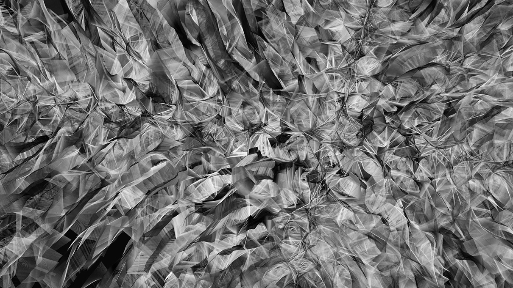
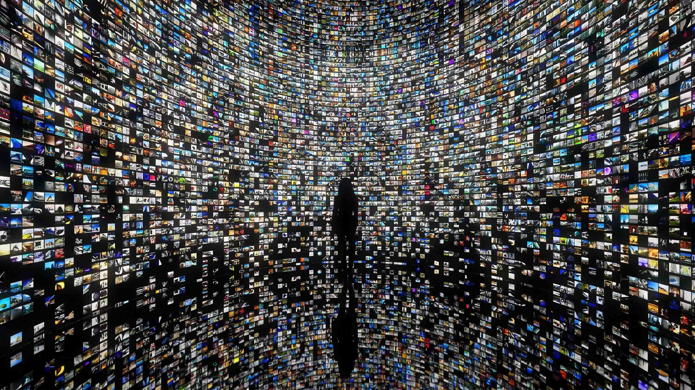

# 生成式藝術的技術基礎

## 什麼是演算法？

生成式藝術依賴於數據和演算法的使用，其核心是創造出一種可重複的、但卻每次運行都可能產生獨特結果的程式。藝術家的工作是設定一組參數或規則，這些規則會導引藝術品的創作過程。例如，一個生成式藝術作品的規則可能規定了形狀、顏色或模式的選擇，或者設定了如何反應觀眾的互動行為。

以生成式藝術家凱西·瑞斯的作品《Process》為例，他利用自己撰寫的軟體來創造一系列的視覺作品。這些作品的生成基於一組簡單的規則，這些規則操縱形狀和顏色的變化，並結合了隨機性元素。因此，即使是在同一組規則的指導下，每次運行程式都將生成獨特的視覺效果。

*Casey Reas - Process 20 2014
Custom software (black and white, silent), computer
Dimensions variable, horizontal or vertical*

生成式藝術的精髓在於它的隨機性與不確定性，其最終形式與觀眾的互動和隨機元素有關。例如，拉斐爾·洛薩諾-赫默（Rafael Lozano-Hemmer）的作品《光的身影》創造了一個動態互動的環境。觀眾一進入這個空間，他們的影子就會結合投影影像，形成一個由參與者行為驅動的即時生成的視覺體驗。此外，像新媒體藝術家 Refik Anadol這樣的藝術家使用機器學習和大數據將其作品昇華到一種形式，其中數據為藝術作品帶來不確定性和變化的可能性。

*ZHA x RAS, 2022, Architecting the Metaverse Animation*

生成藝術和傳統藝術的主要區別在於生成藝術的動態性與變化性。與傳統的、一次性創作的藝術形式相比，生成藝術作品的最終形態往往隨著時間和觀眾互動而變化。例如，音樂家Brian Eno的生成音樂創作就是一個很好的例子，他使用特定的程序或演算法，使音樂永遠不會以相同的方式播放兩次。

在生成式藝術中，演算法是藝術創作的核心工具。想象一下你正在烹飪，你的食譜就像一個演算法。這個食譜告訴你需要哪些食材，以及怎樣的順序和方式去烹調這些食材，最後得到你想要的一道菜。同樣，藝術家如Manfred Mohr和Roman Verostko等人創造了一種特定的演算法，這種演算法會根據一定的規則選擇色彩、形狀或動態，並在畫布上以某種方式來表現這些元素，從而產生獨特的藝術作品。

實際上，演算法在我們的生活中無處不在，並且在各種情境中扮演著重要角色。當我們用GPS導航時，就是在使用一種名為Dijkstra的演算法來找到兩點之間的最短路徑。當我們在網路上購物，電子商務平台就會使用推薦系統算法，根據我們的購買和瀏覽歷史來推薦商品。這些都是演算法在我們日常生活中的應用。

而在科學研究中，演算法的使用更是關鍵。比如說，生物學家通過各種演算法來解析基因數據，揭示生命的奧秘；而天文學家則使用演算法來處理來自深空的數據，嘗試解讀宇宙的神秘。

因此，學習和理解演算法是非常有用的，不僅可以幫助我們理解世界是如何運作的，也可以提升我們解決問題的能力。隨著科技的發展，對演算法的理解和應用變得越來越重要，無論是在學術、工作還是日常生活中，掌握演算法都是一種強大的工具。

### 基本數學和邏輯背景

在深入研究演算法之前，我們需要理解一些基本的數學概念和邏輯原理，這些對於理解和創建演算法至關重要。

首先，數學是演算法的基礎。無論是在計算時間和空間複雜度，還是在設計和分析數據結構和算法時，我們都需要依賴於數學。以下是一些關鍵的數學概念：

1. 集合與資料結構: 理解集合及其運算有助於我們理解資料結構如陣列、鏈表、堆疊、樹等的工作原理。

2. 數學函數和極限: 這些概念對於理解演算法的效率，例如時間和空間複雜度分析非常重要。

3. 概率和統計: 這對於理解隨機演算法和機器學習算法非常重要。

4. 線性代數和微積分: 這些在許多高級演算法中都有應用，尤其是在機器學習和數據科學中。

其次，邏輯是電腦科學的基石，尤其是在演算法設計中。以下是一些基本的邏輯概念：

1. 命題邏輯: 這涉及到命題的真偽值以及如何通過邏輯運算（例如“與”、“或”和“非”）來組合它們。

2. 條件語句和循環: 這涉及到如何使用邏輯來控制程式的流程，例如使用if語句來根據條件進行分支，或使用while和for循環來重複某些操作。

3. 證明技術: 這包括直接證明、反證法和歸納法等。這些技術對於理解和證明演算法的正確性和效率至關重要。

這些數學和邏輯概念對於理解和應用演算法是不可或缺的。有了這些知識，我們就可以更深入地理解演算法的工作原理，並更有效地設計和實現演算法。

### 資料結構

數據結構是一種方式，可以將數據組織起來，以便我們可以有效地操作它。以下是一些常見的數據結構：

1. 陣列（Array）: 陣列是最基本的數據結構之一，用於存儲同類型的元素。每個元素都有一個索引，可以通過該索引快速訪問元素。陣列在解決各種問題時都十分實用，如排序和搜尋問題。

2. 堆疊（Stack）: 堆疊是一種遵循"後進先出"（Last-In-First-Out，LIFO）原則的數據結構。它可以被用於解決各種問題，如括號匹配，撤銷操作等。

3. 佇列（Queue）: 佇列是一種遵循"先進先出"（First-In-First-Out，FIFO）原則的數據結構。它在各種場景中都有應用，如數據流分析，緩衝操作等。

4. 鏈表（LinkedList）: 鏈表是一種由一系列節點構成的線性集合，每個節點都包含數據和指向下一個節點的指針。與陣列相比，鏈表在插入和刪除操作上更具效率。

5. 樹（Tree）: 樹是一種非線性數據結構，具有階層關係。它用於表示一對多的關係，並常被用於排序和搜索操作，例如二叉搜索樹和堆。

6. 圖（Graph）: 圖是一種由節點（頂點）和邊組成的數據結構。它可以表示任意的二元關係，並被廣泛用於模擬和解決如網路路由，社交網路等問題。

這些數據結構對於演算法的實現至關重要，因為它們影響著數據的組織方式，從而影響著演算法的效率。瞭解這些基本的數據結構將幫助我們更好地理解和設計演算法。

### 演算法分析

理解和評估一個演算法的效率是非常重要的，因為它直接影響到該演算法解決問題的速度和資源使用。演算法的效率主要由時間複雜度和空間複雜度來衡量。

1. 時間複雜度: 時間複雜度是指執行一個演算法所需的時間。我們通常使用大O符號（O）來表示它。例如，O(n) 表示算法的運行時間與輸入大小成正比，而 O(n^2) 表示運行時間與輸入大小的平方成正比。一個好的演算法應該盡可能地降低時間複雜度，即在最少的時間內解決問題。

2. 空間複雜度: 空間複雜度是指執行一個演算法所需的記憶體空間。與時間複雜度一樣，我們也使用大O符號來表示空間複雜度。例如，O(n) 表示算法所需的記憶體空間與輸入大小成正比。在許多情況下，我們需要在時間複雜度和空間複雜度之間做出權衡，因為存儲更多的數據可以加快計算速度，但同時也會消耗更多的記憶體。

通過理解並評估時間複雜度和空間複雜度，我們可以選擇最適合特定問題和環境的演算法。而好的生成式藝術家，必定會對於如何有效地透過演算法分析，進而強化運算的能力，達到更複雜的運算結果。雖然這些問題可能過於專業，但是對於某些生成式藝術創作者來說，仍然是必須要深入研究的一環。

### 排序和搜尋演算法

排序和搜尋是電腦科學中最常見的問題，對於數據處理和管理至關重要。這一節將介紹一些基本的排序和搜尋演算法，並解釋它們的工作原理和應用場景。

排序演算法：排序演算法用於將一組數據按照特定順序排列。以下是一些常見的排序演算法：

1. 泡沫排序：這是最簡單的排序演算法之一。它重複地遍歷數組，比較每對相鄰的元素，並在必要時進行交換。雖然簡單，但泡沫排序的時間複雜度為O(n^2)，在大型數據集上可能效率不高。

2. 快速排序：這是一種高效的排序演算法，使用了分治法（Divide and Conquer）策略。快速排序選擇一個“基準”元素，並將數組分為兩部分，一部分的元素都比基準小，另一部分的元素都比基準大。然後對這兩部分數組分別進行快速排序。其時間複雜度為O(n log n)。

搜尋演算法：搜尋演算法用於在數據集中找到特定的元素。以下是一種常見的搜尋演算法：

二分搜尋：這是一種高效的搜尋演算法，要求待搜尋的數組已經排序。二分搜尋從數組的中間元素開始，如果中間元素正好是目標值，則搜尋結束。如果目標值小於中間元素，則在數組的左半部分進行搜尋；如果目標值大於中間元素，則在數組的右半部分進行搜尋。其時間複雜度為O(log n)。

透過理解和應用這些排序和搜尋演算法，我們可以更有效地處理和操作數據。

### 圖形演算法

圖形是電腦科學中一種重要的數據結構，用來表示物件之間的對應關係。一個圖形由節點（或稱頂點）和邊組成，邊表示節點之間的連接。這一章節將探討一些用於處理圖形結構的常見演算法，包括深度優先搜索、廣度優先搜索和Dijkstra的演算法。

1. 深度優先搜索（DFS）：深度優先搜索是一種用於遍歷或搜索圖形的演算法。DFS從圖形的某一節點開始，儘可能深地探索每一條邊，直到該節點的所有未訪問的相鄰節點都被探索過。如果還有未訪問的節點，則DFS會選擇其中一個並重複上述過程。這種方法通常使用堆疊數據結構來記錄待訪問的節點。

2. 廣度優先搜索（BFS）：與深度優先搜索不同，廣度優先搜索是先訪問離起始節點最近的所有節點，再逐步探索更遠的節點。在進行BFS時，我們會使用一個佇列來記錄待訪問的節點。BFS常用於解決最短路徑問題或判斷兩個節點之間是否存在路徑。

3. Dijkstra的演算法：這是一種用於尋找圖形中兩節點之間最短路徑的演算法。Dijkstra的演算法將每一條邊賦予一個權重（可表示成本、距離等），並使用優先隊列來持續選擇最小權重的邊，直到找到終點或確定無法到達終點。

這些圖形演算法在電腦網路、社交網路分析、路徑規劃等眾多領域都有著廣泛的應用。理解和熟練掌握這些演算法對於解決實際問題極為重要。

### 動態規劃

動態規劃是一種求解最優化問題的強大技術，它將一個問題分解為一系列較小的子問題，並以此創建一種解決該問題的系統。動態規劃在處理具有「最優子結構」和「重疊子問題」特性的問題時特別有效。最優子結構意味著問題的最佳解包含其子問題的最佳解，重疊子問題則意味著在計算最終結果的過程中，某些子問題會被重複計算多次。

一些典型的動態規劃問題包括：

1. 背包問題：背包問題是一種經典的最優化問題，主要涉及到價值和重量兩個因素。給定一個固定容量的背包和一些物品（每種物品都有各自的重量和價值），問如何選擇物品裝入背包，使得背包內物品的總價值最大。

2. 最長共同子序列（LCS）：此問題是找出兩個序列的最長共同子序列。例如，對於序列 "ABCD" 和 "ACDF"，最長共同子序列是 "ACD"。

3. 最短路徑問題：例如，Dijkstra's演算法和Floyd-Warshall演算法，用於找出兩點間的最短路徑。

動態規劃通常用一個表格來儲存子問題的解，從最小的子問題開始填表，直到得到原問題的解。此方法有助於避免重複計算同一子問題，從而提高效率。理解動態規劃的概念，並學會如何應用動態規劃來解決問題，可以幫助我們在面對各種實際問題時，如程式挑戰、工程優化問題等，找到最有效的解決方案。

### 機器學習與演算法

機器學習是一種人工智能的方法，它允許電腦系統從數據中學習並改善其性能，而無需人工明確編寫程式。它的核心就是運用各種演算法，以自動找出數據中的模式並做出預測或決策。

以下是一些常見的機器學習演算法：

1. 決策樹：決策樹是一種監督式學習演算法，通常用於分類問題。它通過創建一個樹狀結構，將每個內部節點設定為一個測試問題，將每個分支設定為測試結果，將每個葉節點設定為一個預測類別，以此完成對數據的劃分。

2. 神經網絡：神經網絡是一種模擬人腦神經元工作的演算法，常用於深度學習中。一個神經網絡包括多層神經元，每個神經元都與上一層和下一層的神經元相連接。這種演算法可以學習並模擬複雜的非線性關係。

3. 支持向量機：支持向量機(SVM)是一種強大的監督式學習演算法，主要用於分類和迴歸分析。SVM 的目標是找到一個決策邊界，以最大化不同類別之間的邊距。

這些演算法都基於一個共同的目標：從數據中學習模式並做出預測。然而，他們的實現方式和應用場景卻各有不同。理解這些演算法的工作原理和適用性，能夠幫助我們在處理特定問題時選擇最合適的工具。

### 演算法在實際生活中的應用

演算法在我們的日常生活中起著關鍵的角色，從搜尋資訊，到導航路線，再到機器學習和預測分析，都有演算法的身影。以下將介紹一些實際生活中的例子：

1. 搜尋引擎：當我們在搜尋引擎中輸入查詢詞時，如Google或Bing，它會使用複雜的演算法，根據我們的搜尋詞來回傳最相關的網頁結果。這涉及到信息檢索和排序演算法，以及基於我們過去的搜尋行為和其他因素的機器學習模型。

2. 導航系統：當我們使用GPS導航系統找到最短或最快的路線時，我們其實是在使用圖形演算法。例如，Dijkstra的演算法就常用於找到兩點之間的最短路徑。

3. 推薦系統：網路商店如亞馬遜或Netflix的影片推薦，都是通過演算法根據我們的消費習慣和偏好來提供商品或電影的推薦。

4. 社交媒體：Facebook、Instagram等社交媒體平台利用演算法來決定在你的動態消息中顯示哪些內容，這主要基於你過去的互動、你的聯繫人以及其他多種因素。

5. 醫療領域：機器學習和演算法在醫療領域的應用也日益增加，從疾病預測和診斷，到個性化的醫療方案，演算法都發揮著重要的作用。

這些只是演算法在實際生活中的一些應用，實際上，隨著科技的進步，演算法的應用越來越廣泛，對我們的生活影響越來越大。

### 未來的趨勢

隨著科技的迅速發展，我們可以預見到演算法在未來將繼續進行更多創新和擴展。以下是一些值得關注的未來趨勢：

1. 量子計算：量子計算是利用量子力學現象進行計算的一種新型計算方式。它可以解決某些對傳統電腦而言極其困難的問題。量子演算法，如Shor的質因數分解演算法和Grover的搜索演算法，提供了一種比經典電腦更高效的解決問題的方式。

2. 生成式藝術：隨著機器學習和人工智慧的發展，生成式藝術或者說計算藝術已經成為當代藝術領域的一個重要分支。例如，利用生成對抗網絡(GANs)創作出的藝術品已經在藝術市場上取得了驚人的價格。

3. 自動化決策：隨著機器學習和人工智慧技術的進步，演算法在決策過程中的角色越來越重要。從財經市場的自動交易到自動駕駛車輛，再到臨床決策支持系統，都可以看到自動化決策的身影。

4. 增強學習：這是一種機器學習的策略，使機器透過嘗試並從錯誤中學習，進而找到解決問題的最佳策略。隨著遊戲理論和模擬環境技術的進步，增強學習有可能在未來的演算法發展中扮演更大的角色。

以上這些只是未來演算法可能的發展趨勢，隨著科技的不斷進步，我們可以期待更多創新的演算法將會出現，並對我們的生活產生深遠影響。

## 生成模型和神經網絡

### 什麼是神經網絡？

神經網絡是一種用於機器學習的計算模型，其設計靈感來自於人類大腦的工作原理。人腦由上億個互相連接的神經元構成，這些神經元以複雜的方式傳送和接收訊息，使得我們可以感知周遭環境並作出反應。

同樣地，一個神經網絡由許多稱為神經元的小單元組成，每個神經元負責接收輸入訊息，進行處理後再將結果傳遞給下一層的神經元。神經元之間的連接強度，也就是權重，可以在學習過程中調整，以改進神經網絡的性能。

神經網絡可以學習從數據中擷取特徵，並用於解決各種問題，例如圖像識別、語音識別、預測分析等。接下來的章節，我們將會進一步理解神經網絡的結構與工作原理，以及它們如何用於解決實際問題。

### 人腦與電腦的比較

人腦和電腦雖然在處理資訊的方式上有許多相似之處，但它們仍存在著許多重要的差異。

首先，人腦是一種生物系統，由約860億個神經元組成，這些神經元透過化學物質傳遞信號。這使得人腦能夠並行處理大量資訊，也就是說，許多神經元可以同時活動，對環境進行反應。人腦還能學習並記憶經驗，形成我們的知識和技能。

相反，電腦是一種人造的機器，主要由硬體和軟體組成。硬體包括處理器、記憶體等元件，這些元件通過電子訊號來傳輸和儲存資訊。電腦處理資訊的速度極快，遠超人腦，但是通常以序列方式（即一次處理一項任務）進行。軟體則是用於控制硬體的指令和規則。

此外，人腦具有自我修復和自我組織的能力，而電腦則需要人工維護和修理。人腦在學習和適應新環境方面的能力遠超電腦，電腦需要由人類編寫的程式碼來學習和適應。

總的來說，雖然人腦和電腦在許多方面都是資訊處理系統，但它們在結構、工作方式和能力上有著根本的差異。理解這些差異有助於我們更好地理解神經網絡，這是一種試圖模仿人腦工作方式的計算模型。

神經元是人腦中的基礎單元，它們負責處理和傳遞信息。一個神經元由三部分組成：突觸、細胞體和軸突。

每個神經元都有許多突觸，它們接收來自其他神經元的訊息。這些訊息以化學形式存在，當它們到達突觸時，會轉化為電信號。

這些電信號接著通過神經元的細胞體，這是神經元的主要部分，並在那裡進行處理。如果累計的信號強度超過一定的閾值，那麼神經元就會被激活，並且生成一個新的電信號。

這個新的電信號沿著神經元的軸突傳播，軸突是神經元的一種長纖維。最後，這個電信號到達軸突的終點，並透過突觸傳遞給下一個神經元。

這就是神經元工作的基本方式，但是值得注意的是，人腦中有上億個神經元，並且每個神經元可能與上千個其他神經元相連。這種複雜的連接網路形成了我們的思想、記憶和情感。

人工神經網絡（Artificial Neural Networks, ANN）是由大量互相連接的簡單單元或"節點"組成的計算系統，這些單元模擬了生物神經系統的工作原理。ANN 通常由輸入層、隱藏層和輸出層構成，每一層都包含多個節點，節點間的連接帶有相應的權重。

在人工神經網絡中，資訊流動的方式與生物神經元類似。當資訊進入網絡時，它會透過輸入層的節點，然後流經一個或多個隱藏層，最後到達輸出層。在這個過程中，每一層的節點都會對接收到的資訊進行處理，並將結果傳遞給下一層。

每個節點的處理過程包括將所有輸入值與其相應的權重相乘，然後加總這些產品以得到一個總和，接著將這個總和通過一個稱為"激活函數"的數學函數，以決定該節點的輸出。這種計算過程模仿了生物神經元的工作方式。

人工神經網絡的一個關鍵特性是它能夠學習。學習是透過改變節點間連接的權重來實現的，通常這是透過一種稱為"反向傳播"的演算法來完成。通過這種方式，ANN可以根據輸入的數據和期望的輸出進行訓練，並最終學習到能夠將輸入映射到期望輸出的函數。

神經網絡的基本結構由三種類型的層組成：輸入層、隱藏層和輸出層。

1. 輸入層：這是網絡的起點，每個節點（也被稱為神經元）代表一個特定的輸入。例如，如果你正在處理一張圖片，那麼每個神經元可能代表圖片中的一個像素。

2. 隱藏層：這些是網絡的內部層，每個層都由多個神經元組成。每個神經元將收到前一層所有神經元的輸出，這些輸出被加權並總和，然後通過一個激活函數（如ReLU或sigmoid）進行轉換，以產生該神經元的輸出。

3. 輸出層：這是網絡的最終層，其神經元的數量與你希望網絡預測的類別數量相同。例如，如果你正在進行一個二分類問題（如判斷一張圖片是否包含一隻貓），那麼輸出層將只有一個神經元。

舉例來說，假設你正在使用神經網絡來辨識手寫數字。輸入層可能由784個神經元組成，每個神經元代表一個28x28像素圖像中的一個像素。然後，可能有兩個隱藏層，每個層包含256個神經元。最後，輸出層由10個神經元組成，每個神經元代表一個可能的數字（0到9）。這就是一個基本的全連接前向神經網絡。

神經網絡的學習過程通常包含以下幾個步驟：

1. 初始化：首先，我們會隨機初始化神經網絡的所有權重和偏置值。這些權重和偏置值是我們需要透過學習來調整的參數。

2. 前向傳播：接著，我們會將一組輸入數據（例如，一張圖片或一段文字）餵入網絡。數據將從輸入層經過隱藏層傳播到輸出層，每一層的神經元都會根據其權重和偏置值以及激活函數來計算它的輸出。

3. 計算損失：當數據到達輸出層後，我們將計算網絡的預測結果與實際標籤的差距。這個差距被稱為"損失"，並且會用一個損失函數來計算，例如均方誤差或交叉熵。

4. 反向傳播：接下來，我們將使用一種叫做反向傳播的技術來計算每個權重和偏置對損失的貢獻。這一步會從輸出層開始，向後經過每一層，計算出損失對每個權重和偏置的偏導數（或者說"梯度"）。

5. 參數更新：最後，我們將使用一種優化演算法（例如梯度下降或Adam）來根據計算出的梯度來調整權重和偏置。通常，我們會用一個學習率來控制調整的步伐。

這就是一個神經網絡學習的基本過程。而這一個過程將會不斷重複，直到網絡的性能達到滿意的水平，或者已經不再有顯著的改善為止。

### 深度學習的威力

深度學習是一種強大的工具，能夠從大量數據中自動學習和改進。與傳統的機器學習相比，深度學習可以處理更多的輸入數據，更準確地分類和預測結果。這是因為深度學習模型具有多層神經網絡結構，使其能夠學習更多、更複雜的特徵。

深度學習和傳統機器學習的主要差異在於如何處理數據並從中學習。傳統機器學習需要人工選擇和提取特徵，而深度學習可以直接學習原始數據並自動提取有用的特徵。此外，深度學習模型通常具有更多的隱藏層和參數，因此能夠處理更複雜的任務，但同時也需要更多的計算資源和數據。

深度學習已經在許多領域都顯示出其強大的能力。例如，在圖像處理方面，它可以用於臉部識別、物體檢測和圖像分割等任務。在自然語言處理方面，深度學習被用於語音識別、機器翻譯和情感分析等任務。深度學習也被用於遊戲玩家的行為分析，以及在醫療領域的疾病預測和診斷等。

### 讓電腦自己創作：生成模型

生成模型是一種特別的機器學習方法，它的目標是學習數據的真實分布，以便能夠生成新的、與真實數據相似的數據。這種模型的名稱「生成」來自於它的主要功能：生成新的樣本。

生成模型不僅僅學習數據的特徵，它們試圖理解數據的內在結構以及數據之間的關係，從而能夠創建新的、原始的數據樣本。這些新的樣本在許多特徵上都應與訓練數據相似，但是它們是全新的，並非訓練數據的簡單複製。

最常見的生成模型例子可能是生成對抗網絡（GANs），它由兩部分神經網絡組成：生成器和鑑別器。生成器的工作是創建新的數據樣本，而鑑別器的工作則是分辨生成的樣本是否真實。兩者相互對抗，通過多次訓練迭代，生成器逐漸獲得了創造出看起來越來越真實的數據的能力。

一個具體的例子是使用生成對抗網絡來創建新的圖像，例如人臉或者風景照片。這種模型可以學習到人臉或風景照片的特徵和結構，然後生成新的、看起來非常真實的圖像，即使這些圖像在現實世界中並不存在。

### 生成對抗網絡：電腦的藝術家

生成對抗網絡（GANs）是一種特殊的深度學習模型，它由兩部分神經網絡組成：生成器和鑑別器，兩者相互對抗，而得名對抗網絡。在電腦藝術領域，GANs被廣泛用來生成圖像，創建出來的作品常常令人驚艷。

生成器的目標是生成新的、真實的數據樣本，這些樣本是從一個隨機噪聲開始生成的。鑑別器的目標是從生成器產生的樣本和真實樣本中區分出哪些是真實的，哪些是生成的。生成器和鑑別器相互對抗，生成器嘗試騙過鑑別器，讓其無法區分生成的樣本與真實樣本，而鑑別器則嘗試更好地區分生成的樣本和真實的樣本。經過多次訓練，生成器最終能夠生成出令鑑別器難以區分真假的樣本。

生成對抗網絡的應用在藝術領域中越來越多。例如，GANs被用來生成新的圖像，如人臉或風景照片，甚至畫作。這些模型可以學習到人臉或風景照片、畫作的特徵和結構，然後生成新的、看起來非常真實的圖像，即使這些圖像在現實世界中並不存在。

例如，"Portrait of Edmond Belamy" 是一張由生成對抗網絡創作的畫像，並在2018年於佳士得拍賣會上以43萬美元的價格賣出，這是世界上第一幅被拍賣的人工智慧藝術作品。這個例子展示了生成對抗網絡在藝術創作上的巨大潛力。

### 未來的可能性

人工智慧的發展正在打開前所未有的可能性。從精準醫療、個性化教育、智能家居，到自駕車、智慧城市等領域，人工智慧將讓世界運行得更為順暢，並為我們的生活帶來方便。在藝術領域，生成模型與神經網絡已經使得電腦可以創作出與人類藝術家相匹敵的作品。我們可以期待，未來的藝術界將更加包容與多元，既有人類的傳統創作，也有機器的無限可能。

為了在這個由人工智慧主導的新世界中生存和繁榮，我們需要學習和理解這些新的技術。不僅僅是理解它們是如何工作的，還需要理解它們對於我們生活的影響以及可能帶來的道德和社會問題。我們需要讓自己具備跨學科的知識和能力，不僅僅是在數學和電腦科學方面，也包括在藝術、社會學和倫理學等方面。我們需要學會如何用新的技術工具去創造、學習、交流和解決問題。

