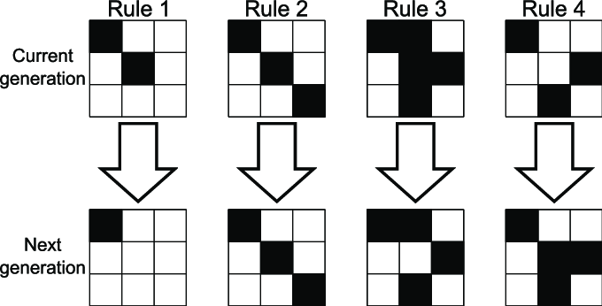

# 生成式藝術的工具和技術

## 常用的生成式藝術工具和軟件

生成式藝術的基本理念和原則中，隨機性與規律性的結合，以及從簡單到複雜的概念，是其核心思想的重要部分。

### 隨機性與規律性

生成式藝術往往包含兩種對立但卻又可以相互結合的元素：隨機性和規律性。這意味著藝術家在創作過程中，並不是完全預先規劃好每一個細節，而是設計一組基本的規則或算法，然後讓這些規則在一定的隨機性下產生變化，從而創造出無法預知但卻有一定規律的作品。

舉例來說，美國藝術家Brian Eno的音樂作品“Music for Airports”就是一個典型的例子。在這部作品中，他設計了一組音樂片段的播放規則，然後讓這些片段在一定的隨機性下不斷重複和組合，從而創造出無窮無盡的音樂變化。

### 從簡單到複雜

生成式藝術的另一個核心概念是“從簡單到複雜”。這意味著通過一組簡單的規則或模式，可以生成出極度複雜和豐富的作品。這種方法的威力在於，即使是非常簡單的規則，只要組合和變化得當，也可以創造出令人驚艷的藝術效果。

例如，英國數學家约翰·康威的“生命遊戲”就是一個非常好的例子。在這個遊戲中，只有三條簡單的規則，但這些規則卻可以在數據格中生成出各種複雜和美麗的圖案，這些圖案有的甚至可以自我複製和變化，仿佛具有生命一般。

*生命遊戲規則*

### 生成式藝術的創作工具

為了實現這些想法，生成式藝術可以使用一些程式工具來完成：

生成式藝術的創作工具眾多，每種工具都有其特色和用途，因此，理解和選擇合適的工具對於生成式藝術的創作至關重要。

1. Processing：這是一種基於Java語言的開源編程環境，專為藝術家、設計師、研究人員和初學者設計。它提供了一個簡單易用的平台，用戶可以快速創建視覺化圖像、動畫和互動元素。因此，如果你希望創建視覺化作品，並且對Java語言有一定了解，那麼Processing可能是一個不錯的選擇。

2. openFrameworks：openFrameworks是一個基於C++語言的開源工具包，它提供了一個強大而靈活的平台，用戶可以創建各種視覺化作品、互動裝置、實體裝置和實驗性專案。由於它基於C++，因此，如果你已經熟悉C++語言，並且想要創建更複雜或者專業的作品，那麼openFrameworks可能是一個好選擇。

3. p5.js：p5.js是一種基於JavaScript語言的開源編程環境，它以Processing為靈感，並將其概念擴展到了網頁和JavaScript世界。因此，如果你希望創建基於網頁的互動視覺化作品，並且已經熟悉JavaScript語言，那麼p5.js可能是一個適合的選擇。

選擇工具時，要考慮的因素有很多。首先，你需要明確你的創作目標，例如你希望創建什麼樣的作品，你需要什麼樣的功能或效果。其次，你需要考慮你的技能和經驗，例如你熟悉哪種程式語言，你有哪些相關的編程或藝術經驗。最後，你也需要考慮你的學習和發展需求，例如你希望學習和掌握哪些新的技能或概念。根據這些因素，你可以選擇最適合你的工具。

## 程式設計和編碼在生成式藝術中的角色：

在生成式藝術中，程式設計和編碼是創作的基礎和核心。透過程式，藝術家可以定義和控制創作的規則、過程和輸出，並在此基礎上進行創新和實驗。在生成式藝術中，藝術家可以透過程式來創建和運用各種規則。例如，藝術家可以使用程式來定義形狀的形成規則、顏色的變化規則、動態的變化規則等，從而生成獨特的視覺效果和結構。透過程式，生成式藝術可以具有動態和互動性。例如，藝術家可以使用程式來控制作品的動態變化，或者是讓作品對用戶的操作或環境的變化進行響應。程式設計和編碼也讓生成式藝術具有高度的創新性和實驗性。藝術家可以透過程式來探索新的視覺效果、新的創作方法，甚至是新的藝術概念和理論。

舉例來說：

形狀的生成：例如，藝術家可以使用程式來定義一個形狀的生成規則，如使用數學函數來定義一個圖形的形狀，或者是使用隨機函數來創建不確定的形狀。然後，藝術家可以透過程式來重複和變化這些形狀，從而生成複雜和獨特的視覺結構。

顏色的變化：例如，藝術家可以使用程式來控制顏色的變化。他們可以使用程式來定義一種顏色到另一種顏色的漸變規則，或者是使用隨機函數來創建不確定的顏色變化。然後，藝術家可以透過程式來應用和變化這些顏色，從而生成豐富和動態的視覺效果。

用戶互動：例如，藝術家可以使用程式來創建與用戶互動的作品。他們可以使用程式來讓作品對用戶的操作（如點擊、滑動、鍵盤輸入等）或環境的變化（如時間、光線、聲音等）進行響應，從而生成變化和動態的視覺效果。

程式設計和編碼不僅是生成式藝術創作的基礎，也是其創新和實驗的重要工具。

## 數據視覺化與生成式藝術的結合

數據視覺化是將抽象的數據資訊轉化為易於理解的視覺圖像的過程，而生成式藝術則是透過程式碼生成藝術的過程。兩者的結合，可以創造出更富有創新性和表現力的視覺效果，並且能夠更有效地傳達和解釋數據信息。

創新性：藉由使用生成式藝術的方法，我們可以超越傳統的視覺化技術，例如柱狀圖、折線圖等，創造出新的、富有藝術感的視覺效果，這可以提高視覺化的吸引力和記憶力。

表現力：生成式藝術可以讓我們在數據視覺化中表現出更豐富和深度的信息。例如，我們可以使用顏色、形狀、動態等視覺元素來表現數據的多維度和多層次的關係，這可以提高視覺化的理解力和解釋力。

動態和互動：生成式藝術也可以讓我們在數據視覺化中創造出動態和互動的效果。例如，我們可以使用程式來讓視覺化隨著時間或用戶的操作而變化，這可以提高視覺化的活躍度和參與度。

例如數據視覺化藝術作品，藝術家可以使用生成式藝術的方法來創造一個數據視覺化藝術作品，這個作品可以將一個社會問題（如氣候變化、城市化等）的數據資訊轉化為一個動態和互動的視覺展示，觀眾可以在欣賞藝術的同時，獲得有關這個問題的深度理解。

例如互動數據視覺化，設計師可以使用生成式藝術的方法來創造一個互動數據視覺化，這個視覺化可以讓用戶透過操作來探索和理解一組複雜的數據，如經濟數據、社會網絡數據等，並在此過程中，產生豐富和多變的視覺效果。

例如動態數據視覺化，科學家可以使用生成式藝術的方法來創造一個動態數據視覺化，這個視覺化可以展示一個自然現象（如風暴、海潮等）或者一個科學過程（如化學反應、生物進化等）的動態變化，並在此過程中，生成出具有美學價值的視覺效果。

這就是數據視覺化與生成式藝術的結合，以及一些相關的例子。可以看出，這種結合不僅可以提高數據視覺化的創新性和表現力，還可以提高其動態性和互動性，從而使得數據資訊的傳達和解釋更加有效和深入。