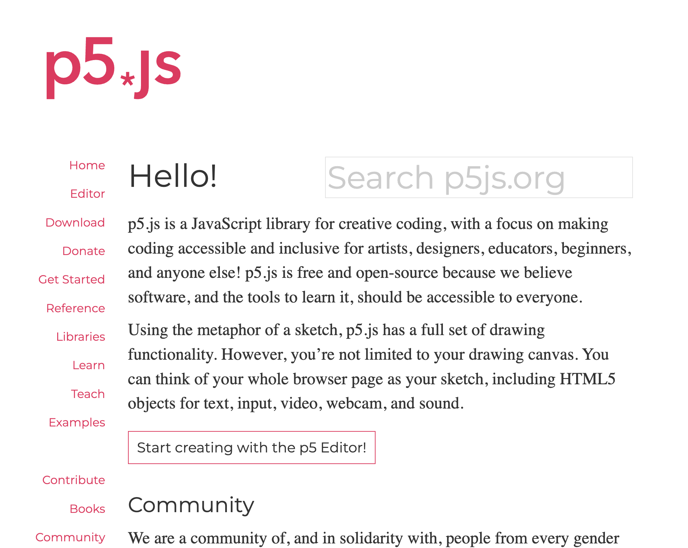
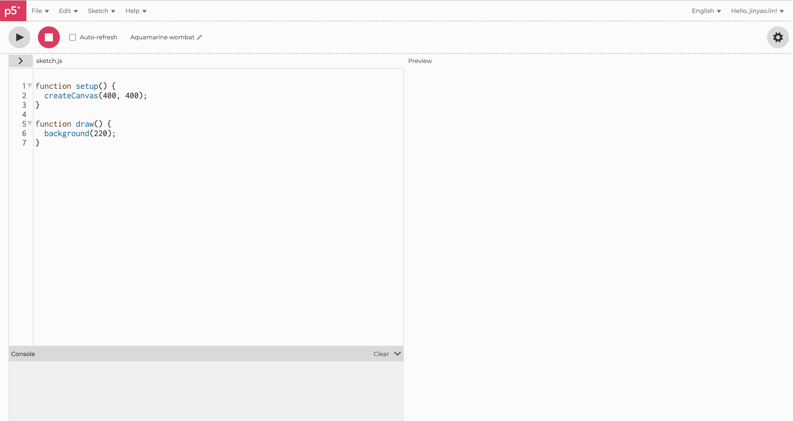

# P5JS與生成式藝術

## p5.js與生成式藝術的介紹

p5.js是一款開放源碼的JavaScript函式庫，專為視覺和生成式藝術設計，簡化了許多複雜的程式碼，使得編寫創作更為直覺和容易。它是由Lauren McCarthy創建，並由Processing Foundation維護。p5.js允許用戶在瀏覽器上使用JavaScript語言來編程，進行視覺編程，創建2D和3D圖形，也可以做互動式或動畫的視覺元素。p5.js是生成式藝術的一個強大工具，因為它讓藝術家和設計師可以用程式設計的方式來創造藝術，這讓人們可以進行非常複雜和多樣化的創作，而且這種方式也讓藝術創作變得更為直覺和動態。

p5.js是生成式藝術的理想工具，有幾個關鍵的原因：

1. 易於學習和使用：p5.js設計得簡單直覺，非常適合初學者。其語法相對簡潔，使得初學者可以輕鬆進入並快速瞭解如何進行繪圖和動畫創作。

2. 視覺導向：p5.js是一種視覺化的程式語言，意味著它專為創建視覺元素而設計。與傳統的文字導向程式設計相比，視覺化程式語言更直觀，讓你在編程的同時能看到實時的視覺輸出結果。

3. 社區支援：p5.js擁有一個活躍的開發者和藝術家社區，提供許多教程、範例程式碼和資源，方便學習和解決問題。

4. 跨平台與網頁相容：p5.js是基於JavaScript的，這意味著你的作品可以在任何支援網頁瀏覽器的裝置上運行，無需特殊的軟體或插件。

5. 靈活性和擴展性：雖然p5.js自身具有豐富的繪圖和互動功能，但它也允許使用者引入其他JavaScript庫和工具，這意味著它可以與許多其他的網頁技術結合使用，如HTML、CSS、WebGL等。

## 如何設置並開始使用p5.js

P5.JS倚賴透過瀏覽器網頁來執行程式，因此我們需要一個網頁伺服器(Web Server)來放置我們的程式。

要在本機安裝Web Server，我們可以選擇一些簡單易用的選項，例如Python的內建HTTP Server，或是Node.js的http-server模組。以下是這兩種方式的步驟：

1. Python內建HTTP Server：
如果你的電腦已經安裝了Python，那麼可以使用Python的內建HTTP Server來快速建立一個本機的Web Server。

打開你的終端機或命令提示字元，並將目錄切換到你的網站檔案所在的資料夾，然後執行以下的指令：
如果你的Python版本是3.x，請執行：

`python -m http.server`

如果你的Python版本是2.x，請執行：

`python -m SimpleHTTPServer`

然後你可以在你的網頁瀏覽器中打開 http://localhost:8000 ，就可以看到你的網站了。

2. Node.js的http-server模組：
如果你的電腦已經安裝了Node.js和npm，那麼你可以選擇使用http-server這個npm模組來建立Web Server。
首先，在終端機或命令提示字元中執行以下的指令來全域安裝http-server：

`npm install --global http-server`


然後，切換到你的網站檔案所在的資料夾，並執行以下的指令來啟動Server：

`http-server`

這時候，你可以在你的網頁瀏覽器中打開 http://localhost:8080 ，就可以看到你的網站了。

這些都是在本機快速安裝Web Server的方法，讓你可以在本機運行和測試你的網站。

使用p5.js非常簡單，你只需要進行幾個步驟就可以開始創作：

下載p5.js：首先，你需要從p5.js的官方網站下載最新的p5.js程式庫。這是一個JavaScript檔案，包含了p5.js的所有功能。

### 建立專案環境

建立HTML檔案：為了使用p5.js，你需要建立一個HTML檔案。這個檔案將包含一個連結到你剛剛下載的p5.js程式庫，以及你的主要程式碼。在你的HTML檔案中，你需要使用<script>標籤來連結p5.js程式庫。例如，如果你的p5.js檔案和HTML檔案在同一個資料夾，你的<script>標籤應該如下所示：

`<script src="p5.js"></script>`

```html
<!DOCTYPE html>
<html>
  <head>
    <title>My p5.js Project</title>
    <script src="https://cdnjs.cloudflare.com/ajax/libs/p5.js/1.4.0/p5.js"></script>
    <script src="sketch.js"></script>
  </head>
  <body>
    <main>
    </main>
  </body>
</html>
```


寫入p5.js程式碼：接著你可以開始寫你的p5.js程式碼。一般來說，你的程式碼應該包含兩個主要的函數：setup()和draw()。setup()函數在程式開始時執行一次，用於進行一些初始設定，如建立畫布等。draw()函數則在setup()之後不斷重複執行，用於繪製和更新你的畫面。

執行你的程式：最後，你只需要在網頁瀏覽器中開啟你的HTML檔案，就可以看到你的p5.js程式的結果了。以上就是使用p5.js的基本步驟。一旦你瞭解了如何設置和使用p5.js，你就可以開始創作各種有趣的生成式藝術作品了。

### 線上開發環境

如果你是剛接觸程式設計，或者你不想在本地設置開發環境，p5.js提供了一個線上的程式編輯器，讓你可以直接在網頁瀏覽器中編寫和運行程式。這是一個方便且強大的工具，適合初學者或者進行快速原型開發的時候使用。

首先，打開p5.js網站（https://p5js.org/），然後在網站的上方導覽列中，點擊"Editor"的連結，就可以打開p5.js的線上編輯器。


*P5JS website*

當你打開p5.js的線上編輯器後，你會看到一個編程的界面。左邊是程式編輯區，你可以在這裡寫程式。右邊是預覽區，你的程式運行的結果會在這裡顯示。


*P5JS Online Editor*


在編程區中，你會看到兩個預設的函式：setup()和draw()。setup()函式用於設置程式運行前的初使設定，而draw()函式則是一個會不斷重複執行的區塊，適合用來創建動畫或互動。

現在你就可以開始在p5.js線上編輯器中創作你的程式了！你可以透過p5.js的函式庫來繪圖、創造動畫、處理互動，甚至是處理聲音和視訊等等。

## p5.js中的基本概念

當我們開始使用p5.js來創作程式，需要熟悉以下的一些基本概念：

1. 畫布（Canvas）：p5.js中，所有的繪圖都會在一個名為畫布的二維空間中進行。我們可以使用createCanvas()函式來設置畫布的大小。
2. 座標系統：在p5.js的畫布上，左上角是座標系統的原點(0, 0)，x座標向右為正，y座標向下為正。這和我們在數學課程中學習的座標系統有些不同，但這是電腦圖形中常見的設定。
3. 形狀與顏色：p5.js提供了許多內建的函式來繪製各種形狀，如ellipse()畫橢圓，rect()畫矩形等等。顏色也可以透過fill()或stroke()函式來設定。
4. 動畫與互動：p5.js中有一個名為draw()的特殊函式，這個函式會在每秒60次的頻率下不斷被調用，適合用來製作動畫。此外，p5.js也提供了許多處理鍵盤、滑鼠、觸碰等互動的函式。
5. 變數與函式：在p5.js中，我們可以使用變數來儲存我們的數據，並使用函式來組織和重複使用我們的程式碼。這和大多數程式語言中的變數和函式的概念相同。

在 p5.js 中，有很多函數和物件可以用來繪圖和創建視覺效果。以下是一些基本的函數：

1. createCanvas(width, height): 創建一個新的畫布，設定其寬度和高度。

2. background(color): 設定畫布的背景顏色。

3. fill(color): 設定繪圖元素的填充顏色。

4. noFill(): 繪圖元素不填充顏色。

5. stroke(color): 設定繪圖元素的線條顏色。

6. noStroke(): 繪圖元素不描繪線條。

7. strokeWeight(weight): 設定線條的寬度。

8. line(x1, y1, x2, y2): 繪製一條從 (x1, y1) 到 (x2, y2) 的直線。

9. rect(x, y, width, height): 繪製一個矩形，左上角的位置為 (x, y)，寬度為 width，高度為 height。

10. circle(x, y, diameter): 繪製一個圓，中心為 (x, y)，直徑為 diameter。

11. ellipse(x, y, width, height): 繪製一個橢圓，中心為 (x, y)，寬度為 width，高度為 height。

12. triangle(x1, y1, x2, y2, x3, y3): 繪製一個三角形，三個頂點分別為 (x1, y1)，(x2, y2)，(x3, y3)。

13. beginShape() 和 endShape(): 定義一個複雜形狀的開始和結束。在這兩個函數之間，你可以使用 vertex(x, y) 函數來添加形狀的頂點。

14. vertex(x, y): 在 beginShape() 和 endShape() 中使用，添加形狀的一個頂點。

15. curveVertex(x, y): 繪製一個曲線頂點，用於 beginShape() 和 endShape() 中。

16. bezier(x1, y1, x2, y2, x3, y3, x4, y4): 繪製一條貝塞爾曲線。

17. quad(x1, y1, x2, y2, x3, y3, x4, y4): 繪製一個四邊形。