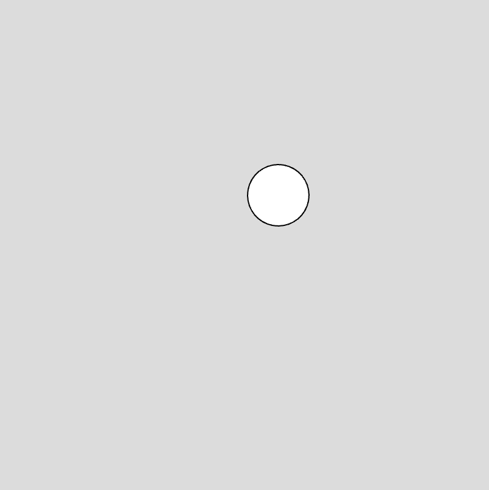
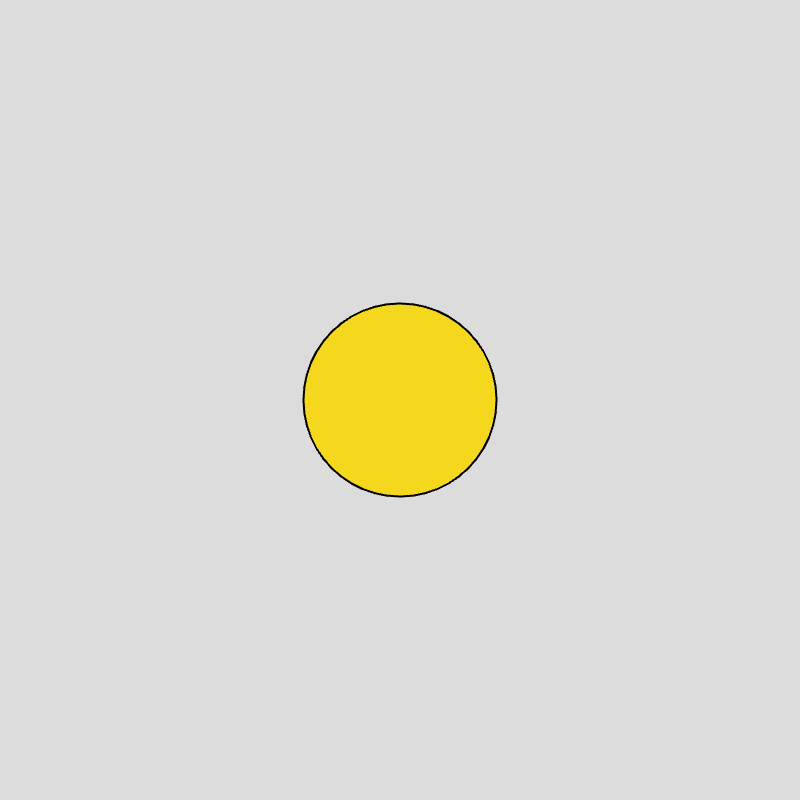
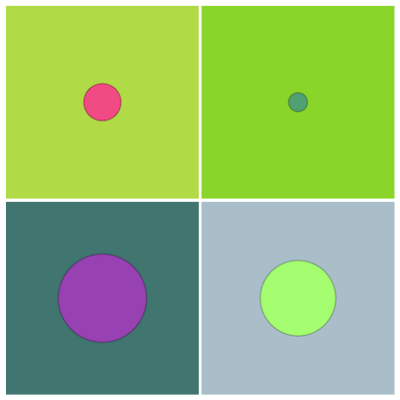
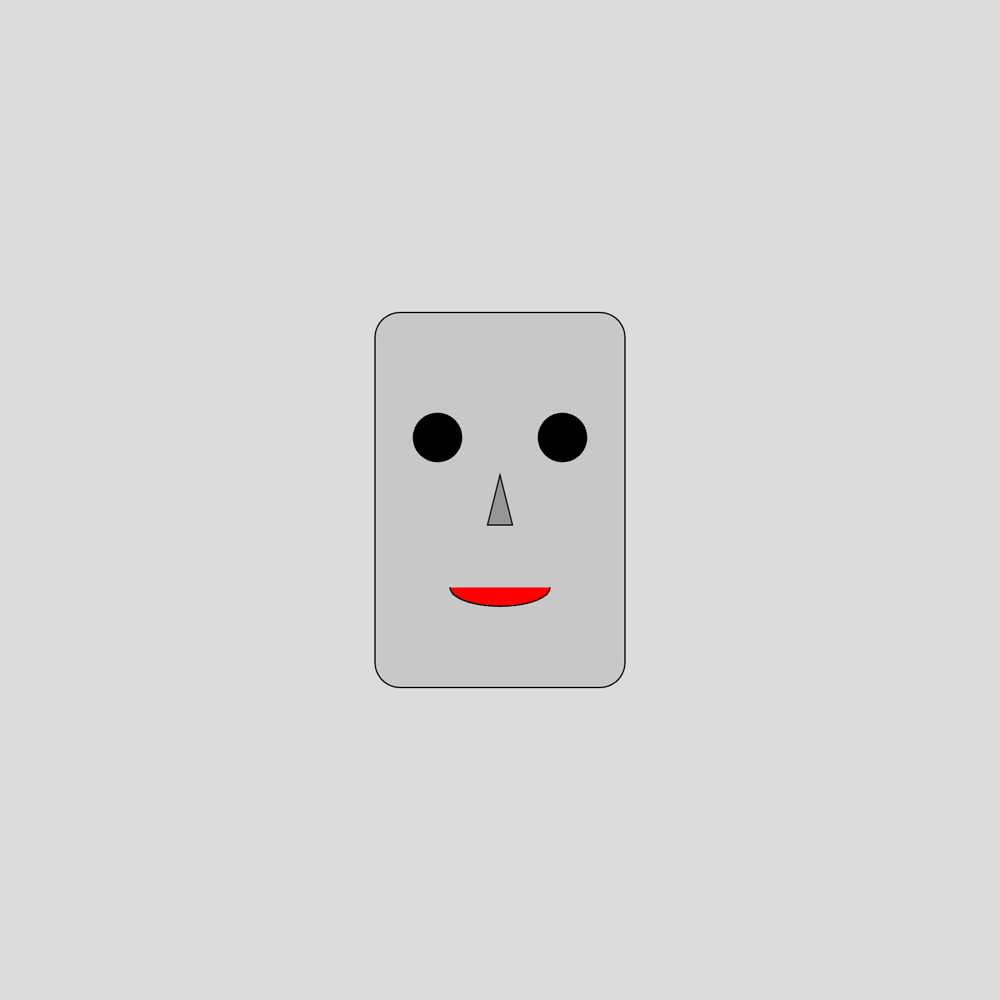
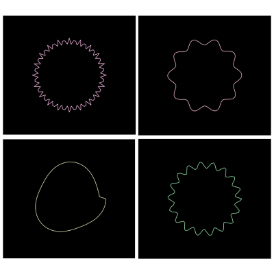
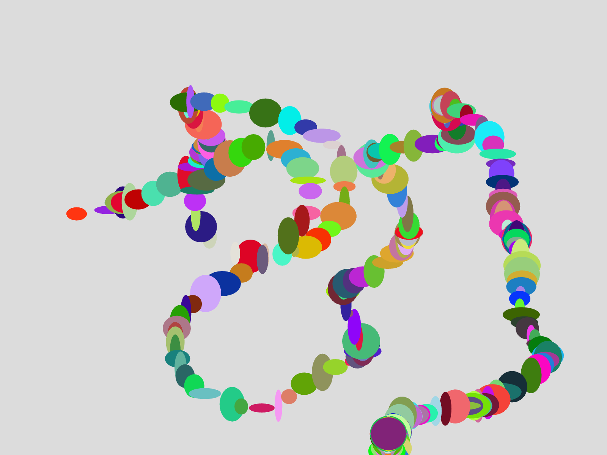
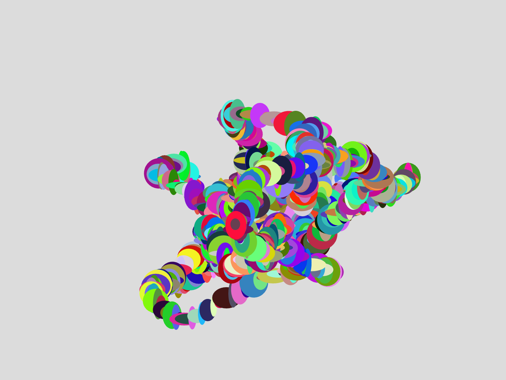
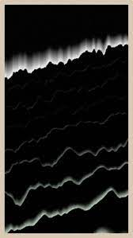
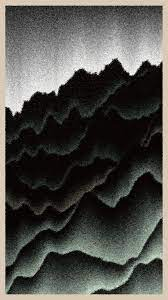
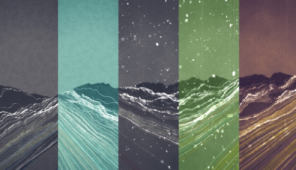

# P5JS的程式開發

## P5的程式基本架構及基礎繪圖

以下是一個使用 p5.js 的基本程式碼示例，此程式會在畫布上繪製一個移動的圓點：

```javascript
// 範例6-1 p5.js 
// 程式一般包含兩個主要部分： setup 函數和 draw 函數

// setup 函數
// 此函數只會在程式開始時執行一次
// 通常用來設定初始狀態（例如畫布大小、背景顏色等）
function setup() {
  createCanvas(400, 400);  // 創建一個 400x400 像素的畫布
}

// draw 函數
// 此函數在 setup 函數執行完畢後，會被持續不斷地呼叫（每秒通常 60 次）
// 通常用來更新畫面（例如繪製動畫）
function draw() {
  background(220);  // 將背景填充為灰色（RGB 值 220）

  // 使用 mouseX 和 mouseY 變數（這兩個變數會自動追蹤滑鼠的位置）
  // 在滑鼠的位置繪製一個圓形
  ellipse(mouseX, mouseY, 50, 50);
}
```

在 p5.js 的程式中，`setup()` 和 `draw()` 是兩個最基本也最重要的函數。`setup()` 用於進行初始設定，如設定畫布大小、載入圖片或音樂等。`draw()` 則用於更新畫面，如繪製動畫、更新圖像位置等。因為 `draw()` 會被持續不斷地呼叫，所以它是動態視覺作品的主要場所。


*範例 6-1 隨著滑鼠的移動，球體會不斷的更新位置並且重新繪製*


以下是一個簡單的 p5.js 程式，它在畫布的中心創建一個原點，並在原點處隨機產生不同顏色和大小的圓形：

```javascript
//範例6-2 p5.js
function setup() {
  createCanvas(400, 400);  // 創建一個 400x400 像素的畫布
  frameRate(1);  // 設定每秒只更新一次畫面
}

function draw() {
  background(220);  // 將背景填充為灰色（RGB 值 220）

  // 設定原點在畫布的中心
  translate(width / 2, height / 2);

  // 隨機選擇填充顏色
  fill(random(255), random(255), random(255));

  // 在原點處繪製一個隨機大小的圓形
  ellipse(0, 0, random(100));

  // 還原填充顏色為白色
  fill(255);
}
```

在此程式中，`frameRate()` 函數設定每秒只更新一次畫面，使得每秒只產生一個新的圓形。`translate()` 函數則用來將原點移動到畫布的中心。`random()` 函數則用來產生一個隨機的數值，用於設定圓形的顏色和大小。


*範例 6-2 每秒更新的一個圓形*

讀者可以任意修改參數，例如每秒的更新頻率，或者是隨機數字的大小。

當然，我們可以將 `background()` 函數的參數改為隨機值，從而達到隨機背景色的效果。以下是修改後的程式碼：

```javascript
  background(random(255), random(255), random(255)); 
```

在這段程式碼中，我們將 `background()` 函數的參數改為 `random(255), random(255), random(255)`，每個參數都會生成一個介於 0 到 255 的隨機數值，分別代表 RGB 三個通道的顏色值，從而產生隨機背景色。


*範例6-2 p5.js 修改background結果 每次更新後背景顏色也會一起更新*

以下是一個使用 p5.js 的程式，它會在畫布的中心隨機繪製一個機器人的臉：

```javascript
//範例6-3 p5.js
function setup() {
  createCanvas(800, 800);  // 創建一個 800x800 像素的畫布
}

function draw() {
  background(220);  // 將背景填充為灰色（RGB 值 220）

  // 繪製機器人的頭
  fill(200);
  rectMode(CENTER);  // 使得 rect 函數的前兩個參數代表矩形的中心
  rect(width / 2, height / 2, 200, 300, 20);  // 在畫布的中心繪製一個寬度為 200、高度為 300、圓角為 20 的矩形

  // 繪製眼睛
  fill(0);
  let eyeSize = random(30, 40);  // 隨機選擇眼睛的大小
  ellipse(width / 2 - 50, height / 2 - 50, eyeSize);  // 左眼
  ellipse(width / 2 + 50, height / 2 - 50, eyeSize);  // 右眼

  // 繪製鼻子
  fill(150);
  triangle(width / 2, height / 2 - 20, width / 2 - 10, height / 2 + 20, width / 2 + 10, height / 2 + 20);  // 繪製一個頂點分別為三點的三角形

  // 繪製嘴巴
  fill(255, 0, 0);
  arc(width / 2, height / 2 + 70, 80, 30, 0, PI);  // 在畫布的中心偏下處繪製一個寬度為 80、高度為 30、起始角度為 0、結束角度為 PI 的弧形

  // 還原填充顏色為白色
  fill(255);
}
```

在這段程式中，我們使用 `rectMode(CENTER)` 將 `rect()` 函數的模式設定為以中心點為準，使得矩形的中心點對準畫布的中心。隨後，我們使用 `random()` 函數隨機選擇眼睛的大小，並用 `ellipse()` 函數繪製兩個大小相同的眼睛。然後，我們用 `triangle()` 函數繪製鼻子，並用 `arc()` 函數繪製嘴巴。最後，我們還原了填充顏色為白色。


*範例6-3 隨機改變眼睛大小產生的機器人頭*

## 使用P5.JS創作靜態藝術作品

筆者在2021年fxhash生成式平台上發表的作品 Distortion City #0，用了圓的數學公式並透過頻率的更改，產生一個在圓周上產生變化的協調圖型。

```javascript
//範例6-4 p5.js
// 定義變數
let points = []; // 存儲點的數組
let rndcolor1, rndcolor2, rndcolor3; // 定義三個變數來存儲隨機顏色的 RGB 值

// setup 函數在 p5.js 程式一開始運行時只會被調用一次
function setup() {
  // 創建一個和視窗一樣大小的畫布
  createCanvas(windowWidth, windowHeight, WEBGL);

  // 生成100個點，這些點的位置在一個半徑變化的圓形軌道上
  for (let i = 0; i < 100; i++) {
    let index = (i / 100) * 6.28 ; // 變量 index 在 [0, 2*PI) 範圍內變化
    let r = 100 + cos(index*10) * 20; // 半徑 r 是一個變化的值，基礎值為100，變化範圍由 cos 函數決定
    // 生成點並存入數組
    points[i] = [cos(index) * r, sin(index) * r, 0];
  }

  // 設置背景色為黑色
  background(0);

  // 隨機生成 RGB 顏色
  rndcolor1 = 150 + random() * 106; 
  rndcolor2 = 150 + random() * 106; 
  rndcolor3 = 150 + random() * 106; 

  // 設置筆劃顏色
  stroke(rndcolor1, rndcolor2, rndcolor3);
  strokeWeight(3);

  // 連接生成的所有點，形成一條閉合的曲線
  for (let i = 0; i < 100; i++) {
    line(points[i][0], points[i][1], points[i][2], points[(i + 1)%100][0], points[(i + 1)%100][1], points[(i + 1)%100][2]);
  }
}
```

這段程式會生成一組位於半徑變化的圓形軌道上的點，並將這些點連接起來，形成一條閉合的曲線。並且每次執行這段程式時，由於顏色的隨機生成，生成的曲線會有不同的顏色。注意，`draw` 函數在 p5.js 程式中會不斷重複執行，這在創建動畫時非常有用。然而，如果你只想創建一個靜態的藝術作品，你可能只需要在 `setup` 函數中繪製你的作品，然後不需要使用 `draw` 函數。


*範例 6-4 透過改變圓周的半徑生成各種不同之圖形*

在這段程式裡面，`draw()`函數被刪除了，因此畫面將不會更新，所以可以產出一個靜態的畫面。讀者也可以在`draw()`函數裡面調用`noLoop()`，也可以達到一樣的效果。

```javascript
function draw(){
  noLoop();
}
```

在 p5.js 中，如果你想要在繪圖時，不要清除掉先前的畫面，繼續累積在畫布上，那就選擇不要在 `draw` 函數裡面使用 `background` 函數。`background` 函數的作用就是會把畫布上的所有東西清除，並塗上你選定的顏色。如果你選擇不使用它，那就能保留畫布上先前的元素。

來個實作範例，讓我們一步步搭建出一個較複雜的圖形。首先我們先定義一個簡單的規則：每次滑鼠移動，就在滑鼠位置繪製一個圓點，並且保留所有已經繪製過的圓點。這將形成一個繪圖軌跡。

```javascript
//範例6-5 p5.js
function setup() {
    createCanvas(800, 600);
    background(220);  // 一開始就先清除畫布
}

function draw() {
    fill(0);  // 圓點的顏色設為黑色
    noStroke();  // 圓點沒有邊框
    ellipse(mouseX, mouseY, 10, 10);  // 根據滑鼠位置繪製一個小圓點
}
```

這個簡單的規則已經能創造出有趣的圖案，但我們還能更進一步，創造更複雜的圖形。我們可以引入一個變化的元素：讓每個圓點的顏色和大小都是隨機的。這樣，你將會得到一個色彩斑斕，且動態變化的藝術作品。

```javascript
function setup() {
    createCanvas(800, 600);
    background(220);
}

function draw() {
    fill(random(255), random(255), random(255));  // 圓點的顏色隨機
    noStroke();
    ellipse(mouseX, mouseY, random(10, 50), random(10, 50));  // 圓點的大小隨機，且位置隨著滑鼠的移動而變化
}
```



*範例 6-5 隨著滑鼠的移動產生的筆觸*

你也可以進一步嘗試其他的變化，例如讓圓點的顏色隨著時間或滑鼠速度變化，或者讓圓點的形狀不再是圓形，而是其他的形狀。只要你的創意無限，你就能用 p5.js 創造出無窮無盡的藝術作品。

### 透過時間線增加複雜度

你可以使用 p5.js 內建的 `noise()` 函數來生成 Perlin Noise。Perlin Noise 是一種常用於電腦圖形學和視覺藝術中的噪音函數，它可以生成自然而平滑的隨機數字序列。

以下是一個使用 Perlin Noise 創建動態圖形的範例。在這個例子中，我們使用 `noise()` 函數來決定圓點的 x 和 y 坐標，並使用一個變數 `t` 來模擬時間的變化：

```javascript
//範例 6-6
let t = 0;  // 初始時間

function setup() {
    createCanvas(800, 600);
    background(220);
}

function draw() {
    fill(random(255), random(255), random(255));  // 圓點的顏色隨機
    noStroke();

    let x = noise(t) * width;  // 透過 noise() 函數和時間 t 來決定 x 坐標
    let y = noise(t + 5) * height;  // 透過 noise() 函數和時間 t 來決定 y 坐標

    ellipse(x, y, random(10, 50), random(10, 50));  // 圓點的大小隨機，位置由 Perlin Noise 控制

    t += 0.01;  // 時間每幀進行小幅度增加
}
```


*範例6-6 以perlin noise的運動結果*

在此程式中，引入變數 t 的主要目的是模擬時間的概念，並且使得我們的圖像在每一幀畫面中都有所不同。增加 t 的值會讓我們在 Perlin Noise 函數中取樣不同的點，從而產生出變化的視覺效果。這使得我們的程式可以產生動態的圖形，而不是僅僅是靜態的。

Perlin Noise 是一種光滑的隨機數據生成方式，這種光滑的性質使得它在不同時間點生成的數據之間有著自然的過渡，這一特性讓它在圖形或動畫的生成中十分有用。當我們用 Perlin Noise 來控制圖形的位置或顏色時，即使在每一幀畫面中我們都在改變數據，但生成的效果仍然會看起來非常流暢和自然。

另外，引入時間變數 t 並使其不斷增加，會使得 Perlin Noise 的生成結果不斷改變，這種不斷變化的特性可以讓我們的圖形顯示出更加複雜和多變的視覺效果。隨著時間的推移，圖形會以看似隨機但又充滿規律的方式不斷變化，這種變化性使得我們的作品具有更強的生命力和豐富性，從而增加了作品的藝術價值。

在這個例子裡面，物件會不斷的移動。當然我們也可以透過在`draw()`加入一小段程式，讓其在移動一段時間之後就停止。因為t會在每次呼叫`draw()`的時候增加，因此當t大於20的時候，就會呼叫noLoop()，而noLoop的效果就會讓P5JS不再繼續呼叫`draw()`，進而停止更新。

```javascript
if(t > 20){
    noLoop();
}
```

### Perlin Noise的使用

在這個例子中，你會看到圖形在畫布上以一種平滑且看似隨機的方式移動。這是因為 Perlin Noise 的特性，它會產生一種自然而連續的變化，這使得它非常適合用來模擬自然現象，如水波、雲朵、山脈等。

舉例筆者在2022年與其他五位生成式藝術家所共同發表的「百岳計畫」其中的「秘境」及旅英創作者林逸文的作品「植被」，便是以perlin noise作為主要的運動線條，構成山脈的筆觸。


*林經堯作品百岳計畫-「秘境」*


*林逸文作品 - 百岳計畫-「植被」。*


### 以作品 Sunrise Sunset為例

接下來我會以筆者在fxhash發表的Sunrise Sunset為例，一步一步的引導使用者從基礎進到創作。

以下是程式碼的主程式：

```javascript
//sketch.js
// 初始化一些全局變量
let canvasSize;
let sunarray;
let fxcanvas = fx.canvas();
let R = new Random();
let variety;
let canvas;
let object_type;
initValue();

// 設定特徵變數的初始值
window.$fxhashFeatures = {
  "scene": variety.name,
  "silhouette": object_type_name[object_type]
}

// 設定畫布
function setup() {
  // 設定畫布大小以適應視窗大小
  if(windowWidth > windowHeight){
    canvasSize = windowHeight;
  }else{
    canvasSize = windowWidth;
  }
  
  // 創建一個新的畫布
  canvas = createCanvas(canvasSize, canvasSize);
  
  // 設定畫布的像素密度
  pixelDensity(displayDensity());
  
  // 設定顏色模式
  colorMode(HSB,360,100,100);
  
  // 設定背景顏色
  background(variety.bgcolor);
}

// 繪圖函數
function draw() {
  // 不再自動重新繪製
  noLoop();
  
  // 將原點移至畫布中央
  translate(canvasSize/2,canvasSize/2);
  
  // 繪製天空和太陽
  sky();
  sun();
  
  // 繪製雲朵
  for(var i=0;i<10;i++){
    px=(fxrand()-0.5)*canvasSize;
    py=fxrand()*-canvasSize/3-canvasSize/6;
    cloud(px,py);
  }
  
  // 繪製太陽反射
  sunreflectionarray();
  
  // 繪製海洋
  ocean();

  // 根據物件類型繪製不同的物件
  switch(object_type){
    case 0:
      boat();
      break;
    case 1:
      whale();
      break;
    case 2:
      dolphin();
      break;
    case 3:
      dolphins();
      break;
    case 4:
      island();
      break;
  }
  
  // 將繪圖內容轉換為紋理，並進行後處理
  var texture = fxcanvas.texture(canvas.elt);
  fxcanvas.draw(texture);
  fxcanvas.noise(0.4).ink(0.15).update();
  
  // 將後處理後的紋理繪製回原始畫布
  drawingContext.drawImage(fxcanvas,-canvasSize/2,-canvasSize/2,canvasSize,canvasSize);
  
  // 繪製畫布邊框
  noFill();
  stroke(0,0,0);
  strokeWeight(canvasSize*0.05);
  rectMode(CENTER);
  rect(0,0,canvasSize,canvasSize);
  
  // 顯示預覽
  fxpreview();
}

// 初始化變量的函數
function initValue(){ 
  variety = variety_db[R.randome_dice([6,4,6,4,2,2])];
  object_type = R.randome_dice([8,8,8,4,4]);
}
```

物件的繪製則放置在object.js裡面，並利用`sun()`,`sunreflectionarray()`,`boat()`,`sky()`,`dolphin()`,`island()`等函數來定義繪圖的內容。

```javascript
//object.js
// 數據集表示海豚的形狀
let dol = [
    [-13.11, -20.01],
    [-12.04, -20.91],
    [-10.71, -21.92],
    // 省略了部分數據...
    [-13.87, -18.93]
];

// 產生太陽的位置和顏色
function sun() {
  push();
  let px = (R.random_dec() - 0.5) * 0;
  let py = R.random_dec() * -100 - 100;
  noStroke();
  fill(variety.sun);
  circle(px, 0, canvasSize / 6);
  pop();
}

// 產生太陽反射的位置和顏色
function sunreflectionarray() {
  push();
  let noiseoffset;
  sunarray = [];
  for (var i = 0; i <= canvasSize; i++) {
    sunarray[i] = [];
    noiseoffset = noise(i / 3) - 0.5;
    px = 0 + noiseoffset * 80;
    py = i;
    length = canvasSize / 6 - sin(i / canvasSize * PI / 2) * canvasSize / 6;

    sunarray[i][1] = px - length / 2;
    sunarray[i][2] = px + length / 2;
  }
  pop();
}

// 繪製船的形狀和位置
function boat() {
  let px = R.random_num(-50, 50);
  push();
  scale(canvasSize / 800);
  translate(px, 0);
  scale(0.4);
  stroke(variety.silhouette);
  fill(variety.silhouette);
  rect(-20, -5, 40, 5);
  line(0, 0, 0, -50);
  triangle(0, -50, 0, -8, 20, -10);
  line(0, -50, -20, -5);
  triangle(-20, -7, 0, -8, -8, -28);
  pop();
}

// 繪製天空的形狀和顏色
function sky() {
  push();
  strokeWeight(canvasSize * 0.0001);
  for (var i = 0; i < 24000; i++) {
    let px = (R.random_dec() - 0.5) * canvasSize;
    let py = Math.floor((1 - pow(R.random_dec(), 0.25)) * canvasSize / 2) * -1;
    py = max(min(py, 0), -canvasSize);
    let sz = R.random_num(40, 80);
    let bright = R.random_num(-20, 20) + variety.sky[2];
    stroke(variety.sky[0], variety.sky[1], bright);
    line(px - sz / 2, py, px + sz / 2, py);
  }
  pop();
}


// 繪製海豚的形狀和位置
function dolphin() {
  push();
  scale(canvasSize / 800);
  fill(variety.silhouette);
  noStroke();
  beginShape();
  for (var i = 0; i < dol.length; i++) {
    vertex(dol[i][0], dol[i][1]);
  }
  endShape(CLOSE);
  pop();
}


// 繪製島嶼的形狀和位置
function island() {
  fill(variety.silhouette);
  stroke(variety.silhouette);
  push();
  scale(canvasSize / 800);
  push();
  arc(0, 12, 60, 30, PI + PI / 8, TWO_PI - PI / 8, CHORD);
  pop();
  strokeWeight(canvasSize / 400);
  line(10, 0, 10, -18);
  push();
  centerx = cos(TWO_PI - PI / 4) * 6;
  centery = sin(TWO_PI - PI / 4) * 6;
  translate(10, -20);
  push();
  rotate(-PI / 4);
  translate(-centerx, -centery);
  arc(0, 0, 6, 6, PI + PI / 4, TWO_PI - PI / 4, CHORD);
  pop();
  push();
  rotate(-PI / 16);
  translate(-centerx, -centery);
  arc(0, 0, 6, 6, PI + PI / 4, TWO_PI - PI / 4, CHORD);
  pop();
  push();
  scale(-1, 1);
  rotate(-PI / 16);
  translate(-centerx, -centery);
  arc(0, 0, 6, 6, PI + PI / 4, TWO_PI - PI / 4, CHORD);
  pop();
  pop();
  pop();
}
```
以下是Random.js的內容。這一段定義了一個隨機物件，並透過fxhash的變數將fxhash生成的唯一亂數值帶入。這個功能可以讓NFT物件在被鑄造的同時，獲得一個獨一無二的key。

```javascript
//Random.js
class Random {
    constructor(fxhash) {
        this.fxhash=fxhash;
    }
    // random number between 0 (inclusive) and 1 (exclusive)
    random_dec() {
        return fxrand();
    }
    // random number between a (inclusive) and b (exclusive)
    random_num(a, b) {
        return a + (b - a) * this.random_dec();
    }

    random_num2(list) {
        return list[0] + (list[1] - list[0]) * this.random_dec();
    }
    // random integer between a (inclusive) and b (inclusive)
    // requires a < b for proper probability distribution
    random_int(a, b) {
        return Math.floor(this.random_num(a, b + 1));
    }
    // random boolean with p as percent liklihood of true
    random_bool(p) {
        return this.random_dec() < p;
    }
    // random value in an array of items
    random_choice(list) {
        return list[this.random_int(0, list.length - 1)];
    }
    randome_dice(list) {
        let totaldice = 0;
        let dicearray = [];
        let diceresult = 0;
        for (var i = 0; i < list.length; i++) {
            totaldice += list[i];
            for (var j = 0; j < list[i]; j++) {
                dicearray.push(i);
            }
        }
        diceresult = dicearray[Math.floor(this.random_dec() * totaldice)];
        return diceresult;
    }
}
```


*sunrise sunset #*

*sunrise sunset #*

*sunrise sunset #*

*sunrise sunset #*

在這個作品中，天空和海洋都是透過大量的line來繪製，並透過顏色來調整，製造出繪製的質感。以海洋的副程式為例子：


```javascript

function ocean() {
  push(); // push() 函數用於保存當前繪製樣式的設定和變換狀態，以防後續的繪製改變這些設定

  fill(variety.ocean); // 設定填充顏色，這裡將填充顏色設定為 variety.ocean，是從Random裡面獲取的隨機值

  // 繪製一個矩形代表海洋，矩形的左上角座標是(-canvasSize/2, 0)，寬度是canvasSize，高度是canvasSize/2
  rect(-canvasSize/2, 0, canvasSize, canvasSize/2);
  
  strokeWeight(canvasSize*0.0001); // 設定繪製線條的粗細，這裡是根據畫布尺寸來確定線條粗細

  // 使用for循環繪製24000條線條，這些線條可能代表海面的波紋或反射
  for(var i = 0; i < 24000; i++){
    
    // 計算線條的 x 座標，範圍從 -canvasSize/2 到 canvasSize/2
    let px = (R.random_dec() - 0.5) * canvasSize;
    
    // 計算線條的 y 座標，取值範圍在0到canvasSize/2之間，數值越大的機率越高，這使得線條在海面下方的部分更密集
    let py = Math.floor((1 - pow(R.random_dec(), 0.25)) * canvasSize/2);
    
    // 確保y座標在畫布範圍內
    py = max(min(py, canvasSize), 0);
    
    // 隨機取得線條長度
    let sz = R.random_num(canvasSize/20, canvasSize/18);
    
    // 隨機取得亮度
    let bright = R.random_dec() * 100;

    // 如果線條在太陽下方，則線條的顏色設定為太陽的顏色，否則設定為海洋反射的顏色
    if(px > sunarray[py][1] && px < sunarray[py][2]){
      stroke(variety.sun[0], variety.sun[1], bright);
    } else {
      stroke(variety.oceanreflect[0], variety.oceanreflect[1], bright); 
    }
    
    // 繪製線條，起點是(px-sz/2, py)，終點是(px+sz/2, py)
    line(px - sz/2, py, px + sz/2, py);
  }
  
  pop(); // pop() 函數用於恢復之前 push() 函數儲存的繪製樣式設定和變換狀態
}
```


此段程式碼定義了一個函數，這個函數用於繪製海洋和海洋上的波紋。波紋的顏色取決於是否在太陽下方，如果在太陽下方，則使用太陽的顏色，否則使用海洋反射的顏色。波紋在海面下方的部分更密集，看起來更有深度感。

太陽/月亮也可以用同樣的生成方式來隨機產生。

```javascript
function sun() {
  push(); // push() 函數用於保存當前繪製樣式的設定和變換狀態，以防後續的繪製改變這些設定
  
  // R.random_dec() 是一個自定義函數，用於產生隨機的十進位數字，並減去 0.5，最後乘以 0 得到太陽的 x 座標
  // 根據這行程式碼，px 始終會是 0，可能原本的目的是想讓太陽在 x 軸方向上有隨機偏移，但乘以 0 之後就沒有這個效果了
  let px = (R.random_dec() - 0.5) * 0;
  
  // 產生一個介於 -200 到 -100 之間的隨機數字作為太陽的 y 座標
  let py = R.random_dec() * -100 - 100;
  
  noStroke(); // noStroke() 函數讓圖形不繪製邊緣線條
  
  fill(variety.sun); // fill() 函數設定填充顏色，這裡將填充顏色設定為 variety.sun，可能是一種顏色名稱或色碼

  // 繪製一個圓形代表太陽，中心座標是 (px, 0)，半徑是畫布尺寸的六分之一
  // 由於 px 始終是 0，所以這個圓形會被繪製在畫布的垂直中央
  circle(px, 0, canvasSize / 6);
  
  pop(); // pop() 函數用於恢復之前 push() 函數儲存的繪製樣式設定和變換狀態
}
```

此段程式碼定義了一個函數，這個函數用於繪製一個圓形代表太陽，太陽的位置是畫布的垂直中央，半徑是畫布尺寸的六分之一。

讀者可能已經注意到，在每一段程式之前和之後都會有相對應的`push()`和`pop()`函數的呼叫。在許多程式語言中，包括 Processing 和 p5.js (一種基於 JavaScript 的程式庫，用於繪圖和視覺效果)，`push()` 和 `pop()` 是兩個常見的函數，用於儲存和恢復畫布狀態。

- `push()`: 這個函數用來保存當前的繪圖設定。這包括當前的變換狀態（例如平移和旋轉），以及當前的樣式設定（例如填充色、描邊顏色、描邊寬度等）。每次呼叫 `push()` 時，它會將當前的設定儲存到一個 "狀態堆疊" 中。這使得你可以在更改設定之後，很容易地恢復到之前的設定。
- `pop()`: 這個函數用來恢復最後一次 `push()` 所保存的繪圖設定。它會從狀態堆疊中取出最近一次的設定，並將這些設定應用到當前的繪圖上。這使得你可以在做完一些變更之後（例如繪製一個具有特定樣式和變換的圖形），很容易地恢復到之前的狀態。

該程式碼的目的是創建一個陣列，該陣列存儲了用於在海洋上描繪太陽反射的信息。以下是該程式碼的行號註解：

```javascript
function sunreflectionarray(){
  push();  // 保存當前的繪圖狀態和設置
  let noiseoffset;  // 宣告一個變數，用於儲存噪聲偏移值
  sunarray=[];  // 初始化陣列來存儲太陽反射的資訊
  for(var i=0;i<=canvasSize;i++){  // 對於畫布上的每一點
    sunarray[i]=[];  // 在 sunarray 中為當前的 i 值創建一個新陣列
    noiseoffset=noise(i/3)-0.5;  // 計算噪聲偏移值，這將導致波紋的效果
    px=0+noiseoffset*80;  // 計算太陽反射在 x 軸上的位置
    py=i;  // 將當前的 i 值設為 y 軸的位置
    length=canvasSize/6-sin(i/canvasSize*PI/2)*canvasSize/6;  // 計算太陽反射的寬度
    
    sunarray[i][1]=px-length/2;  // 將太陽反射的左邊界儲存到 sunarray 的當前 i 位置
    sunarray[i][2]=px+length/2;  // 將太陽反射的右邊界儲存到 sunarray 的當前 i 位置
  }
  pop();  // 恢復先前保存的繪圖狀態和設置
}
```

該函數利用 Perlin 噪聲函數（noise 函數）創建了一種自然和平滑的波動效果，這種效果通常在模擬自然現象時使用，例如此處的太陽光在海面上的反射。該函數最後儲存了一個陣列，該陣列將被用於繪製海面的反射效果，這部分的資料在`ocean()`函數裡面有使用到。

