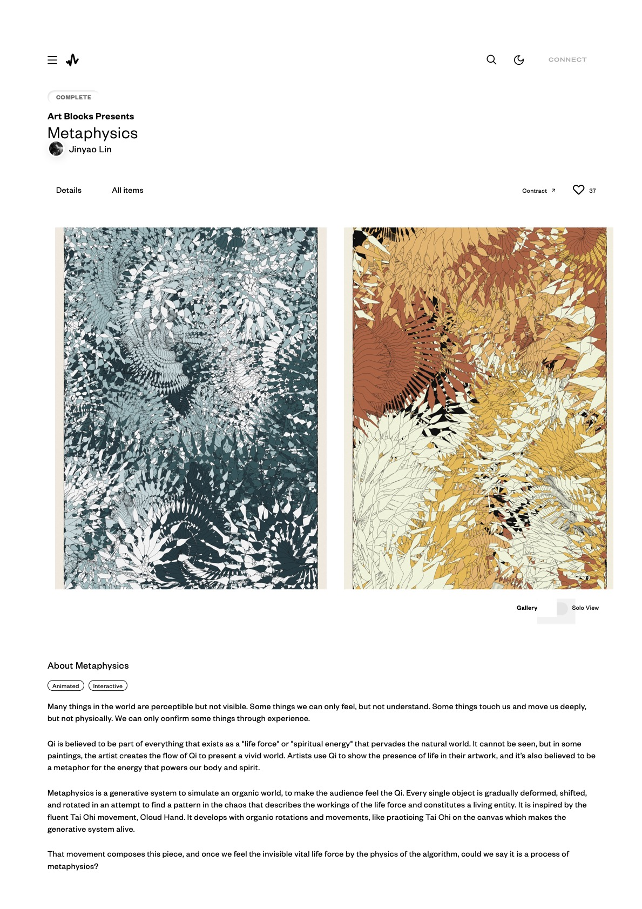

# METAPHYSICS的程式分析

Metaphysics ，中文[形而上]。是筆者在 2022年12月8日在Art Blocks平台發表的一個生成式藝術作品。總共200版，24種顏色，多種不同的生成邏輯。讀者可以在下列網址看到所有的生成結果。<https://www.artblocks.io/collections/presents/projects/0x99a9b7c1116f9ceeb1652de04d5969cce509b069/382?section=all%20items>


	
*Metaphysics by Jinyao Lin*


作品的說明如下:

```
這世界上有很多事物我們可以感知，卻無法看見。有些事情我們只能感受，卻不能理解。有些事情深深地觸動並感動我們，卻並非以物理方式存在。只有透過經驗，我們才能確認某些事物的存在。

氣被認為是存在於所有事物中的一部分，作為一種充滿自然世界的「生命力」或「精神能量」。它無法被看見，但在某些畫作中，藝術家創造了氣的流動以展現一個生動的世界。藝術家用氣來展示他們作品中生命的存在，也被認為是象徵著驅動我們身體與精神的能量的隱喻。

[形而上]是一種生成系統，用來模擬一個有機的世界，使觀眾能感受到氣。每個物件都在嘗試找尋混沌中的規律，逐漸變形、移動和旋轉，這描述了生命力的運作並構成了一個生命實體。這源於流暢的太極動作——雲手的啟發。它隨著有機的旋轉和移動進行，就像在畫布上練習太極一樣，使生成系統變得有生命。

這種運動構成了這件作品，當我們通過算法的物理特性感受到這種無形的生命力時，我們是否可以說這是一種形而上的過程？
```

作品的核心是一個透過noise所生成的葉子物件。

這段程式碼定義了一個JavaScript的類別，名稱為`leaf`。這個類別代表一片葉子，它具有多個屬性和方法。以下是對該程式碼的解析與註解：

```javascript
class leaf {
    // 建構函式，用於初始化一個leaf實例
    constructor(idx, height, width, position, rot, scalelevel, seed) {
        this.idx = idx; // 葉子的索引
        this.height = height; // 葉子的高度
        this.width = width; // 葉子的寬度
        this.position = position; // 葉子的位置
        this.rot = rot; // 葉子的旋轉角度
        this.scalelevel = scalelevel; // 葉子的縮放等級
        this.iter = 0; // 迭代次數，預設為0
        this.strokecolor; // 葉子邊緣的顏色
        this.fillcolor; // 葉子填充的顏色
    }

    // 設定葉子的位置
    setPosition(position) {
        this.position = position;
    }

    // 設定葉子邊緣的顏色
    setColor(color) {
        this.strokecolor = color;
    }

    // 設定葉子填充的顏色
    setFill(color) {
        this.fillcolor = color;
    }

    // 設定葉子的旋轉角度
    setRotation(rot) {
        this.rot = rot;
    }

    // 設定葉子的縮放等級
    setScale(scalelevel) {
        this.scalelevel = scalelevel;
    }

    // 設定迭代次數
    setIter(iter) {
        this.iter = iter;
    }

    // 繪製葉子
    display() {
        let no, realpos;
        let leafarray = [];

        tempcnv.push(); // 保存當前的繪圖狀態
        tempcnv.stroke(this.strokecolor); // 設定邊緣顏色
        tempcnv.fill(this.fillcolor); // 設定填充顏色
        tempcnv.beginShape(); // 開始繪製形狀

        for (var j = 0; j < 40; j++) {
            let vertex_id = j < 20 ? j : 39 - j;
            let leaf_r_l = j < 20 ? 0 : 1;
            let k = j < 20 ? -1 : knifeleaf;
            // 根據噪聲函數計算葉子形狀
            no = (noise(1, this.iter / 20 + this.idx + vertex_id / (this.height * brushdist)) - 0.5) * this.width * k*leafscale;
            let px = no * sin(vertex_id / 20 * PI) * 10;
            let py = -vertex_id / 20 * this.height*leafscale;
            realpos = createVector(px, py).
            add([0, pixeltoratio(1)]).
            mult(this.scalelevel).
            rotate(this.rot).
            add(this.position);
            if (checkborder(realpos.x, realpos.y)){
                tempcnv.vertex(realpos.x, realpos.y);              
            }
        }
        tempcnv.endShape(CLOSE);
        tempcnv.pop();
    }
}
```

這個類別主要包含了葉子的基本屬性（如位置、大小、顏色等），並且提供一些方法來改變這些屬性。`display`方法用來繪製這個葉子，該方法會使用一個噪聲函數來給葉子添加一些自然感的細節。透過簡單的數學公式，這個物件可以產生許多基本形狀的葉子。並且透過noise及leafscale的值，讓葉子有各種不同寬度及變化，例如針葉，闊葉以及鋸齒狀的葉子。

在這裡程式使用了iter作為演化的迭代。當物件被執行一次，iter便會+1，而這個值會影響到noise的變化，因為當葉子每一次被畫出來的時候，都會有些許的不同。程式利用noise的線性變化，讓前後迭代產生漸變，進而模擬一種物件的演化過程。


*Metaphysics #0 by Jinyao Lin*

程式的主枝幹則是透過另外一個類別所定義。

這段程式碼定義了一個叫做`spine`的類別。這個類別代表了一個像是脊柱或是路徑的物件，而它可以被用來控制葉子物件的位置和旋轉。以下是這段程式碼的註解和分析：

```javascript
class spine {
    // 建構函式，用來初始化spine的實例
    constructor(idx, pos, vec, len, life) {
        this.idx = idx; // 索引值
        this.x = pos.x; // 初始x位置
        this.y = pos.y; // 初始y位置
        this.vx = vec.x; // 初始x向量
        this.vy = vec.y; // 初始y向量
        this.pos = pos; // 初始位置
        this.vec = vec; // 初始向量
        this.len = len; // 長度
        this.iter = 0; // 迭代次數，初始為0
        this.life = life; // 生命，可能代表這個spine物件的壽命
        this.lastpx = pos.x; // 最後的x位置，初始為初始x位置
        this.lastpy = pos.y; // 最後的y位置，初始為初始y位置
        this.dead = false; // 是否已死亡，初始為否
        // 創建一個新的leaf物件，與此spine物件關聯
        this.leaf = new leaf(idx, R.random_dec() * 30 + 90, broad, createVector(0, 0), 0, 0, R.random_dec() * 10000);
    }

    // 重置這個spine物件的狀態
    reset() {
        this.pos.set(this.x, this.y); // 重置位置
        this.vec.set(this.vx, this.vy); // 重置向量
        this.iter = 0; // 重置迭代次數
        this.lastpx = this.x; // 重置最後的x位置
        this.lastpy = this.y; // 重置最後的y位置
        this.dead = false; // 重置死亡狀態
    }

    // 顯示這個spine物件
    display() {
        tempcnv.push(); // 儲存當前的繪圖狀態
        // 創建一個新的向量，這個向量會受到噪音函數的影響
        let no = (noise(this.idx / 10, this.iter / 400) - 0.5)*0.5;
        let newvec = p5.Vector.fromAngle(this.vec.heading() + no *PI * spine_angle_range, this.iter*pixeltoratio(1));
        // 計算新的x和y位置
        let px = this.pos.x + newvec.x;
        let py = this.pos.y + newvec.y;
        let spinepx = range(px, canvasSize * 0.7, 0);
        let spinepy = range(py, canvasSize, 0);
        tempcnv.strokeWeight(0.1 * pixeltoratio(1) * leafscale);
        if (checkborder(px,py)&& checkborder(this.lastpx, this.lastpy)){
            tempcnv.line(px, py, this.lastpx, this.lastpy);          
        }
        this.lastpx = px;
        this.lastpy = py;
        // ... 後續的程式碼主要處理畫布上的點，以及設定和繪製關聯的leaf物件
        tempcnv.pop(); // 恢復先前的繪圖狀態
    }
}
```

這個`spine`類別主要負責管理和控制一個葉子物件的生長，它通過改變自己的位置和旋轉來改變葉子物件的位置和旋轉。這個類別包括一些用於重置物件狀態的方法，以及一個`display`方法用於繪製物件本身和關聯的葉子物件。


*Metaphysics #89 by Jinyao Lin*

值得注意的是，這段程式並不是單純的使用noise作為路徑的演化，而是將noise產生的亂數值，轉換到物件的移動角度加總量。

```javascript
let no = (noise(this.idx / 10, this.iter / 400) - 0.5)*0.5;
let newvec = p5.Vector.fromAngle(this.vec.heading() + no *PI * spine_angle_range, this.iter*pixeltoratio(1));
```

這樣的好處是，物件的轉向可以更像是太極的雲手一般，在轉動的時候加速，而要反轉前會減速，如此一來更符合自然的韻律。整個作品畫面則透過這兩個簡單的邏輯來建構。最後形成一個複雜而有其邏輯的畫面。

如同前一章的亂數物件程式，本作品也使用了Random類別。這段程式碼定義了一個叫做`Random`的類別。這個類別被用來創建具有特定種子值的偽隨機數生成器，並提供了一些實用的方法來生成不同範圍和類型的隨機數。較為不同的是，這隻程式使用了artblocks所提供的亂數引擎作為核心，並透過修改完成筆者所需要的亂數函數。以下是該程式碼的註解和分析：

```javascript
class Random {
    // 建構函式，使用myhash來初始化兩個獨立的偽隨機數生成器
    constructor(myhash) {
        this.useA = false;
        // sfc32 是一種具有 128-bit 種子的偽隨機數生成器
        let sfc32 = function(uint128Hex) {
            // 從輸入的128位種子中解析出四個32位整數
            let a = parseInt(uint128Hex.substr(0, 8), 16);
            let b = parseInt(uint128Hex.substr(8, 8), 16);
            let c = parseInt(uint128Hex.substr(16, 8), 16);
            let d = parseInt(uint128Hex.substr(24, 8), 16);
            // 返回一個函數，該函數將進行一次sfc32的迭代並返回一個[0,1)之間的浮點數
            return function() {
                // ...
                return (t >>> 0) / 4294967296;
            };
        };
        // 創建兩個獨立的偽隨機數生成器
        this.prngA = new sfc32(myhash.substr(2, 32));
        this.prngB = new sfc32(myhash.substr(34, 32));
        // 進行一百萬次迭代以"燃燒"生成器，增加其隨機性
        for (let i = 0; i < 1e6; i += 2) {
            this.prngA();
            this.prngB();
        }
    }
    // 返回一個[0,1)之間的浮點數，每次調用會交替使用兩個生成器
    random_dec() {
        this.useA = !this.useA;
        return this.useA ? this.prngA() : this.prngB();
    }
    // 返回一個在[a,b)範圍內的浮點數
    random_num(a, b) {
        return a + (b - a) * this.random_dec();
    }
    // ...
    // 從一個列表中選擇一個隨機元素
    random_choice(list) {
        return list[this.random_int(0, list.length - 1)];
    }
    // 從一個列表中根據給定的權重選擇一個隨機元素
    chancedice(list) {
        // ...
        return diceresult;
    }
    // 返回一個隨機向量
    randomVector(minx,maxx,miny,maxy){
        return createVector(this.random_num(canvasSize*minx,canvasSize*maxx),this.random_num(canvasSize*miny,canvasSize*maxy));  
    }
}
```

此類的功能是使用種子（seed）來產生可預測，但在表面上看起來像隨機的數字序列。這對於很多種類型的模擬和遊戲來說是很重要的，因為它們需要能夠在每次執行時重現相同的結果。

程式的主程式創建並控制一個具有複雜視覺效果的畫布，並給予建立動態視覺：

1. `setup()`：在p5.js環境中初始化一些變量和設置。
2. `draw()`：它會不斷地在每個畫面更新時被調用。在這個函數中，你會看到一個條件分支`if (stage == 1) {...} else if (stage == 2) {...}`，這樣的結構，根據`stage`的值，程序會進入不同的繪圖和更新狀態。
3. `setcanvasdata()`：這個函數是用於創建一個700x1000的二維陣列，並將每一個元素都初始化為0。這部分是拿來做碰撞測試的。
4. `initGraphics(isWEBGL)`：這個函數用於創建一個新的p5.js圖形對象。該對象的大小由`canvasSize`決定，並且根據`isWEBGL`的值決定是否使用WEBGL模式。
5. `resetCanvas()`：這個函數調用`initGraphics()`函數三次，用於創建或重設`tempcnv`、`backgroundcnv`和`fxcnv`這三個圖形對象。
6. `prepare()`：這個函數將畫布準備好，將背景設定為一個特定的顏色，並將一個特定的效果應用到整個畫布上。
7. `initValue()`：這個函數是用來初始化一系列的參數值，這些參數將影響到後續繪圖的結果。

這只是一個初步的解讀，這段程式碼中還有許多其他細節和功能，如設定顏色模式、創建隨機種子、調整畫面密度等等，以達到特定的視覺效果。其中包含了一些關於畫布大小、顏色、繪圖模式等的設定，也包含了一些關於動畫和視覺效果的控制。

下面是每個部分的註解：

```javascript
// 定義一些全局變數
let autosave = false;  // 自動儲存標誌
let hash = tokenData.hash;  // 用於種子的哈希值
let density = 2;  // 顯示密度
let R = new Random(hash);  // 基於哈希值創建一個新的隨機數生成器
let debug = true;  // 調試標誌
// 省略一些其他的變量定義...

function setup() {
    // setup() 函數在 p5.js 中會在一開始被調用一次
    // 這裡對 canvas 進行一些初始化設定

    // 依據是否為行動裝置設定像素密度
    if (/Android|webOS|iPhone|iPad|iPod|BlackBerry/i.test(navigator.userAgent)) {
      mypixelDensity = displayDensity();
    } else {
      mypixelDensity = displayDensity() * density;
    }
    
    // 創建一個 3D 繪圖環境的畫布
    cnv = createCanvas(canvasSize * 0.7, canvasSize, WEBGL);
    // 省略一些初始化設定...
}

function draw() {
    // draw() 函數在 p5.js 中每個畫面更新時會被調用
    // 這裡是更新動畫的地方

    if (stage == 1) {
        // 如果當前是階段 1
        // 檢查畫面中的所有 "myspine" 對象，對於出界或生命期結束的對象進行標記
        // 對於還存活的對象，將其顯示在畫面上
    } else if (stage == 2) {
        // 如果當前是階段 2
        // 清空特效畫布，並將特效畫布繪製到主畫布上
    }
}

function initGraphics(isWEBGL){
  // 這個函數根據傳入的參數決定是創建一個 2D 或是 3D 的繪圖環境，並設定一些共享屬性
}

function resetCanvas() {
  // 重設畫布環境
}

function prepare() {
  // 這個函數準備一些畫布資料和設定背景
}

function initValue() {
  // 初始化一些值，大部分都是使用隨機數生成器生成
}
```

這個程式碼通過使用隨機數生成器，每次運行都會產生不同的結果。


完整的程式請參閱下方。

```javascript
let brushname = ["Diffusion", "Multi-Diffusion", "Symmetric", "Clone", "Chaos", "Construction", "Mass Construction"];
let animationspeed = 20;
let mg = 0.022;

let coloring_db = ["continuous", "continuous segment", "vivant"];


let brushdist_db = [
    1, 0.5, 0.1, 0.05
];
let texture_db = [{
        "name": "Golden Fiber",
        "texturecolor": [46, 80, 20, 90],
        "texturetype": 0,
        "fiber_count": 120000,
        "fiber_width": 100
    },
    {
        "name": "Silver Fiber",
        "texturecolor": [0, 0, 20, 100],
        "texturetype": 0,
        "fiber_count": 100000,
        "fiber_width": 100
    },
    {
        "name": "Linen Dark Fiber",
        "texturecolor": [46, 30, 40, 100],
        "texturetype": 0,
        "fiber_count": 100000,
        "fiber_width": 100
    },
    {
        "name": "Linen Light Fiber",
        "texturecolor": [46, 30, 80, 100],
        "texturetype": 0,
        "fiber_count": 100000,
        "fiber_width": 100
    },
    {
        "name": "Dark Red Fiber",
        "texturecolor": [6, 80, 0, 100],
        "texturetype": 0,
        "fiber_count": 100000,
        "fiber_width": 100
    },
    {
        "name": "Blue Fiber",
        "texturecolor": [220, 30, 0, 100],
        "texturetype": 0,
        "fiber_count": 100000,
        "fiber_width": 100
    },
    {
        "name": "Golden Wood",
        "texturecolor": [46, 60, 60, 100],
        "fiber_count": 100000,
        "texturetype": 1,
        "fiber_width": 100
    },
    {
        "name": "Silver Wood",
        "texturecolor": [0, 0, 20, 100],
        "texturetype": 1,
        "fiber_count": 100000,
        "fiber_width": 100
    },
    {
        "name": "Red Wood",
        "texturecolor": [6, 80, 20, 100],
        "texturetype": 1,
        "fiber_count": 100000,
        "fiber_width": 100
    },
    {
        "name": "Bamboo",
        "texturecolor": [46, 40, 60, 100],
        "texturetype": 1,
        "fiber_count": 100000,
        "fiber_width": 100
    },

    {
        "name": "Golden Tilt",
        "texturecolor": [46, 40, 0, 100],
        "fiber_count": 100000,
        "texturetype": 2,
        "fiber_width": 100
    },
    {
        "name": "Silver Tilt",
        "texturecolor": [0, 0, 20, 100],
        "texturetype": 2,
        "fiber_count": 100000,
        "fiber_width": 100
    },
    {
        "name": "Red Tilt",
        "texturecolor": [6, 80, 20, 100],
        "texturetype": 2,
        "fiber_count": 100000,
        "fiber_width": 100
    },
    {
        "name": "Bamboo Tilt",
        "texturecolor": [46, 30, 70, 100],
        "texturetype": 2,
        "fiber_count": 100000,
        "fiber_width": 100
    },
]
let bgcolor_db = [{
        "name": "Black",
        "texture_list": [0, 1, 6, 10, 11],
        "color": [0, 0, 0],
        "contrast": 50,
        "saturation": 20

    },
    {
        "name": "Grey",
        "texture_list": [1, 7, 11],
        "color": [0, 0, 65],
        "contrast": 40,
        "saturation": 20

    },
    {
        "name": "Paper1",
        "texture_list": [2, 9, 13],
        "color": [33, 8, 95],
        "contrast": 10,
        "saturation": 0


    },
    {
        "name": "Paper2",
        "texture_list": [3, 9, 13],
        "color": [46, 8, 95],
        "contrast": 20,
        "saturation": 5
    },
    {
        "name": "Red",
        "texture_list": [4, 8, 12],
        "color": [2, 28, 35],
        "contrast": 40,
        "saturation": 20
    },
    {
        "name": "Light_gold",
        "texture_list": [3, 6, 13],
        "color": [49, 15, 85],
        "contrast": 20,
        "saturation": 20
    },
    {
        "name": "Light_blue",
        "texture_list": [1, 5],
        "color": [220, 5, 85],
        "contrast": 20,
        "saturation": 20
    },
    {
        "name": "Dark_gold",
        "texture_list": [0, 6, 10],
        "color": [49, 45, 10],
        "contrast": 20,
        "saturation": 20
    },
    {
        "name": "Minus_black",
        "texture_list": [0, 1, 6, 10, 11],
        "color": [0, 0, 0],
        "contrast": 20,
        "saturation": 20

    },


];
let variety_db = [{
        "name": "Sketch",
        "bgcolor_list": [2, 3],
        "colorset": [
            [33, 6, 98],
            [33, 6, 98],
            [33, 6, 98],
            [33, 6, 98],
            [33, 6, 98]
        ],
        "spine_angle_range": [2, 20],
        "wireframe_color": [0, 0, 5],
        "brushset_dicer": [1, 1, 1, 1, 1, 1, 1],
        "broad": [2, 4],
        "minlife": [300, 400],
        "maxlife": [500, 700],
        "brushdist": [1, 0.5, 0.3],
        "knifeleaf": [0, 1],
        "leafscale": [1, 2]
    },
    {
        "name": "Monochrome",
        "bgcolor_list": [0, 1],
        "colorset": [
            [208, 23, 35],
            [203, 12, 45],
            [0, 0, 98],
            [107, 3, 65],
            [174, 4, 45]
        ],
        "spine_angle_range": [2, 30],
        "wireframe_color": [0, 0, 5],
        "brushset_dicer": [1, 1, 1, 1, 1, 1, 1],
        "broad": [2, 5],
        "minlife": [300, 400],
        "maxlife": [500, 700],
        "brushdist": [1, 0.5, 0.2],
        "knifeleaf": [0, 1],
        "leafscale": [1, 2]

    },
    {
        "name": "Aomori",
        "bgcolor_list": [1, 2, 3, 6],
        "colorset": [
            [208, 56, 55],
            [208, 51, 65],
            [16, 50, 99],
            [208, 25, 99],
            [203, 42, 75]
        ],
        "spine_angle_range": [4, 20],
        "wireframe_color": [0, 0, 5],
        "brushset_dicer": [1, 1, 1, 1, 1, 1, 1],
        "broad": [2, 5],
        "minlife": [300, 400],
        "maxlife": [500, 700],
        "brushdist": [1, 0.8, 0.4],
        "knifeleaf": [0, 1],
        "leafscale": [1, 2]
    },
    {
        "name": "Aokigahara",
        "bgcolor_list": [0, 2, 3],
        "colorset": [
            [191, 68, 25],
            [186, 68, 35],
            [186, 22, 75],
            [186, 12, 85],
            [2, 0, 95]
        ],
        "spine_angle_range": [2, 60],
        "wireframe_color": [0, 0, 5],
        "brushset_dicer": [1, 1, 1, 1, 1, 1, 1],
        "broad": [2, 4],
        "minlife": [300, 400],
        "maxlife": [500, 700],
        "brushdist": [1, 0.5, 0.1, 0.05],
        "knifeleaf": [0, 1],
        "leafscale": [1, 2]
    },
    {
        "name": "Arashiyama",
        "bgcolor_list": [0, 4],
        "colorset": [
            [22, 48, 55],
            [11, 48, 65],
            [45, 18, 99],
            [33, 41, 99],
            [22, 58, 85]
        ],
        "spine_angle_range": [10, 50],
        "wireframe_color": [0, 0, 5],
        "brushset_dicer": [1, 1, 1, 1, 1, 1, 1],
        "broad": [2, 5],
        "minlife": [300, 400],
        "maxlife": [500, 700],
        "brushdist": [1, 0.8, 0.4, 0.2],
        "knifeleaf": [0, 1],
        "leafscale": [1, 2]
    },
    {
        "name": "Mei",
        "bgcolor_list": [2, 3],
        "colorset": [
            [33, 8, 99],
            [33, 8, 99],
            [6, 45, 99],
            [33, 8, 99],
            [33, 8, 99]
        ],
        "spine_angle_range": [4, 12],
        "wireframe_color": [0, 0, 5],
        "brushset_dicer": [1, 1, 1, 1, 1, 1, 1],
        "broad": [2, 5],
        "minlife": [300, 400],
        "maxlife": [500, 700],
        "brushdist": [1, 0.5, 0.2],
        "knifeleaf": [0, 1],
        "leafscale": [1, 2]
    },
    {
        "name": "Strelitzia",
        "bgcolor_list": [2, 3],
        "colorset": [
            [228, 65, 44],
            [206, 65, 44],
            [46, 75, 99],
            [46, 35, 99],
            [164, 32, 75]
        ],
        "spine_angle_range": [2, 12],
        "wireframe_color": [0, 0, 5],
        "brushset_dicer": [1, 1, 1, 1, 1, 1, 1],
        "broad": [2, 5],
        "minlife": [300, 400],
        "maxlife": [500, 700],
        "brushdist": [1, 0.5, 0.1, 0.05],
        "knifeleaf": [0, 1],
        "leafscale": [1, 2]
    },
    {
        "name": "Northland",
        "bgcolor_list": [6],
        "colorset": [
            [220, 66, 65],
            [220, 66, 55],
            [220, 17, 75],
            [214, 45, 75],
            [214, 67, 55]
        ],
        "spine_angle_range": [2, 20],
        "wireframe_color": [0, 0, 100],
        "brushset_dicer": [1, 1, 1, 1, 1, 1, 1],
        "broad": [2, 6],
        "minlife": [300, 400],
        "maxlife": [500, 700],
        "brushdist": [0.8, 0.5, 0.1, 0.05],
        "knifeleaf": [0, 1],
        "leafscale": [1, 2]
    },
    {
        "name": "Morandi",
        "bgcolor_list": [2, 3],
        "colorset": [
            [203, 53, 35],
            [203, 47, 45],
            [197, 25, 85],
            [197, 28, 75],
            [203, 36, 65]
        ],
        "spine_angle_range": [2, 40],
        "wireframe_color": [0, 0, 5],
        "brushset_dicer": [1, 1, 1, 1, 1, 1, 1],
        "broad": [2, 5],
        "minlife": [300, 400],
        "maxlife": [500, 700],
        "brushdist": [1, 0.5, 0.1, 0.05],
        "knifeleaf": [0, 1],
        "leafscale": [1, 2]
    },
    {
        "name": "Nepal",
        "bgcolor_list": [3],
        "colorset": [
            [203, 84, 12],
            [158, 55, 47],
            [4, 84, 73],
            [46, 75, 90],
            [0, 0, 25]
        ],
        "spine_angle_range": [2, 20],
        "wireframe_color": [0, 0, 99],
        "brushset_dicer": [1, 1, 1, 1, 1, 1, 1],
        "broad": [3, 7],
        "minlife": [300, 400],
        "maxlife": [500, 700],
        "brushdist": [1, 0.5, 0.4, 0.3],
        "knifeleaf": [1, 1],
        "leafscale": [1, 2]
    },
    {
        "name": "Myrtle Rose",
        "bgcolor_list": [2, 3],
        "colorset": [
            [181, 68, 46],
            [340, 22, 16],
            [183, 75, 33],
            [110, 30, 50],
            [0, 59, 85]
        ],
        "spine_angle_range": [2, 6],
        "wireframe_color": [46, 8, 95],
        "brushset_dicer": [1, 1, 1, 1, 1, 1, 1],
        "broad": [3, 5],
        "minlife": [300, 400],
        "maxlife": [500, 700],
        "brushdist": [0.75, 0.5, 0.1, 0.05],
        "knifeleaf": [0, 1],
        "leafscale": [1, 2]
    },
    {
        "name": "Calligraphy",
        "bgcolor_list": [0, 7],
        "colorset": [
            [50, 15, 35],
            [39, 23, 15],
            [33, 3, 95],
            [33, 12, 85],
            [39, 12, 55]
        ],
        "spine_angle_range": [2, 20],
        "wireframe_color": [0, 0, 5],
        "brushset_dicer": [1, 1, 1, 1, 1, 1, 1],
        "broad": [1, 10],
        "minlife": [300, 400],
        "maxlife": [500, 700],
        "brushdist": [1, 0.5, 0.1, 0.05],
        "knifeleaf": [0, 1],
        "leafscale": [1, 2]
    },
    {
        "name": "Barcelona",
        "bgcolor_list": [2, 3],
        "colorset": [
            [180, 91, 45],
            [73, 20, 85],
            [15, 99, 87],
            [40, 84, 95],
            [238, 97, 13]
        ],
        "spine_angle_range": [4, 20],
        "wireframe_color": [0, 0, 5],
        "brushset_dicer": [1, 1, 1, 1, 1, 1, 1],
        "broad": [3, 6],
        "minlife": [300, 400],
        "maxlife": [500, 700],
        "brushdist": [0.75, 0.5, 0.1, 0.05],
        "knifeleaf": [0, 1],
        "leafscale": [1, 2]
    },
    {
        "name": "Prussian",
        "bgcolor_list": [0, 2],
        "colorset": [
            [191, 53, 55],
            [46, 15, 95],
            [5, 34, 99],
            [0, 62, 85],
            [208, 98, 35]
        ],
        "spine_angle_range": [4, 30],
        "wireframe_color": [0, 0, 15],
        "brushset_dicer": [1, 1, 1, 1, 1, 1, 1],
        "broad": [2, 7],
        "minlife": [300, 400],
        "maxlife": [500, 700],
        "brushdist": [1, 0.5, 0.1, 0.05],
        "knifeleaf": [0.5, 1],
        "leafscale": [1, 2]
    },

    {
        "name": "Kinkakuji",
        "bgcolor_list": [7],
        "colorset": [
            [46, 37, 90],
            [46, 98, 85],
            [46, 55, 75],
            [46, 89, 65],
            [46, 98, 55]
        ],
        "spine_angle_range": [4, 20],
        "wireframe_color": [0, 0, 5],
        "brushset_dicer": [1, 1, 1, 1, 1, 1, 1],
        "broad": [3, 8],
        "minlife": [300, 400],
        "maxlife": [500, 700],
        "brushdist": [0.75, 0.5, 0.1, 0.05],
        "knifeleaf": [0, 1],
        "leafscale": [1, 2]
    },
    {
        "name": "Maize Crayola",
        "bgcolor_list": [2],
        "colorset": [
            [45, 72, 95],
            [33, 20, 95],
            [22, 55, 85],
            [0, 72, 65],
            [160, 26, 75]
        ],
        "spine_angle_range": [4, 20],
        "wireframe_color": [0, 0, 5],
        "brushset_dicer": [1, 1, 1, 1, 1, 1, 1],
        "broad": [2, 4],
        "minlife": [300, 400],
        "maxlife": [500, 700],
        "brushdist": [0.75, 0.5, 0.3],
        "knifeleaf": [0, 1],
        "leafscale": [1, 2]
    },
    {
        "name": "Cardinal",
        "bgcolor_list": [0],
        "colorset": [
            [0, 75, 85],
            [22, 62, 95],
            [39, 53, 95],
            [225, 98, 65],
            [338, 89, 75]
        ],
        "spine_angle_range": [4, 20],
        "wireframe_color": [46, 85, 50],
        "brushset_dicer": [1, 1, 1, 1, 1, 1, 1],
        "broad": [2, 4],
        "minlife": [300, 400],
        "maxlife": [500, 700],
        "brushdist": [0.75, 0.5, 0.3],
        "knifeleaf": [0, 1],
        "leafscale": [1, 2]
    },
    {
        "name": "Opal",
        "bgcolor_list": [8],
        "colorset": [
            [186, 23, 85],
            [0, 0, 95],
            [186, 34, 75],
            [5, 44, 95],
            [0, 0, 5]
        ],
        "spine_angle_range": [4, 20],
        "wireframe_color": [46, 85, 50],
        "brushset_dicer": [0, 0, 0, 0, 0, 1, 0],
        "broad": [2, 4],
        "minlife": [300, 400],
        "maxlife": [500, 700],
        "brushdist": [0.75, 0.5, 0.3],
        "knifeleaf": [1, 1],
        "leafscale": [1, 2]
    },
    {
        "name": "Tart Orange",
        "bgcolor_list": [2, 3],
        "colorset": [
            [186, 31, 65],
            [186, 77, 55],
            [67, 9, 95],
            [45, 42, 65],
            [5, 72, 95]
        ],
        "spine_angle_range": [4, 20],
        "wireframe_color": [46, 85, 50],
        "brushset_dicer": [0, 1, 1, 1, 0, 1, 0],
        "broad": [2, 4],
        "minlife": [300, 400],
        "maxlife": [500, 700],
        "brushdist": [0.75, 0.5, 0.3],
        "knifeleaf": [1, 1],
        "leafscale": [1, 2]
    },
    {
        "name": "Tropica",
        "bgcolor_list": [8],
        "colorset": [
            [355, 66, 95],
            [203, 83, 80],
            [45, 47, 95],
            [28, 41, 95],
            [0, 0, 5]
        ],
        "spine_angle_range": [4, 20],
        "wireframe_color": [0, 0, 5],
        "brushset_dicer": [0, 1, 1, 1, 0, 1, 0],
        "broad": [2, 4],
        "minlife": [300, 400],
        "maxlife": [500, 700],
        "brushdist": [0.75, 0.5, 0.3],
        "knifeleaf": [1, 1],
        "leafscale": [1, 2]
    },
    {
        "name": "Plum Blue",
        "bgcolor_list": [8],
        "colorset": [
            [237, 26, 15],
            [208, 66, 55],
            [128, 14, 75],
            [22, 34, 95],
            [11, 45, 95]
        ],
        "spine_angle_range": [4, 10],
        "wireframe_color": [0, 0, 5],
        "brushset_dicer": [0, 1, 1, 1, 0, 1, 0],
        "broad": [2, 4],
        "minlife": [300, 400],
        "maxlife": [500, 700],
        "brushdist": [0.75, 0.5, 0.3],
        "knifeleaf": [1, 1],
        "leafscale": [1, 2]
    },
    {
        "name": "Autumn",
        "bgcolor_list": [2, 3],
        "colorset": [
            [79, 83, 45],
            [67, 42, 65],
            [39, 20, 95],
            [11, 77, 65],
            [0, 98, 35]
        ],
        "spine_angle_range": [4, 10],
        "wireframe_color": [0, 0, 5],
        "brushset_dicer": [0, 1, 1, 1, 0, 1, 0],
        "broad": [2, 4],
        "minlife": [300, 400],
        "maxlife": [500, 700],
        "brushdist": [0.75, 0.5, 0.3],
        "knifeleaf": [1, 1],
        "leafscale": [1, 2]
    },
    {
        "name": "Grullo",
        "bgcolor_list": [2, 3],
        "colorset": [
            [67, 10, 95],
            [39, 66, 95],
            [33, 55, 95],
            [16, 66, 75],
            [0, 0, 5]
        ],
        "spine_angle_range": [4, 10],
        "wireframe_color": [0, 0, 5],
        "brushset_dicer": [0, 1, 1, 1, 0, 1, 0],
        "broad": [2, 4],
        "minlife": [300, 400],
        "maxlife": [500, 700],
        "brushdist": [0.75, 0.5, 0.3],
        "knifeleaf": [1, 1],
        "leafscale": [1, 2]
    },
    {
        "name": "Pewter Blue",
        "bgcolor_list": [2, 3],
        "colorset": [
            [203, 25, 75],
            [146, 25, 45],
            [45, 69, 95],
            [45, 69, 95],
            [0, 61, 65]
        ],
        "spine_angle_range": [4, 10],
        "wireframe_color": [0, 0, 5],
        "brushset_dicer": [0, 1, 1, 1, 0, 1, 0],
        "broad": [2, 4],
        "minlife": [300, 400],
        "maxlife": [500, 700],
        "brushdist": [0.75, 0.5, 0.3],
        "knifeleaf": [1, 1],
        "leafscale": [1, 2]
    }
];

class spine {
    constructor(idx, pos, vec, len, life) {
        this.idx = idx;
        this.x = pos.x;
        this.y = pos.y;
        this.vx = vec.x;
        this.vy = vec.y;
        this.pos = pos;
        this.vec = vec;
        this.len = len;
        this.iter = 0;
        this.life = life;
        this.lastpx = pos.x;
        this.lastpy = pos.y;
        this.dead = false;
        this.leaf = new leaf(idx, R.random_dec() * 30 + 90, broad, createVector(0, 0), 0, 0, R.random_dec() * 10000);

    }

    reset() {
        this.pos.set(this.x, this.y);
        this.vec.set(this.vx, this.vy);
        this.iter = 0;
        this.lastpx = this.x;
        this.lastpy = this.y;
        this.dead = false;
    }

    display() {
        tempcnv.push();
        let no = (noise(this.idx / 10, this.iter / 400) - 0.5) * 0.5;
        let newvec = p5.Vector.fromAngle(this.vec.heading() + no * PI * spine_angle_range, this.iter * pixeltoratio(1));
        let px = this.pos.x + newvec.x;
        let py = this.pos.y + newvec.y;
        let spinepx = range(px, canvasSize * 0.7, 0);
        let spinepy = range(py, canvasSize, 0);
        tempcnv.strokeWeight(0.1 * pixeltoratio(1) * leafscale);
        if (checkborder(px, py) && checkborder(this.lastpx, this.lastpy)) {
            tempcnv.line(px, py, this.lastpx, this.lastpy);
        }
        this.lastpx = px;
        this.lastpy = py;
        let nspinepx = Math.floor(spinepx / (canvasSize * 0.7) * 700);
        let nspinepy = Math.floor(spinepy / canvasSize * 1000);
        if (canvasData[nspinepx][nspinepy] == 0 || canvasData[nspinepx][nspinepy] == this.idx) {
            canvasData[nspinepx][nspinepy] = this.idx;
        } else {
            if (deathflag != false)
                this.dead = true;
        }

        //let leafcolor = colorbase[Math.floor(abs(no) * 30) % 5];
        let leafcolor;
        if (coloring == 0) {
            leafcolor = colorbase[this.idx % 5];
        } else if (coloring == 1) {
            leafcolor = colorbase[int(this.idx / 2) % 5];
        } else if (coloring == 2) {
            leafcolor = colorbase[int(abs(no * 300)) % 5];
        }

        let backgroundmask = max(bgcolor.contrast - this.iter * 0.3, 0);
        let saturationmask = max(bgcolor.saturation - this.iter * 0.3, 0);

        let c = color(leafcolor[0], min(leafcolor[1] - saturationmask, 100), min(leafcolor[2] - backgroundmask, 100));
        //fill(c);
        this.leaf.setFill(c);
        this.leaf.setPosition(createVector(px, py));
        this.leaf.setScale(pixeltoratio(0.4) * ((this.iter + 500) / 800));
        this.leaf.setRotation(no * 720);
        this.leaf.setIter(this.iter);
        this.leaf.setColor(variety.wireframe_color);
        this.leaf.display();
        tempcnv.pop();
    }


}


class leaf {
    constructor(idx, height, width, position, rot, scalelevel, seed) {

        this.idx = idx;
        this.height = height;
        this.width = width;
        this.position = position;
        this.rot = rot;
        this.scalelevel = scalelevel;
        this.iter = 0;
        this.strokecolor;
        this.fillcolor;

    }

    setPosition(position) {
        this.position = position;
    }
    setColor(color) {
        this.strokecolor = color;
    }
    setFill(color) {
        this.fillcolor = color;
    }

    setRotation(rot) {
        this.rot = rot;
    }
    setScale(scalelevel) {
        this.scalelevel = scalelevel;
    }
    setIter(iter) {
        this.iter = iter;
    }

    display() {
        let no, realpos;
        let leafarray = [];

        tempcnv.push();
        tempcnv.stroke(this.strokecolor);
        tempcnv.fill(this.fillcolor);
        tempcnv.beginShape();

        for (var j = 0; j < 40; j++) {
            let vertex_id = j < 20 ? j : 39 - j;
            let leaf_r_l = j < 20 ? 0 : 1;
            let k = j < 20 ? -1 : knifeleaf;
            //k=1;
            no = (noise(1, this.iter / 20 + this.idx + vertex_id / (this.height * brushdist)) - 0.5) * this.width * k * leafscale;
            let px = no * sin(vertex_id / 20 * PI) * 10;
            let py = -vertex_id / 20 * this.height * leafscale;
            realpos = createVector(px, py).
            add([0, pixeltoratio(1)]).
            mult(this.scalelevel).
            rotate(this.rot).
            add(this.position);
            if (checkborder(realpos.x, realpos.y)) {
                tempcnv.vertex(realpos.x, realpos.y);
            }
        }
        tempcnv.endShape(CLOSE);
        tempcnv.pop();
    }
}

class Random {
    constructor(myhash) {
        this.useA = false;
        let sfc32 = function(uint128Hex) {
            let a = parseInt(uint128Hex.substr(0, 8), 16);
            let b = parseInt(uint128Hex.substr(8, 8), 16);
            let c = parseInt(uint128Hex.substr(16, 8), 16);
            let d = parseInt(uint128Hex.substr(24, 8), 16);
            return function() {
                a |= 0;
                b |= 0;
                c |= 0;
                d |= 0;
                let t = (((a + b) | 0) + d) | 0;
                d = (d + 1) | 0;
                a = b ^ (b >>> 9);
                b = (c + (c << 3)) | 0;
                c = (c << 21) | (c >>> 11);
                c = (c + t) | 0;
                return (t >>> 0) / 4294967296;
            };
        };
        this.prngA = new sfc32(myhash.substr(2, 32));
        this.prngB = new sfc32(myhash.substr(34, 32));
        for (let i = 0; i < 1e6; i += 2) {
            this.prngA();
            this.prngB();
        }
    }
    random_dec() {
        this.useA = !this.useA;
        return this.useA ? this.prngA() : this.prngB();
    }
    random_num(a, b) {
        return a + (b - a) * this.random_dec();
    }

    random_num2(list) {
        return list[0] + (list[1] - list[0]) * this.random_dec();
    }
    random_int(a, b) {
        return Math.floor(this.random_num(a, b + 1));
    }
    random_bool(p) {
        return this.random_dec() < p;
    }
    random_choice(list) {
        return list[this.random_int(0, list.length - 1)];
    }
    chancedice(list) {
        let totaldice = 0;
        let dicearray = [];
        let diceresult = 0;
        for (var i = 0; i < list.length; i++) {
            totaldice += list[i];
            for (var j = 0; j < list[i]; j++) {
                dicearray.push(i);
            }
        }
        diceresult = dicearray[Math.floor(this.random_dec() * totaldice)];
        return diceresult;
    }
    randomVector(minx, maxx, miny, maxy) {
        return createVector(this.random_num(canvasSize * minx, canvasSize * maxx), this.random_num(canvasSize * miny, canvasSize * maxy));
    }
}


let varying = 'precision highp float; varying vec2 vTexCoord;';

let vs =
    varying +
    'attribute vec3 aPosition;' +
    'attribute vec2 aTexCoord;' +
    'void main() {' +
    '  vTexCoord = aTexCoord;' +
    '  vec4 positionVec4 = vec4(aPosition, 1.0);' +
    'positionVec4.xy = (positionVec4.xy * 2.0 - 1.0)*1.0;' +
    'gl_Position = positionVec4;' +
    '}';

let fs =
    varying +
    'uniform sampler2D uTexture;' +
    'uniform float amount;' +
    'float rand(vec2 co) {' +
    '        return fract(sin(dot(co.xy ,vec2(12.9898,78.233))) * 43758.5453);' +
    '    }' +
    'void main() {' +
    'vec4 color = texture2D(uTexture, vTexCoord);' +
    'float diff = (rand(vTexCoord) - 0.5) * amount;' +
    'color.r += diff;' +
    'color.g += diff;' +
    'color.b += diff;' +
    'gl_FragColor = color;' +
    '}';


let noiseShader, highlightShader;
let recording = false;
let recorder;
let chunks = [];

const fr = 30;

function record() {
    chunks.length = 0;

    let stream = document.querySelector('canvas').captureStream(fr);

    recorder = new MediaRecorder(stream);

    recorder.ondataavailable = e => {
        if (e.data.size) {
            chunks.push(e.data);
        }
    };

    recorder.onstop = exportVideo;

}

function exportVideo(e) {
    var blob = new Blob(chunks, {
        'type': 'video/webm'
    });

    // Draw video to screen
    var videoElement = document.createElement('video');
    videoElement.setAttribute("id", Date.now());
    videoElement.controls = true;
    document.body.appendChild(videoElement);
    videoElement.src = window.URL.createObjectURL(blob);

    // Download the video 
    var url = URL.createObjectURL(blob);
    var a = document.createElement('a');
    document.body.appendChild(a);
    a.style = 'display: none';
    a.href = url;
    a.download = 'metaphysics.webm';
    a.click();
    window.URL.revokeObjectURL(url);

}


function checkborder(px, py) {
    return px > (canvasSize * mg) && px < (canvasSize * (0.7 - mg)) && py > (canvasSize * mg) && py < (canvasSize * (1 - mg)) ? true : false;
}


function pixeltoratio(pixel) {
    return pixel * canvasSize / 800;
}

function randomVector(minx, maxx, miny, maxy) {
    return createVector(R.random_num(canvasSize * minx, canvasSize * maxx), R.random_num(canvasSize * miny, canvasSize * maxy));
}


function range(value, max, min) {
    if (value > max) {
        value = max;
    }
    if (value < min) {
        value = min;
    }
    return value;
}

function restart() {
    mypixelDensity = displayDensity() * density;
    resetCanvas();
    prepare();
    scene = 0;
    stage = 1;
    //console.log("reset");
    for (var i = 0; i < myspine.length; i++) {
        myspine[i].reset();
    }


}

function keyPressed() {
    if (keyCode === 83 && autosave == false) {
        density = 3;
        animationspeed = 20;
        autosave = true;
        restart();
    } else if (keyCode == 65) {
        density = 2;
        autosave = false;
        animationspeed = 1;
        restart();
    } else if (keyCode == 66) {
        if (mg == 0) {
            mg = 0.022;
        } else {
            mg = 0;
        }
        density = 2;
        autosave = false;
        animationspeed = 20;
        restart();

    } else if (keyCode == 82 && !recording) {
        recording = true;
        console.log("recording started!");
        recorder.start();
        density = 2;
        autosave = false;
        animationspeed = 1;
        restart();

    }

}
let autosave = false;
let hash = tokenData.hash;
let density = 2;
let R = new Random(hash);
let debug = true;
let canvasSize, maxWindowSize;
let lastpx, lastpy;
let myspine, myleaf;
let spinecount, spinelife;
let spine_angle_range, broad, maxlife, minlife, brushtype, brushdist, contrast, coloring;
let knifeleaf, leafscale;
let deathflag, skipborder;
let cnv, tempcnv, backgroundcnv, fxcnv;
let margin;
let execbox = 0;
let canvasdata;
let stage = 0;
let scene, maxscene;
let variety, variety_idx;
let mypixelDensity;
let texturetype;
let bgcolor, bgtexture;


function setup() {
    canvasSize = windowHeight;
    margin = canvasSize * 0.2;
    if (/Android|webOS|iPhone|iPad|iPod|BlackBerry/i.test(navigator.userAgent)) {
        mypixelDensity = displayDensity();
    } else {
        mypixelDensity = displayDensity() * density;
    }

    cnv = createCanvas(canvasSize * 0.7, canvasSize, WEBGL);
    record();

    colorMode(HSB, 360, 100, 100);

    initValue();
    myleaf = [];
    initspine();
    resetCanvas();
    prepare();

    stage = 1;
}

function setcanvasdata() {
    canvasData = [];
    for (var i = 0; i <= 700; i++) {
        canvasData[i] = [];
        for (var j = 0; j <= 1000; j++) {
            canvasData[i][j] = 0;
        }
    }
}


function draw() {
    if (stage == 1) {
        let alivecount = 0;
        for (var frame = 0; frame < animationspeed; frame++)
            for (var i = myspine.length - 1; i >= 0; i--) {
                if (checkborder(myspine[i].pos.x, myspine[i].pos.y) != true) {
                    myspine[i].dead = true;
                    spinelife--;
                }
                if (myspine[i].iter > myspine[i].life && myspine[i].dead != true) {
                    myspine[i].dead = true;
                    spinelife--;
                }
                if (myspine[i].dead == false) {
                    myspine[i].iter += 1;
                    alivecount++;

                    myspine[i].display();
                }
            }
        if (alivecount == 0 || scene > maxscene) {
            if (recording) {
                recording = false;
                recorder.stop();
            }
            stage = 2;
        } else {
            noiseShader.setUniform('uTexture', tempcnv);
            noiseShader.setUniform('amount', 0.1 / density);
            fxcnv.rect(0, 0, 1, 1);
            image(fxcnv, -canvasSize * 0.35, -canvasSize / 2, canvasSize * 0.7, canvasSize);
            scene += animationspeed / 20;
        }

    } else if (stage == 2) {
        fxcnv.clear();
        noiseShader.setUniform('uTexture', tempcnv);
        noiseShader.setUniform('amount', 0.1 / density);
        fxcnv.rect(0, 0, 1, 1);
        image(fxcnv, -canvasSize * 0.35, -canvasSize / 2, canvasSize * 0.7, canvasSize);
        stage = 3;
        if (autosave) {
            saveCanvas(cnv, "metaphysics_" + variety.name + "_" + hash, "jpg");
            autosave = false;

        }
    }
}

function initGraphics(isWEBGL) {
    let myCanvas;
    if (myCanvas) myCanvas.remove();
    myCanvas = createGraphics(canvasSize * 0.7, canvasSize, isWEBGL ? WEBGL : P2D);
    myCanvas.colorMode(HSB, 360, 100, 100);
    myCanvas.pixelDensity(mypixelDensity);
    return myCanvas;
}

function resetCanvas() {
    pixelDensity(mypixelDensity);
    tempcnv = initGraphics(false);
    backgroundcnv = initGraphics(false);
    fxcnv = initGraphics(true);
}

function prepare() {
    setcanvasdata();
    backgroundcnv.background(bgcolor.color);
    backgroundtexture(backgroundcnv);
    noiseShader = fxcnv.createShader(vs, fs);
    fxcnv.clear();
    fxcnv.background(0, 0, 100);
    fxcnv.shader(noiseShader);
    noiseShader.setUniform('uTexture', backgroundcnv);
    noiseShader.setUniform('amount', 0.1);
    fxcnv.noStroke();
    fxcnv.rect(0, 0, 1, 1);
    image(fxcnv, -canvasSize * 0.35, -canvasSize / 2, canvasSize * 0.7, canvasSize);
}


function initValue() {
    variety_idx = R.random_int(0, variety_db.length - 1);
    variety = variety_db[variety_idx];
    //variety = variety_db[21];

    colorbase = variety.colorset;
    let bgcolor_idx = R.random_choice(variety.bgcolor_list);
    bgcolor = bgcolor_db[bgcolor_idx];
    let texture_idx = R.random_choice(bgcolor.texture_list);
    bgtexture = texture_db[texture_idx];
    spine_angle_range = R.random_num2(variety.spine_angle_range);
    broad = R.random_num2(variety.broad);
    noiseSeed(R.random_dec() * 10000);
    minlife = R.random_num2(variety.minlife);
    maxlife = R.random_num2(variety.maxlife);
    skipborder = R.chancedice([1, 1]);
    deathflag = R.chancedice([100, 10]);
    //deathflag=false;
    spinecount = 120;
    brushtype = R.chancedice(variety.brushset_dicer);
    knifeleaf = R.random_num2(variety.knifeleaf);
    leafscale = R.random_num2(variety.leafscale) * 1.5 + 0.25;
    brushdist = R.random_choice(variety.brushdist) / (broad * leafscale);
    texturetype = R.random_int(0, 2);
    coloring = R.random_int(0, 2);

    contrast = variety.contrast;
}


function backgroundtexture(myCanvas) {
    let BR = new Random(hash);
    for (var i = 0; i < bgtexture.fiber_count; i++) {
        let p = BR.randomVector(0, 0.7, 0, 1);
        let sz = BR.random_dec() * pixeltoratio(bgtexture.fiber_width);
        let brightness = BR.random_num(bgtexture.texturecolor[2], bgtexture.texturecolor[3]);
        myCanvas.stroke(bgtexture.texturecolor[0], bgtexture.texturecolor[1], brightness);
        myCanvas.strokeWeight(pixeltoratio(0.022) * density);
        switch (bgtexture.texturetype) {
            case 0:
                if (BR.random_bool(0.5)) {
                    if (checkborder(p.x - sz / 2, p.y) && checkborder(p.x + sz / 2, p.y))
                        myCanvas.line(p.x - sz / 2, p.y, p.x + sz / 2, p.y);
                } else {
                    if (checkborder(p.x, p.y - sz / 2) && checkborder(p.x, p.y + sz / 2))
                        myCanvas.line(p.x, p.y - sz / 2, p.x, p.y + sz / 2);
                }
                break;
            case 1:
                if (checkborder(p.x, p.y - sz / 2) && checkborder(p.x, p.y + sz / 2))
                    myCanvas.line(p.x, p.y - sz / 2, p.x, p.y + sz / 2);
                break;
            case 2:
                if (checkborder(p.x - sz / 2, p.y - sz / 2) && checkborder(p.x + sz / 2, p.y + sz / 2))
                    myCanvas.line(p.x - sz / 2, p.y - sz / 2, p.x + sz / 2, p.y + sz / 2);
                break;
            case 3:
                if (checkborder(p.x - sz / 2, p.y - sz / 2) && checkborder(p.x + sz / 2, p.y + sz / 2)) {
                    push();

                    translate(p.x, p.y);
                    rotate(BR.random_dec() * PI);
                    myCanvas.line(-sz / 2, -sz / 2, sz / 2, sz / 2);
                    pop();

                }
                break;
        }
    }


}

function initspine() {
    let pos, vec, vec1, newspine;
    let spotcount;
    switch (brushtype) {

        case 0:
            let randomcenter = R.randomVector(0.2, 0.5, 0.3, 0.7);
            spinecount = R.random_int(80, 120);
            myspine = [];
            deathflag = false;
            for (var i = 0; i < spinecount; i++) {
                pos = randomcenter.copy();
                life = R.random_num(minlife, maxlife);

                vec = p5.Vector.fromAngle(i / spinecount * TWO_PI).setMag(pixeltoratio(2));
                myspine.push(new spine(i, pos, vec, 0, life));
            }
            scene = 0;
            maxscene = R.random_int(50, 60);
            spinelife = spinecount;
            //maxscene=50;
            break;

        case 1:
            myspine = [];
            spotcount = R.random_int(2, 4);
            deathflag = false;
            for (var g = 0; g < spotcount; g++) {
                let randomcenter = R.randomVector(0.02, 0.68, 0.02, 0.98);
                spinecount = R.random_int(20, 30);
                for (var i = 0; i < spinecount; i++) {
                    pos = randomcenter.copy();
                    life = R.random_num(minlife, maxlife);
                    vec = p5.Vector.fromAngle(i / spinecount * TWO_PI).setMag(pixeltoratio(2));
                    myspine.push(new spine(g * 100 + i, pos, vec, 0, life));
                }


            }
            scene = 0;
            maxscene = R.random_int(50, 60);
            spinelife = spinecount;
            break;

        case 2:
            myspine = [];
            spotcount = R.random_int(1, 2);
            deathflag = false;
            for (var g = 0; g < spotcount; g++) {
                let randomcenter = R.randomVector(0.1, 0.6, 0.1, 0.9);
                spinecount = R.random_int(20, 30);
                for (var i = 0; i < spinecount; i++) {
                    pos = randomcenter.copy();
                    life = R.random_num(minlife, maxlife);
                    vec = p5.Vector.fromAngle(i / spinecount * TWO_PI).setMag(pixeltoratio(2));
                    myspine.push(new spine(g * 100 + i, pos, vec, 0, life));
                }
                for (var i = 0; i < spinecount; i++) {
                    pos = createVector(abs(canvasSize * 0.7 - randomcenter.x), abs(canvasSize - randomcenter.y));
                    life = R.random_num(minlife, maxlife);
                    vec = p5.Vector.fromAngle(i / spinecount * TWO_PI).setMag(pixeltoratio(2));
                    myspine.push(new spine(g * 100 + i, pos, vec, 0, life));
                }


            }
            scene = 0;
            maxscene = R.random_int(50, 60);
            spinelife = spinecount;
            break;


        case 3:
            myspine = [];
            spotcount = R.random_int(10, 15);
            deathflag = false;
            for (var g = 0; g < spotcount; g++) {
                let randomcenter = R.randomVector(0.02, 0.68, 0.02, 0.98);
                spinecount = R.random_int(5, 7);
                for (var i = 0; i < spinecount; i++) {
                    pos = randomcenter.copy();
                    life = R.random_num(minlife, maxlife);
                    vec = p5.Vector.fromAngle(i / spinecount * TWO_PI).setMag(pixeltoratio(2));
                    myspine.push(new spine(i, pos, vec, 0, life));
                }


            }
            scene = 0;
            maxscene = R.random_int(50, 60);
            spinelife = spinecount;
            break;

        case 4:
            myspine = [];
            spotcount = R.random_int(10, 15);
            deathflag = false;
            for (var g = 0; g < spotcount; g++) {
                let randomcenter = R.randomVector(0.02, 0.68, 0.02, 0.98);
                spinecount = R.random_int(4, 6);
                for (var i = 0; i < spinecount; i++) {
                    pos = randomcenter.copy();
                    life = R.random_num(minlife, maxlife);
                    vec = p5.Vector.fromAngle(R.random_dec() * TWO_PI).setMag(pixeltoratio(2));
                    myspine.push(new spine(g * 100 + i, pos, vec, 0, life));
                }


            }
            scene = 0;
            maxscene = R.random_int(50, 60);
            spinelife = spinecount;
            break;

        case 5:
            myspine = [];
            spotcount = R.random_int(30, 35);
            deathflag = true;
            for (var g = 0; g < spotcount; g++) {
                let randomcenter = R.randomVector(0.02, 0.68, 0.02, 0.98);
                spinecount = 5;
                for (var i = 0; i < spinecount; i++) {
                    pos = randomcenter.copy();
                    life = 300;
                    vec = p5.Vector.fromAngle(R.random_dec() * TWO_PI).setMag(pixeltoratio(2));
                    myspine.push(new spine(g * i, pos, vec, 0, life));
                }


            }
            scene = 0;
            maxscene = R.random_int(50, 60);
            spinelife = spinecount;
            break;
        case 6:
            myspine = [];
            spotcount = 80;
            deathflag = true;
            for (var g = 0; g < spotcount; g++) {
                let randomcenter = R.randomVector(0.02, 0.68, 0.02, 0.98);
                spinecount = 5;
                for (var i = 0; i < spinecount; i++) {
                    pos = randomcenter.copy();
                    life = 300;
                    vec = p5.Vector.fromAngle(R.random_dec() * TWO_PI).setMag(pixeltoratio(2));
                    myspine.push(new spine(g * i, pos, vec, 0, life));
                }


            }
            scene = 0;
            maxscene = R.random_int(50, 60);
            spinelife = spinecount;
            break;


    }


}
```