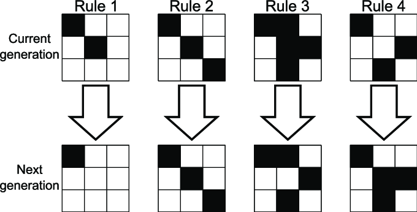
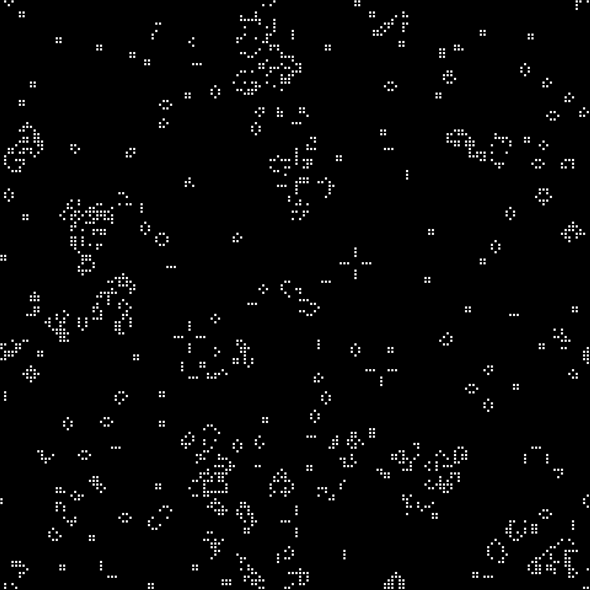
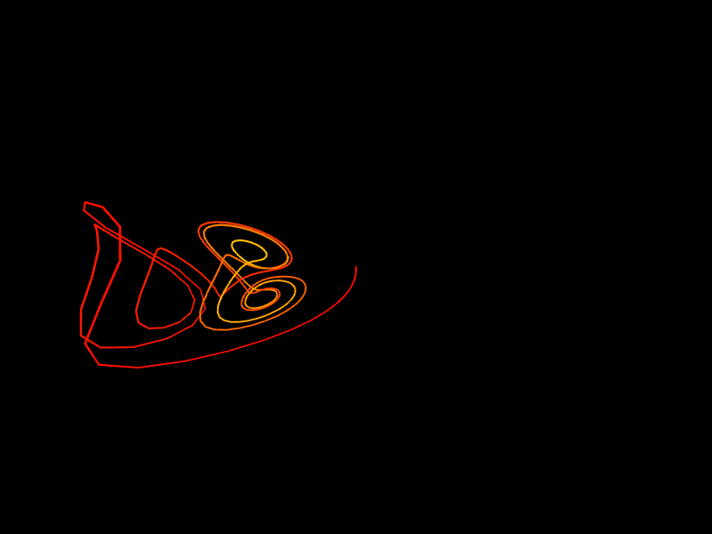

# 生成生成式藝術的探索與實驗

在這個章節我們會致敬一些經典生成式藝術作品。

## 生命遊戲

生命遊戲 (Game of Life) 是由數學家約翰·康威 (John Horton Conway) 在 1970 年創造的零玩家遊戲。該遊戲在一個無窮的二維方格世界進行，每一個方格代表一個生命體或"細胞"。每個細胞在每一個時間步長 (通常稱為"世代") 中生存或死亡，這完全依賴於它的"鄰居"的數量，"鄰居"是指相鄰的方格中的細胞。規則如下：

如果一個細胞有兩個或三個鄰居是活的，它會存活到下一代。
如果一個細胞有四個或更多的鄰居是活的，它會因為"人口過密"而在下一代中死亡。
如果一個細胞有一個或沒有鄰居是活的，它會因為"孤獨"而在下一代中死亡。
如果一個空的方格有剛好三個鄰居是活的，那麼在下一代中，一個新的細胞將在該方格中"出生"。
這些簡單的規則會導致出乎意料的複雜行為，包括能夠移動的"滑翔機"結構，以及能夠產生其他結構的"工廠"結構。這種複雜性使得生命遊戲成為研究自我複製和人工生命的重要工具。



*生命遊戲規則*


以下是一段使用 p5.js 創建生命遊戲的代碼：

```javascript
let grid;
let cols;
let rows;
let resolution = 5;

function setup() {
  createCanvas(800, 800);
  cols = width / resolution;
  rows = height / resolution;

  grid = make2DArray(cols, rows);
  for (let i = 0; i < cols; i++) {
    for (let j = 0; j < rows; j++) {
      grid[i][j] = floor(random(2));
    }
  }
}

function draw() {
  background(0);

  for (let i = 0; i < cols; i++) {
    for (let j = 0; j < rows; j++) {
      let x = i * resolution;
      let y = j * resolution;
      if (grid[i][j] == 1) {
        fill(255);
        stroke(0);
        rect(x, y, resolution - 1, resolution - 1);
      }
    }
  }

  let next = make2DArray(cols, rows);

  for (let i = 0; i < cols; i++) {
    for (let j = 0; j < rows; j++) {
      let state = grid[i][j];
      let sum = 0;
      let neighbors = countNeighbors(grid, i, j);

      if (state == 0 && neighbors == 3) {
        next[i][j] = 1;
      } else if (state == 1 && (neighbors < 2 || neighbors > 3)) {
        next[i][j] = 0;
      } else {
        next[i][j] = state;
      }

    }
  }

  grid = next;
}

function countNeighbors(grid, x, y) {
  let sum = 0;
  for (let i = -1; i < 2; i++) {
    for (let j = -1; j < 2; j++) {
      let col = (x + i + cols) % cols;
      let row = (y + j + rows) % rows;
      sum += grid[col][row];
    }
  }
  sum -= grid[x][y];
  return sum;
}

function make2DArray(cols, rows) {
  let arr = new Array(cols);
  for (let i = 0; i < arr.length; i++) {
    arr[i] = new Array(rows);
  }
  return arr;
}
```

這段代碼創建了一個簡單的"生命遊戲"模擬，它以隨機方式初始化一個網格，然後依據網格中的每一個細胞的鄰居數量來決定它在下一個時間步長應該是死亡或生存。這種簡單的模擬在視覺上可能看起來非常複雜，並且可能會產生出許多不同的有趣模式。這就是生成式藝術的魅力之處。


*game of life result*


## Beautiful Chaos

"Beautiful Chaos" 是 Nathan Selikoff 的一個具象數學系列作品，它涉及的數學領域包括混沌理論、分形幾何等。他使用了混沌理論的一種模型，稱為Lorenz Attractor。Lorenz Attractor 是一種描述在某些物理條件下氣體或流體的運動行為的數學模型。它是由愛德華·尼爾·羅倫茲（Edward Norton Lorenz）在 1963 年提出的，他在研究氣象模型時發現了這種混沌行為。


*Beautiful Chaos by Nathan Selikoff*


以下是一個使用 p5.js 創建類似效果的簡單示例，該示例使用了Lorenz Attractor模型，。


```javascript
var x = 0.1;
var y = 0;
var z = 0;

var a = 10;
var b = 28;
var c = 8 / 3;

var points = new Array();

function setup() {
  createCanvas(800, 600, WEBGL);
  colorMode(HSB);
}

function draw() {
  background(0, 0, 0);
  rotateX(frameCount * 0.01);
  rotateY(frameCount * 0.01);
  
  let dt = 0.01;
  let dx = a * (y - x) * dt;
  let dy = (x * (b - z) - y) * dt;
  let dz = (x * y - c * z) * dt;
  
  x = x + dx;
  y = y + dy;
  z = z + dz;

  points.push(createVector(x, y, z));

  noFill();
  let hu = 0;
  
  beginShape();
  for (let v of points) {
    stroke(hu, 255, 255);
    vertex(v.x, v.y, v.z);
    hu += 0.1;
    if (hu > 255) {
      hu = 0;
    }
  }
  endShape();

  if (points.length > 500) {
    points.shift();
  }
}
```

這個程式使用 Lorenz Attractor 公式來模擬混沌行為。每個迭代都會生成一個新的點，並在 3D 空間中繪製出來。這個範例中使用了 HSB 色彩模式，每個新的點都有不同的色調，這與 Nathan Selikoff 的 "Beautiful Chaos" 系列中的色彩遊戲相似。"Beautiful Chaos" 系列的複雜性遠遠超過了這個簡單的示例。


Lorenz Attractor 是一種三維的分形結構，通常由以下的一組三個微分方程來描述：

```javascript
dx/dt = a*(y - x)
dy/dt = x*(b - z) - y
dz/dt = x*y - c*z
```

在這組方程中，`a`、`b`和`c`是常數，而`x`、`y`和`z`代表系統的狀態。羅倫茲在原始的模型中將`a`設為10，`b`設為28，`c`設為8/3，但這些數值可以被改變以產生不同的行為。

這組方程的一個關鍵特性是它們的非線性，這意味著微小的初始條件的變化可以導致遠期行為的劇變。這是所謂的「蝴蝶效應」，即蝴蝶在巴西的翅膀拍打可能在數週後導致美國的颶風。在視覺化方面，這組方程通常會產生一種形狀類似蝴蝶翅膀的圖案。

Lorenz Attractor 是混沌理論的一個重要範例，這個理論被廣泛應用於氣象學、物理學、工程學、經濟學以及許多其他科學領域。在藝術領域，許多生成式藝術家，如上文提到的 Nathan Selikoff，也利用 Lorenz Attractor 和其他數學模型創造出令人驚嘆的視覺效果。

生成 Lorenz Attractor 或任何其他混沌理論或分形的視覺表示需要對數學有一定的理解。此外，Nathan Selikoff 的 "Beautiful Chaos" 系列還使用了其他的算法和創作技巧，這些我們在這裡並未涵蓋。


*Lorenz Attractor演算法*
