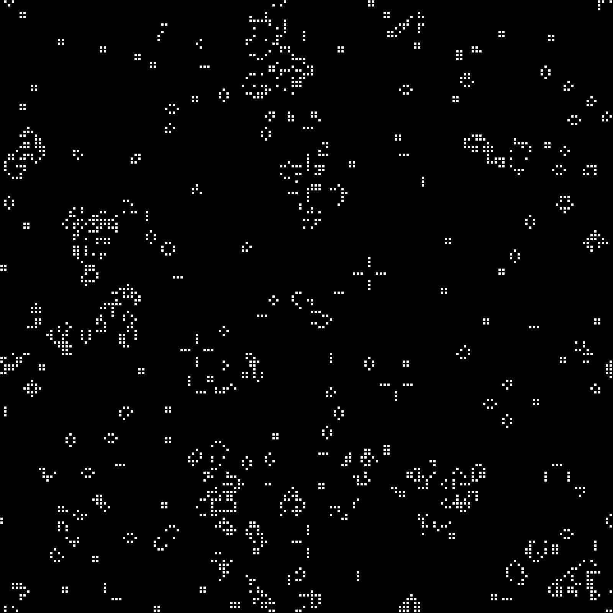

# 經典生成式藝術的探索

在這個章節我們會致敬一些經典生成式藝術作品，並且透過P5.JS來實作其內容。

## 生命遊戲 (Game of Life)

生命遊戲 (Game of Life) 是由數學家約翰·康威 (John Horton Conway) 在 1970 年創造的零玩家遊戲。該遊戲在一個無窮的二維方格世界進行，每一個方格代表一個生命體或"細胞"。每個細胞在每一個時間步長 (通常稱為"世代") 中生存或死亡，這完全依賴於它的"鄰居"的數量，"鄰居"是指相鄰的方格中的細胞。規則如下：

如果一個細胞有兩個或三個鄰居是活的，它會存活到下一代。
如果一個細胞有四個或更多的鄰居是活的，它會因為"人口過密"而在下一代中死亡。
如果一個細胞有一個或沒有鄰居是活的，它會因為"孤獨"而在下一代中死亡。
如果一個空的方格有剛好三個鄰居是活的，那麼在下一代中，一個新的細胞將在該方格中"出生"。
這些簡單的規則會導致出乎意料的複雜行為，包括能夠移動的"滑翔機"結構，以及能夠產生其他結構的"工廠"結構。這種複雜性使得生命遊戲成為研究自我複製和人工生命的重要工具。


*生命遊戲規則*


以下是一段使用 p5.js 創建生命遊戲的代碼：

```javascript
let grid;
let cols;
let rows;
let resolution = 5;

function setup() {
  createCanvas(800, 800);
  cols = width / resolution;
  rows = height / resolution;

  grid = make2DArray(cols, rows);
  for (let i = 0; i < cols; i++) {
    for (let j = 0; j < rows; j++) {
      grid[i][j] = floor(random(2));
    }
  }
}

function draw() {
  background(0);

  for (let i = 0; i < cols; i++) {
    for (let j = 0; j < rows; j++) {
      let x = i * resolution;
      let y = j * resolution;
      if (grid[i][j] == 1) {
        fill(255);
        stroke(0);
        rect(x, y, resolution - 1, resolution - 1);
      }
    }
  }

  let next = make2DArray(cols, rows);

  for (let i = 0; i < cols; i++) {
    for (let j = 0; j < rows; j++) {
      let state = grid[i][j];
      let sum = 0;
      let neighbors = countNeighbors(grid, i, j);

      if (state == 0 && neighbors == 3) {
        next[i][j] = 1;
      } else if (state == 1 && (neighbors < 2 || neighbors > 3)) {
        next[i][j] = 0;
      } else {
        next[i][j] = state;
      }

    }
  }

  grid = next;
}

function countNeighbors(grid, x, y) {
  let sum = 0;
  for (let i = -1; i < 2; i++) {
    for (let j = -1; j < 2; j++) {
      let col = (x + i + cols) % cols;
      let row = (y + j + rows) % rows;
      sum += grid[col][row];
    }
  }
  sum -= grid[x][y];
  return sum;
}

function make2DArray(cols, rows) {
  let arr = new Array(cols);
  for (let i = 0; i < arr.length; i++) {
    arr[i] = new Array(rows);
  }
  return arr;
}
```

這段代碼創建了一個簡單的"生命遊戲"模擬，它以隨機方式初始化一個網格，然後依據網格中的每一個細胞的鄰居數量來決定它在下一個時間步長應該是死亡或生存。這種簡單的模擬在視覺上可能看起來非常複雜，並且可能會產生出許多不同的有趣模式。這就是生成式藝術的魅力之處。


*game of life result*


## Beautiful Chaos

"Beautiful Chaos" 是 Nathan Selikoff 的一個具象數學系列作品，它涉及的數學領域包括混沌理論、分形幾何等。他使用了混沌理論的一種模型，稱為Lorenz Attractor。Lorenz Attractor 是一種描述在某些物理條件下氣體或流體的運動行為的數學模型。它是由愛德華·尼爾·羅倫茲（Edward Norton Lorenz）在 1963 年提出的，他在研究氣象模型時發現了這種混沌行為。


*Beautiful Chaos by Nathan Selikoff*


以下是一個使用 p5.js 創建類似效果的簡單示例，該示例使用了Lorenz Attractor模型，。


```javascript
var x = 0.1;
var y = 0;
var z = 0;

var a = 10;
var b = 28;
var c = 8 / 3;

var points = new Array();

function setup() {
  createCanvas(800, 600, WEBGL);
  colorMode(HSB);
}

function draw() {
  background(0, 0, 0);
  rotateX(frameCount * 0.01);
  rotateY(frameCount * 0.01);
  
  let dt = 0.01;
  let dx = a * (y - x) * dt;
  let dy = (x * (b - z) - y) * dt;
  let dz = (x * y - c * z) * dt;
  
  x = x + dx;
  y = y + dy;
  z = z + dz;

  points.push(createVector(x, y, z));

  noFill();
  let hu = 0;
  
  beginShape();
  for (let v of points) {
    stroke(hu, 255, 255);
    vertex(v.x, v.y, v.z);
    hu += 0.1;
    if (hu > 255) {
      hu = 0;
    }
  }
  endShape();

  if (points.length > 500) {
    points.shift();
  }
}
```

這個程式使用 Lorenz Attractor 公式來模擬混沌行為。每個迭代都會生成一個新的點，並在 3D 空間中繪製出來。這個範例中使用了 HSB 色彩模式，每個新的點都有不同的色調，這與 Nathan Selikoff 的 "Beautiful Chaos" 系列中的色彩遊戲相似。"Beautiful Chaos" 系列的複雜性遠遠超過了這個簡單的示例。


Lorenz Attractor 是一種三維的分形結構，通常由以下的一組三個微分方程來描述：

```javascript
dx/dt = a*(y - x)
dy/dt = x*(b - z) - y
dz/dt = x*y - c*z
```

在這組方程中，`a`、`b`和`c`是常數，而`x`、`y`和`z`代表系統的狀態。羅倫茲在原始的模型中將`a`設為10，`b`設為28，`c`設為8/3，但這些數值可以被改變以產生不同的行為。

這組方程的一個關鍵特性是它們的非線性，這意味著微小的初始條件的變化可以導致遠期行為的劇變。這是所謂的「蝴蝶效應」，即蝴蝶在巴西的翅膀拍打可能在數週後導致美國的颶風。在視覺化方面，這組方程通常會產生一種形狀類似蝴蝶翅膀的圖案。

Lorenz Attractor 是混沌理論的一個重要範例，這個理論被廣泛應用於氣象學、物理學、工程學、經濟學以及許多其他科學領域。在藝術領域，許多生成式藝術家，如上文提到的 Nathan Selikoff，也利用 Lorenz Attractor 和其他數學模型創造出令人驚嘆的視覺效果。

生成 Lorenz Attractor 或任何其他混沌理論或分形的視覺表示需要對數學有一定的理解。此外，Nathan Selikoff 的 "Beautiful Chaos" 系列還使用了其他的算法和創作技巧，這些我們在這裡並未涵蓋。


*Lorenz Attractor演算法*


## Invader Fractal

賈瑞德·塔爾布（Jared Tarbell）是一位數位藝術家和軟體工程師，他的作品多以數學和算法為基礎。他在網站"Complexification.net"上展示的許多作品，如"Substrate"和"Invader Fractal"，都是生成式藝術的經典範例。


*Invader Fractal by Jared Tarbell*

以下是用 p5.js 寫的一個簡單的 Invader Fractal 程式的範例：

```javascript
let size;

function setup() {
  createCanvas(800, 800);
  noStroke();
  size = width / 2;
  noLoop();
}

function draw() {
  background(51);
  translate(width / 2, height / 2);
  drawInvader(0, 0, size);
}

function drawInvader(x, y, side) {
  if (side >= 10) {
    if (random(1) < 0.8) {
      // Draw an Invader-like shape
      push();
      translate(x, y);
      fill(255);
      noStroke();
      rect(-side / 2, -side / 2, side / 2, side / 2); // Body
      rect(side / 2, -side / 2, side / 2, side / 2); // Body
      rect(-side / 4, 0, side / 2, side / 2); // Body
      rect(side / 4, 0, side / 2, side / 2); // Body
      rect(0, -side / 2, side / 4, side / 4); // Eye
      rect(0, side / 4, side, side / 4); // Leg
      pop();
    }
    
    let newSize = side / 2;
    drawInvader(x - newSize, y - newSize, newSize); // Top-left
    drawInvader(x + newSize, y - newSize, newSize); // Top-right
    drawInvader(x - newSize, y + newSize, newSize); // Bottom-left
    drawInvader(x + newSize, y + newSize, newSize); // Bottom-right
  }
}
```


這個程式會在畫布上中繪製一個 "Invader"，首先它會在畫面的中央畫一個四分之一的大小的矩形。然後，它會在該矩形的每個角上遞迴地畫四個更小的矩形。這個過程會持續到矩形的邊長小於一個像素為止。每個矩形是否會被繪製是隨機決定的，所以每次運行程式都會生成一種新的圖形。這是一個簡單的碎形的概念，讀者可以加入更多的效果或者調整來創建你自己的 Invader Fractal 生成藝術。例如，你可以更改每個矩形的顏色，或者讓矩形在一定的規則下改變其形狀。


*範例 fractal結果*


## Mandelbrot Set

Mandelbrot 集是在複數平面上的一個數學集合，由法國數學家本華·曼德爾布羅特於1980年代所提出。該集合是對於一個簡單複變數函數的疊代的結果。

Mandelbrot 集的定義如下：

在複平面上選取一個點c，然後考慮由z_n = z_{n-1}^2 + c所產生的序列，其中z_0 = 0。如果對於該點c，該序列中的數字的模不會趨向於無窮，那麼我們就說這個數字c屬於Mandelbrot集。

這個集合的特殊之處在於它的幾何形狀：它是一個非常複雜的形狀，由無數相似但不完全相同的部分組成，這種性質稱為自相似性。這意味著你可以無限地放大Mandelbrot集的某一部分，並找到與整個集合相似的形狀。這種無窮的複雜性和細節，使得Mandelbrot集成為分形幾何的一個重要範例。

Mandelbrot Set的圖形通常是透過電腦生成的。屬於集合的點通常被著色為黑色，而不屬於集合的點則根據離開序列的速度（也就是迭代的次數）來著色，從而形成一種吸引人的視覺效果。

以下是對這段程式碼的詳細註解：

```javascript
// setup() 函數是 p5.js 在畫布準備好之後一開始會執行的函數。
// 這裡我們建立一個 800x800 的畫布，並設定像素密度為 1。
function setup() {
  createCanvas(800, 800);
  pixelDensity(1);
}

// draw() 函數是 p5.js 在每個畫面更新時執行的函數。
function draw() {
  // 設定畫布背景為白色。
  background(255);
  
  // 進行圖像的每個像素處理。
  loadPixels();
  for (let x = 0; x < width; x++) {
    for (let y = 0; y < height; y++) {

      // 將 x, y 像素座標映射到 -2 到 2 的範圍，形成複平面。
      let a = map(x, 0, width, -2, 2);
      let b = map(y, 0, height, -2, 2);

      // 存儲複數的初始值。
      let ca = a;
      let cb = b;

      // n 紀錄迭代次數，maxIterations 是迭代的上限。
      let n = 0;
      let maxIterations = 100;

      // 迭代複數函數，直到該點逃逸或達到最大迭代次數。
      while (n < maxIterations) {
        let aa = a * a - b * b;
        let bb = 2 * a * b;

        a = aa + ca;
        b = bb + cb;

        // 如果該點逃逸（其值大於 16），則跳出迴圈。
        if (abs(a + b) > 16) {
          break;
        }
        n++;
      }

      // 根據迭代次數決定該像素的亮度。
      let bright = map(n, 0, maxIterations, 0, 1);
      bright = map(sqrt(bright), 0, 1, 0, 255);

      // 如果達到最大迭代次數，則設定亮度為 0（黑色）。
      if (n === maxIterations) {
        bright = 0;
      }
      
      // 將計算出的亮度值應用到該像素上。
      let pix = (x + y * width) * 4;
      pixels[pix + 0] = bright;
      pixels[pix + 1] = bright;
      pixels[pix + 2] = bright;
      pixels[pix + 3] = 255;
    }
  }
  // 更新畫布上的像素。
  updatePixels();
}
```


這個程式主要透過進行複數運算以及操控像素亮度來繪製 Mandelbrot 集的圖像。由於Mandelbrot集的點是在複平面上，每個點的位置（a，b）都對應一個複數z = a + bi。迭代運算 f(z) = z^2 + c 來判定該點是否屬於Mandelbrot集（其中c是該點的初始位置，z是迭代的變數，初始值為0）。若在迭代過程中，z的值超出了一個設定的界限（這裡是16），那麼可以判定該點不屬於Mandelbrot集，並根據迭代的次數來設定該點的顏色。若迭代達到了上限（這裡是100次），那麼可以判定該點屬於Mandelbrot集，並將該點設定為黑色。


*Mandelbrot Set 範例程式的輸出結果*


在 p5.js 中，`loadPixels()` 和 `updatePixels()` 是兩個用來直接操作畫布像素的函數。這些函數允許你直接訪問和修改每個像素的顏色，從而實現更為低級和細膩的控制。

- `loadPixels()`：這個函數讀取畫布上的所有像素的顏色數據，並將其存儲在 `pixels[]` 這個數組中。在調用 `loadPixels()` 後，你可以通過 `pixels[]` 來訪問或者修改像素的顏色。請注意，每個像素的顏色是由四個數據組成的：紅色、綠色、藍色和透明度（或者說是alpha通道），它們的範圍都是 0 到 255。因此，`pixels[]` 這個數組的長度是畫布像素總數的四倍。
- `updatePixels()`：這個函數將 `pixels[]` 數組中的顏色數據寫回畫布上。你在調用 `loadPixels()` 和修改 `pixels[]` 之後，必須調用 `updatePixels()` 來使你的變化生效。如果你忘記調用 `updatePixels()`，那麼你在 `pixels[]` 中做的任何修改都不會反映到畫布上。

以下是一個簡單的例子，它將畫布上所有像素的紅色通道設置為最大值：

```javascript
loadPixels();
for (let i = 0; i < pixels.length; i += 4) {
  pixels[i] = 255; // 將紅色通道設置為最大值
  // pixels[i + 1] 是綠色通道
  // pixels[i + 2] 是藍色通道
  // pixels[i + 3] 是透明度（alpha通道）
}
updatePixels();
```

請注意，在這個例子中，我們遍歷 `pixels[]` 數組的時候，步長是 4，這是因為每個像素的顏色由四個數據組成，所以我們一次跳過四個數據來遍歷每個像素。


## Julia Set

這是一種和 Mandelbrot Set 緊密相關的分形。Julia Set 和 Mandelbrot Set 用的是同樣的公式，但是運算過程稍有不同。在 Mandelbrot Set 中，每個點的複數 c 是固定的，而在 Julia Set 中，c 是固定的，而開始的 z 值會隨著每個點的位置變化。以下是一個 p5.js 程式，用來繪製 Julia Set：

```javascript
// 設置Julia Set的參數
let cX = -0.70176;
let cY = -0.3842;

function setup() {
  createCanvas(800, 800);
  pixelDensity(1);
}

function draw() {
  loadPixels();

  // 遍歷每個像素
  for (let x = 0; x < width; x++) {
    for (let y = 0; y < height; y++) {

      let a = map(x, 0, width, -1.5, 1.5);
      let b = map(y, 0, height, -1.5, 1.5);

      let ca = a;
      let cb = b;

      let n = 0;
      let maxIter = 100;

      // 對每個像素進行迭代
      while (n < maxIter) {
        let aa = a * a - b * b;
        let bb = 2 * a * b;

        a = aa + cX;
        b = bb + cY;

        if (abs(a + b) > 16) {
          break;  // 若超出範圍則跳出
        }
        n++;
      }

      // 將像素的顏色設定為迭代次數
      let brightness = map(n, 0, maxIter, 0, 1);
      brightness = map(sqrt(brightness), 0, 1, 0, 255);
      let pix = (x + y * width) * 4;
      pixels[pix + 0] = brightness;
      pixels[pix + 1] = brightness;
      pixels[pix + 2] = brightness;
      pixels[pix + 3] = 255;
    }
  }
  updatePixels();
  noLoop();
}
```

這段程式的基本概念和繪製 Mandelbrot Set 的程式相似。每個像素的初始值設定為該像素的座標，然後我們對每個像素進行迭代，迭代的公式和 Mandelbrot Set 一樣是 `z = z^2 + c`，但是在這裡 `c` 是一個固定的值，而 `z` 的初始值會隨著每個像素的位置變化。迭代結束後，我們將像素的顏色設定為迭代次數。


*Julia Set範例執行結果*


你可以修改 `cX` 和 `cY` 的值來獲得不同的 Julia Set 圖形。例如，你可以試著將它們設定為 `-0.8` 和 `0.156`，圖像就會產生很不同的變化。


*Julia Set 範例修改數字後執行結果*


## Sierpinski Triangle

謝爾賓斯基三角形（Sierpinski Triangle），又稱為謝爾賓斯基篩或謝爾賓斯基金字塔，是由波蘭數學家瓦茨瓦夫·謝爾賓斯基（Wacław Sierpiński）在20世紀初發現的。這是分形理論中的一種著名圖形，並且被廣泛用於數學和計算機科學教育中，作為遞迴和無窮的視覺表示。

謝爾賓斯基三角形的構建過程相對簡單：開始於一個等邊三角形，接著將其劃分為四個等大的等邊三角形，並去除中間的那一個。然後對其餘的三個三角形重複這一步驟。經過無窮次的這種操作後，我們就得到了謝爾賓斯基三角形。

儘管謝爾賓斯基三角形在形式上是相對簡單的，但其擁有一些非常有趣的性質。例如，它的邊界有無窮長，但其面積卻是有限的。此外，謝爾賓斯基三角形是一種自相似的分形，即無論你放大還是縮小，都能看到與整體相同的形狀。

這種分形以及其他類似的圖形，提供了一種強大的方式，來在數學和計算機科學中探索無窮、限制、遞迴等概念。


以下是一個在 p5.js 中生成 Sierpinski 三角形的簡單程式：

```javascript
// 設定繪圖環境
function setup() {
  createCanvas(800, 800); // 創建一個 800x800 像素的畫布
  background(255); // 將背景色設置為白色
}

// 繪製畫面
function draw() {
  background(255); // 每次繪製前都將背景重設為白色
  sierpinski(width / 2, height / 2, width / 2); // 在畫布中央繪製一個邊長為畫布寬度一半的 Sierpinski 三角形
  noLoop(); // 確保 draw() 函數只運行一次
}

// 遞迴繪製 Sierpinski 三角形
function sierpinski(x, y, d) {
  if (d < 1) { // 如果邊長小於 1，則不進行繪製並結束遞迴
    return;
  }

  // 繪製一個以 (x, y) 為中心，邊長為 d 的等腰三角形
  triangle(x, y - d / 2, x - d / 2, y + d / 2, x + d / 2, y + d / 2);
  
  // 在當前三角形的頂部以及底部兩側分別繪製一個邊長為當前邊長一半的 Sierpinski 三角形
  sierpinski(x, y - d / 2, d / 2);
  sierpinski(x - d / 2, y + d / 2, d / 2);
  sierpinski(x + d / 2, y + d / 2, d / 2);
}
```

這個程式用了遞迴函數來繪製 Sierpinski 三角形。當 `sierpinski` 函數被呼叫時，它會繪製一個三角形，然後呼叫自己三次來繪製三個較小的三角形。這三個小三角形分別位於大三角形的頂部和底部的兩側。當三角形的邊長小於1時，函數會停止呼叫自己。

請注意，這個程式會快速地用大量的記憶體，並且可能導致你的程式或者瀏覽器崩潰，這是因為它要繪製的三角形數量會隨著邊長的減小而快速增加。因此，我們需要在三角形的邊長小於1時停止遞迴。

這個程式生成的 Sierpinski 三角形只有一個固定的級別，如果你想生成一個有多個級別的 Sierpinski 三角形，你可以嘗試改變 `d / 2` 這個值。例如，你可以將它改為 `d / 3` 來生成一個有三個級別的 Sierpinski 三角形。

遞迴就像是一個不斷重複自身的過程，就好比你在看一面面向著自己的鏡子，會看到無盡的自身倒影。每一面鏡子反射的都是前一面鏡子的影像，這就像遞迴函數呼叫自身。

讓我們用一個更生活化的例子來解釋遞迴。假設你正在和朋友玩一個傳話遊戲。你先給第一個朋友一句話，然後他必須將這句話原封不動地傳給下一個人，依此類推，直到最後一個人。這個過程就像是遞迴，每個人都做著相同的事情（傳遞信息），並將任務傳遞給下一個人。

當你在寫遞迴程式的時候，需要注意以下幾點：

1. **遞迴總是需要一個終止條件**：這就像是傳話遊戲最後一個人需要停止傳遞訊息一樣。在程式中，如果沒有終止條件，你的程式將會無止盡地執行下去，最終可能導致系統資源耗盡。
2. **遞迴可能會非常耗費系統資源**：每一次函數的呼叫，不論是遞迴或者非遞迴，電腦都需要為之分配一些記憶體來保存資訊。如果遞迴呼叫的次數過多，就可能耗盡可用的記憶體，這種情況被稱為堆疊溢位。
3. **避免重複計算**：在某些遞迴情況下，你可能會發現你在計算同樣的東西很多次。例如，在計算費波那契數列的遞迴實現中，較大的數值需要很多次的重複計算。在這種情況下，你可以使用一些策略，如記憶化或動態規劃，來保存已經計算過的結果，避免未來的重複計算。
4. **思考如何簡化問題**：通常，遞迴是透過將大問題拆解成較小的問題來解決。這需要你找到一種方法，可以將問題簡化並且進行拆解，最後能夠將這些較小問題的解答組合起來，得到原問題的答案。


*Sierpinski Triangles範例執行結果*


## Koch Snowflake

科赫雪花（Koch Snowflake）是一種由瑞典數學家Helge von Koch於1904年所提出的分形結構。它是由在等邊三角形的每一條邊上重複應用科赫曲線（Koch curve）構造而成的。

科赫雪花的創建過程是這樣的：我們從一個等邊三角形開始，然後將每一邊都分為三等分，並在中間的部分創建一個等邊三角形，但是不包含中間的那一段。然後，我們在這些新增的線段上重複這個過程，並且無窮次地進行下去。這就形成了科赫雪花的形狀。

科赫雪花是早期分形的例子之一，並且是用來展示自相似性和無窮細分的觀念的經典例子。它具有許多有趣的數學性質，例如它的周長是無窮大的，但是它的面積卻是有限的。這種深奧的性質使科赫雪花成為分形幾何中的一個重要研究對象。

此外，科赫雪花還在自然界中有許多實際的表現，例如雪花的形狀、海岸線的形狀等，都可以使用科赫雪花來進行模擬和描述。

以下是一個簡單的 p5.js 程式碼來生成 Koch Snowflake。

```javascript
// 初始化畫布大小和背景色
function setup() {
  createCanvas(800, 800);
  background(0);
}

// 主繪圖函數
function draw() {
  background(0);
  translate(width / 2, height / 2); //將原點移至畫布中心
  stroke(255); //設定繪圖線條的顏色
  let len = 200; //設定初始線段長度
  let iterations = 5; //設定遞迴的次數
  // 從三個頂點開始繪製 Koch Snowflake
  beginShape();
  drawKoch(width / -2, height / 4, width / 2, height / 4, iterations);
  drawKoch(width / 2, height / 4, 0, -height / 2, iterations);
  drawKoch(0, -height / 2, width / -2, height / 4, iterations);
  endShape(CLOSE);
  noLoop(); //停止 draw() 的迴圈
}

// 遞迴繪製 Koch 曲線的函數
function drawKoch(x1, y1, x2, y2, n) {
  if (n == 0) {
    // 基底案例：畫一條直線
    line(x1, y1, x2, y2);
  } else {
    // 計算新的點
    let dx = x2 - x1;
    let dy = y2 - y1;
    let x3 = x1 + dx / 3;
    let y3 = y1 + dy / 3;
    let x4 = x1 + dx / 2 - dy / (2 * sqrt(3));
    let y4 = y1 + dy / 2 + dx / (2 * sqrt(3));
    let x5 = x1 + 2 * dx / 3;
    let y5 = y1 + 2 * dy / 3;

    // 遞迴繪製每一段
    drawKoch(x1, y1, x3, y3, n - 1);
    drawKoch(x3, y3, x4, y4, n - 1);
    drawKoch(x4, y4, x5, y5, n - 1);
    drawKoch(x5, y5, x2, y2, n - 1);
  }
}
```

在這段程式碼中，我們首先在 `setup()` 函數中設定了畫布的大小和背景顏色。在 `draw()` 函數中，我們開始了一個形狀的繪製，並在三個頂點之間呼叫 `drawKoch()` 函數。這個 `drawKoch()` 函數會遞迴地繪製科赫曲線的每一段。當遞迴到底時（也就是 `n == 0`），函數就會繪製一條從 `(x1, y1)` 到 `(x2, y2)` 的線段。否則，它會計算出新的點，並遞迴地繪製每一段。


*Koch Snowflakes 程式的執行結果*

