<!-- .slide: class="title" -->
# 生成式藝術概論

## 它是什麼，從哪裡來，為什麼現在重要

第 1 章

Note:
這一章不寫程式。先把「生成式藝術」這個詞的邊界講清楚，再把它的歷史從 1950 年代拉到 NFT 時代。後面幾章的技術，都是為了回答這一章提出的問題。

---

## 一句話定義

創作過程交給一套**會自己跑**的系統，藝術家決定的是**規則**，不是最後那張圖。

系統可以是數學公式、電腦程式，也可以是生物或物理過程。過程裡通常帶著某種程度的隨機性。

> 傳統繪畫：藝術家控制每一筆。
> 生成式藝術：藝術家控制的是「產生每一筆的那條規則」。

--

## 一句話定義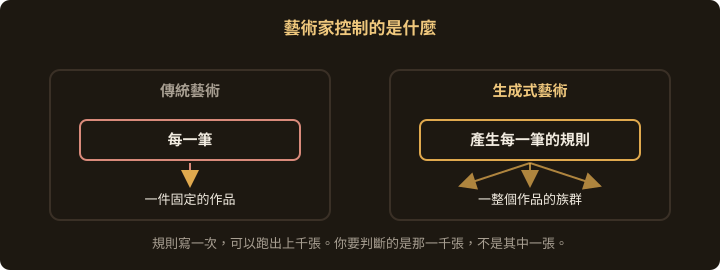

藝術家控制的東西不一樣，作品的數量也就不一樣

--

## 這件事為什麼值得整整一學期

因為規則一旦寫好，它產生的就不只是一件作品，而是一整個作品的**族群**。

你要判斷的不再是「這張好不好看」，而是「這條規則生出來的一千張，好不好看」。

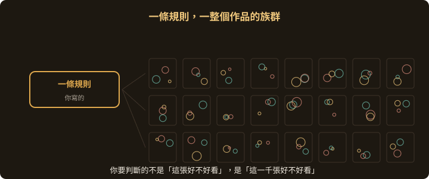

---

## 先看三件作品

--

## Ringers #109

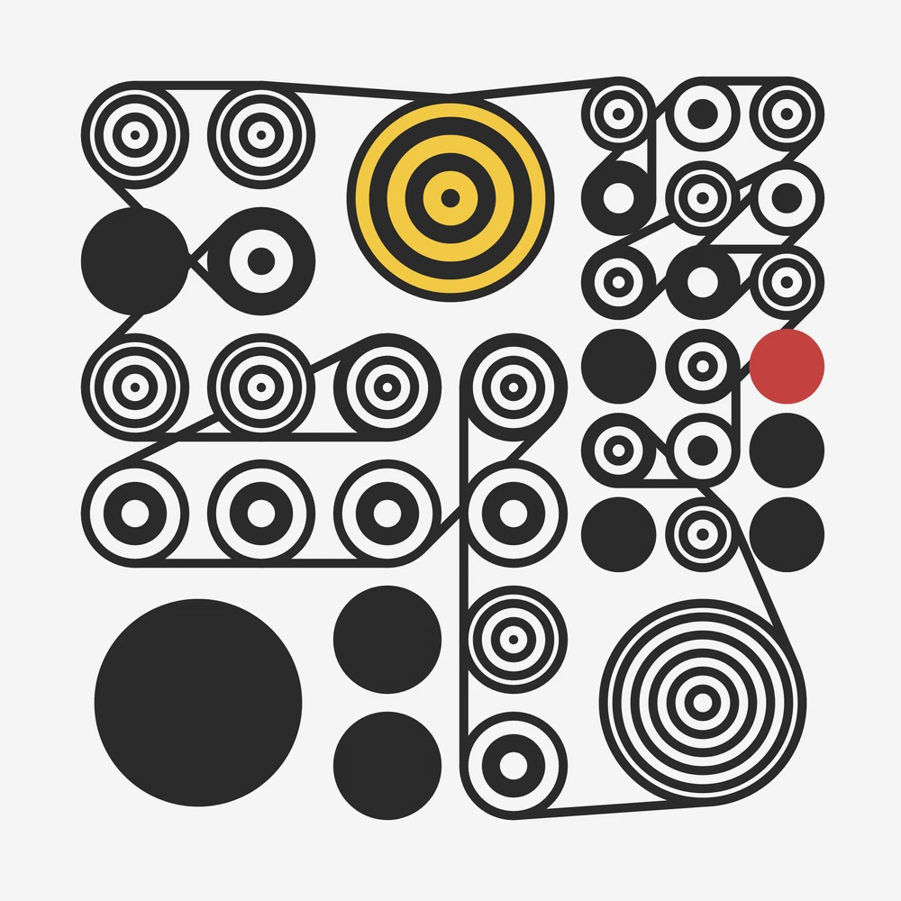

Ringers #109 — Dmitri Cherniak

一條繩子繞過幾根樁。規則就這麼一句，生出來的變化卻幾乎沒有重複。

--

## Edmond de Belamy

Edmond de Belamy — Obvious 團體，以機器學習生成

2018 年在佳士得拍出，是拍賣行第一次賣出由演算法生成的畫作。

--

## Ringers #879，也就是「The Goose」

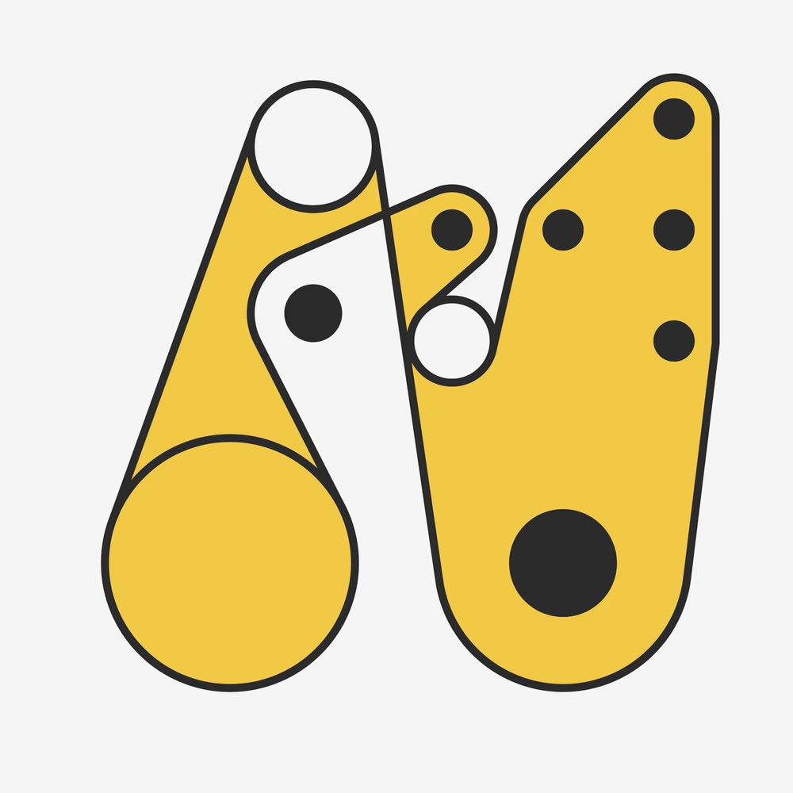

Ringers #879 — 蘇富比落槌 540 萬美元，含佣金 620 萬美元

原本估價 200 至 300 萬美元。

--

## 為什麼是這一張特別貴

生成藝術大多是抽象的，因為演算法通常不會長出可辨認的東西。

`#879` 剛好被隨機數推成了一隻鵝的樣子。**它是同一條規則跑出來的一千張裡，最像具象的那張。**

> 收藏家買的不只是這張圖，
> 而是「這條規則竟然能生出這個」的那份意外。

--

## 為什麼是這一張特別貴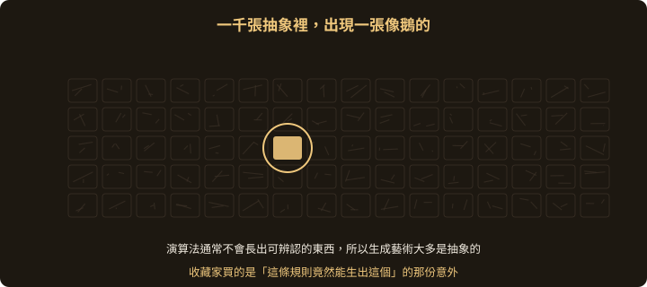

---

## 歷史：三個階段

| 階段 | 年代 | 用什麼跑規則 |
|---|---|---|
| 當代藝術裡的隨機性 | 1950–1970 | 機械、類比電子、觀眾 |
| 電腦時代 | 1970–2000 | 大型主機、繪圖機 |
| 數位與區塊鏈 | 2000– | 個人電腦、瀏覽器、鏈上雜湊 |

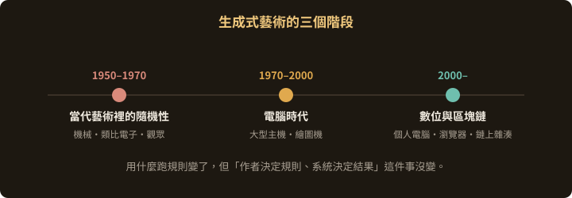

---

## 階段一：先有隨機性，才有電腦

--

## Dick Raaijmakers

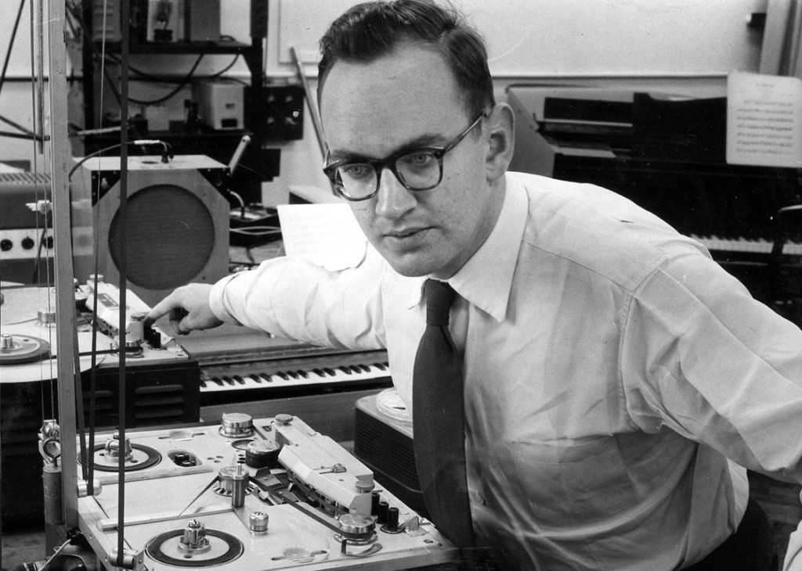

Dick Raaijmakers（1930–2013），荷蘭

飛利浦的音響工程師出身，做電子音樂與劇場。作品裡常有一個自動化的過程在產生聲音與影像。

--

## Pierre Huyghe

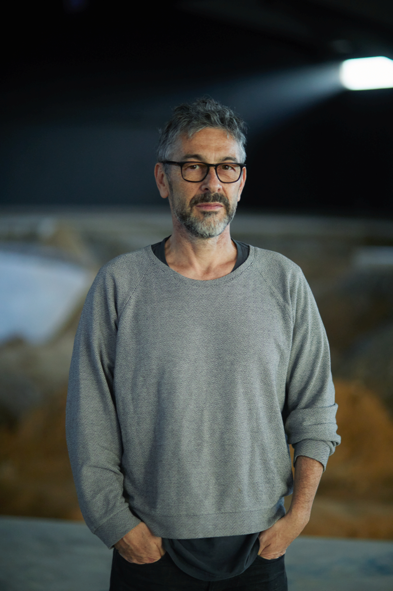

Pierre Huyghe，法國

拿社會系統與生物系統當創作核心，讓作品在真實與虛構的邊界上運作。

--

## Untitled (Human Mask)

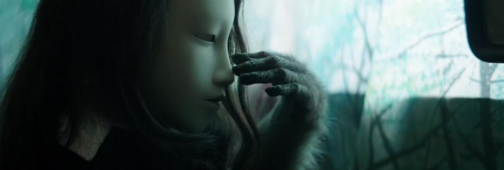

Untitled (Human Mask) — Pierre Huyghe

福島核災後被遺棄的餐館，一隻戴著女性面具的猴子。牠的行為出自本能與訓練，觀眾卻不斷把它讀成人的行為。

--

## 隨機性與觀眾參與的三個經典

- **Yoko Ono《Cut Piece》** — 觀眾上台，自由從她身上剪下一片衣物
- **John Cage《4'33"》** — 沒有預定的音樂，聽到的是現場當下的聲音
- **Marina Abramović《The Artist is Present》** — 觀眾與她對坐，無言相望

> 這三件都不是電腦作品，
> 但它們把「結果由系統與參與者決定」這件事先做完了。

--

## 隨機性與觀眾參與的三個經典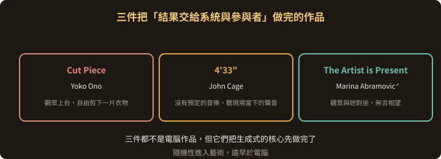

---

## 階段二：電腦時代的四位先驅

--

## Harold Cohen 與 AARON

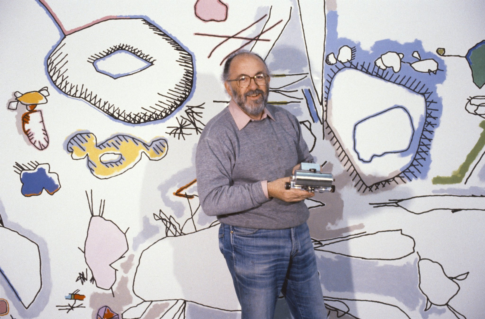

Harold Cohen（1928–2016）與他的程式 AARON

原本是傳統畫家，1970 年代轉向電腦。AARON 能自己畫出有風格、有主題的作品，還能控制機械手臂畫大型壁畫。

--

## AARON 提出的問題

一個程式畫出來的畫，作者是誰？

寫規則的人，還是跑規則的機器？

> 這個問題在 1970 年代就被提出來了，
> 到今天的生成式 AI 也還沒有標準答案。

--

## AARON 提出的問題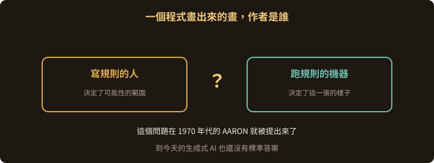

--

## Manfred Mohr

Manfred Mohr（1938– ），德國

1960 年代初就開始用電腦創作，是最早的一批。作品集中在幾何形狀與結構，用自己設計的演算法生成複雜圖形。

--

## Vera Molnar

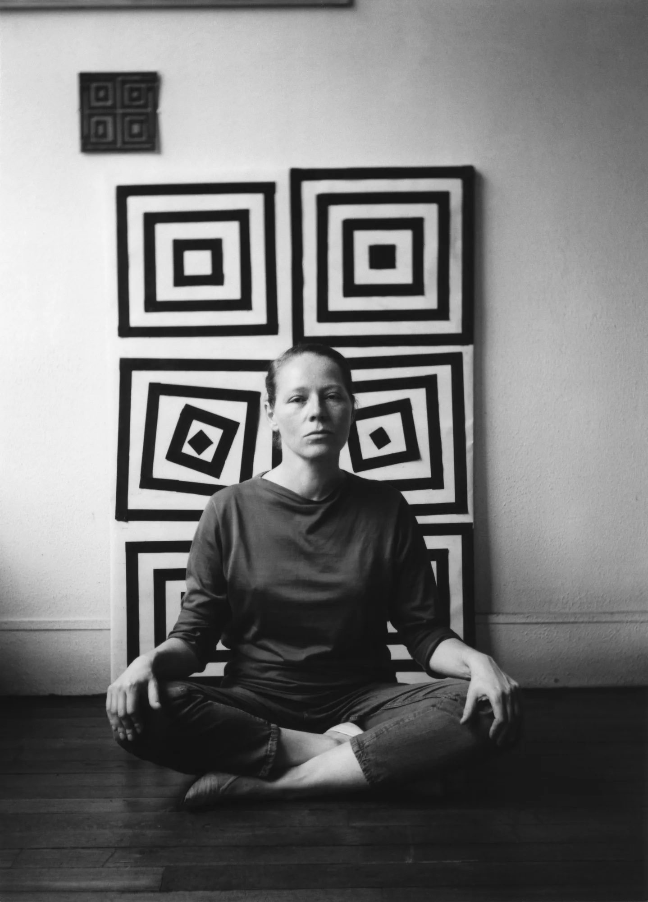

Vera Molnar（1924–2023），匈牙利

在巴黎學繪畫出身，1950 年代末開始用電腦。《Disorderly Order》《Interruptions》用程式控制線條與形狀的排列，研究視覺規律背後的數學。

--

## Roman Verostko

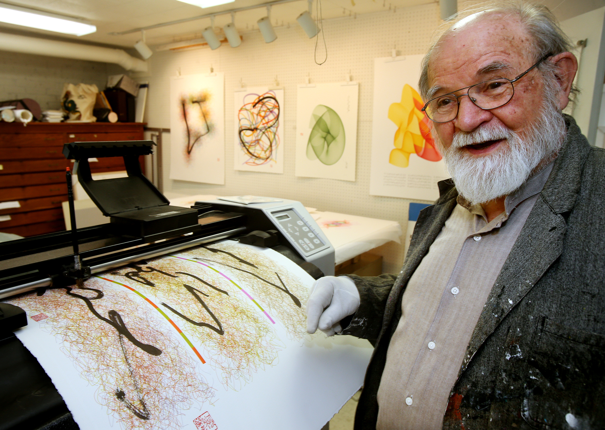

Roman Verostko（1929–2024），美國

原本是本篤會修道士，1970 年代中期轉向藝術。他自己寫軟體、自己做硬體，用程式生成線條再交給繪圖機畫成實體作品。

--

## 這一代的共同點

他們沒有螢幕可以即時預覽。

程式跑完，圖是由**繪圖機**一筆一筆畫出來的。因此規則必須在腦中先成立，錯了要等好幾個小時才知道。

> 限制長出風格：
> 早期電腦藝術的線條感，很大一部分來自繪圖機這支筆。

--

## 這一代的共同點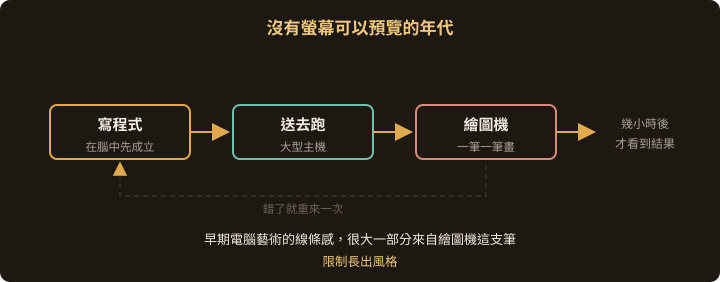

---

## 階段三：21 世紀

--

## 兩股力量同時發生

**技術面**：深度學習與對抗生成網路（GAN）能生出逼真的臉孔與風景。

**市場面**：區塊鏈與 NFT 讓藝術家可以直接把作品賣給收藏家，不必經過畫廊與經銷商。

加上數位藝術本來就逐漸成為主流文化的一部分，觀眾的接受度在這十年間明顯提高。

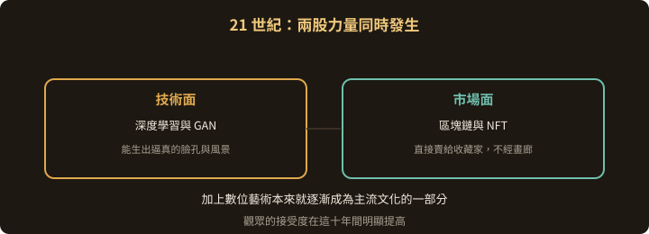

--

## Casey Reas

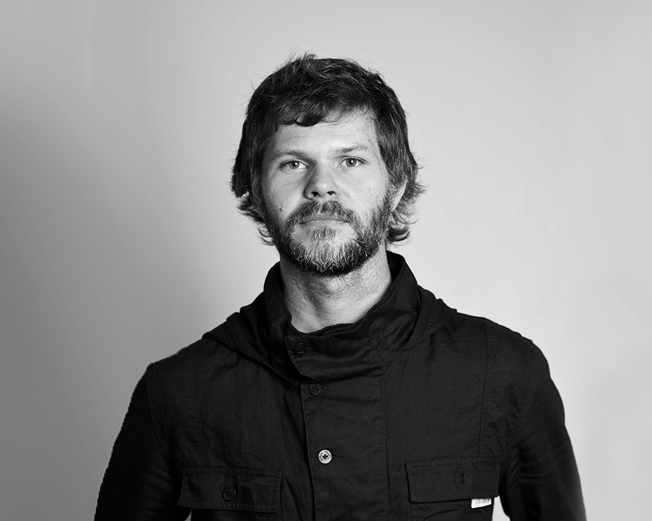

Casey Reas — Processing 的共同創造者，UCLA 任教

作品融合數學、機器學習與人工生命。**他和 Ben Fry 一起做的 Processing，是後面所有創意編碼工具的起點。**

--

## Process 20

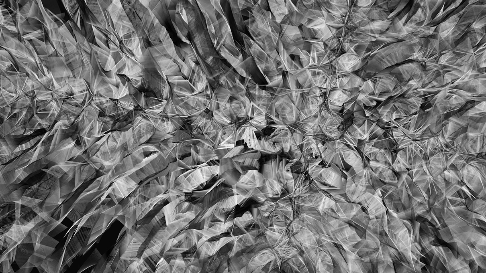

Process 20 — Casey Reas

Reas 的 Process 系列把作品寫成一段文字指令，任何人照著實作都算數。作品是那段規則，不是那張輸出。

--

## Rafael Lozano-Hemmer

Rafael Lozano-Hemmer，墨西哥／加拿大

互動裝置。《Pulse Room》（2006）把觀眾的脈搏接到 200 顆燈泡上，整個房間隨著在場者的心跳閃動。

--

## Shadow Play

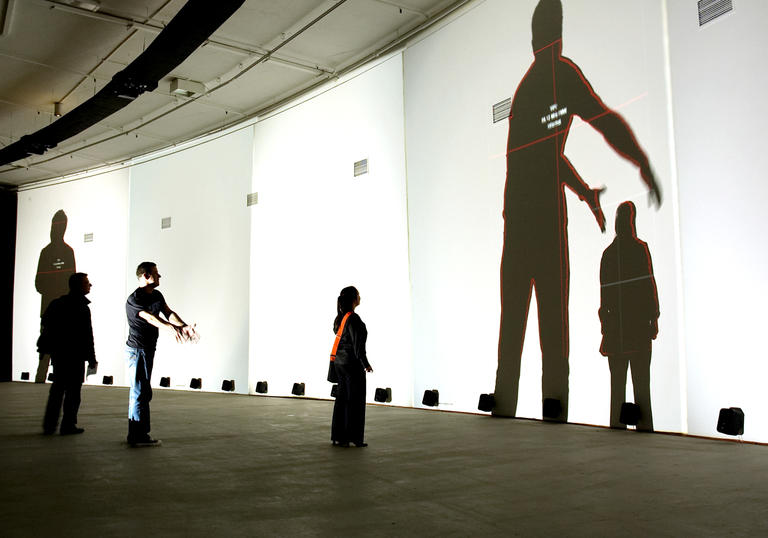

Shadow Play — Rafael Lozano-Hemmer

沒有觀眾走進去，作品就不存在。這裡的生成來源是人。

--

## Golan Levin

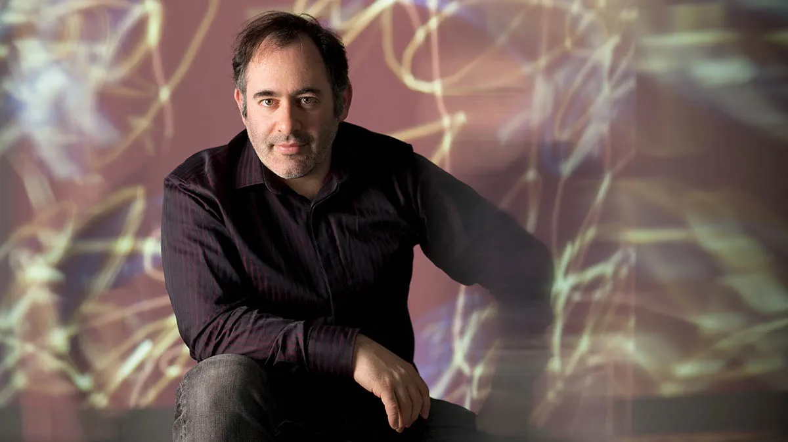

Golan Levin，美國，卡內基美隆大學任教

互動藝術與生成藝術，用即時動畫、機器學習與電腦視覺，處理人與機器互動、把聲音視覺化這些題目。

--

## Jared Tarbell

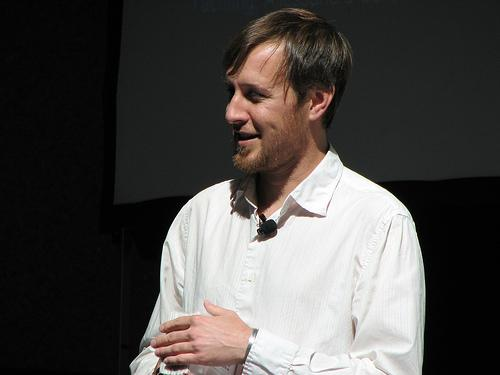

Jared Tarbell，美國

模擬自然界的模式：葉脈、雪花、樹的分枝。每次執行都長出不一樣的結果，所以每次看都是新的。

---

## 平台：作品怎麼被賣掉

--

## Art Blocks

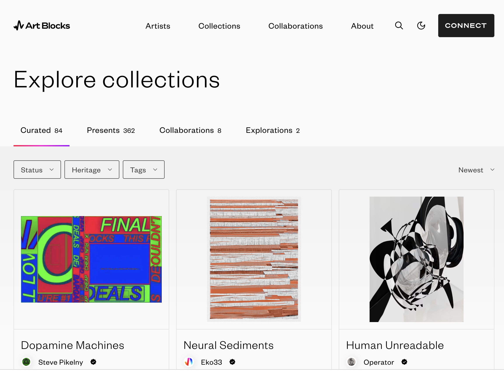

Art Blocks — Erick Calderon 於 2021 年創立，以太坊

--

## Art Blocks 的運作方式

1. 藝術家寫一段程式（通常是 JavaScript），**上傳的是程式碼本身**
2. 程式碼嵌進以太坊上的帳本
3. 收藏家鑄造時，鏈上產生一個隨機雜湊數
4. 那個雜湊數餵進程式，生出**這一枚 NFT 專屬**的畫面

> 收藏家按下鑄造之前，
> 沒有人看過那張圖，包括藝術家本人。

--

## Art Blocks 的運作方式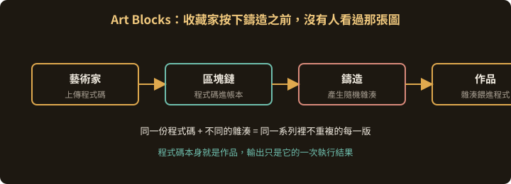

--

## Fidenza

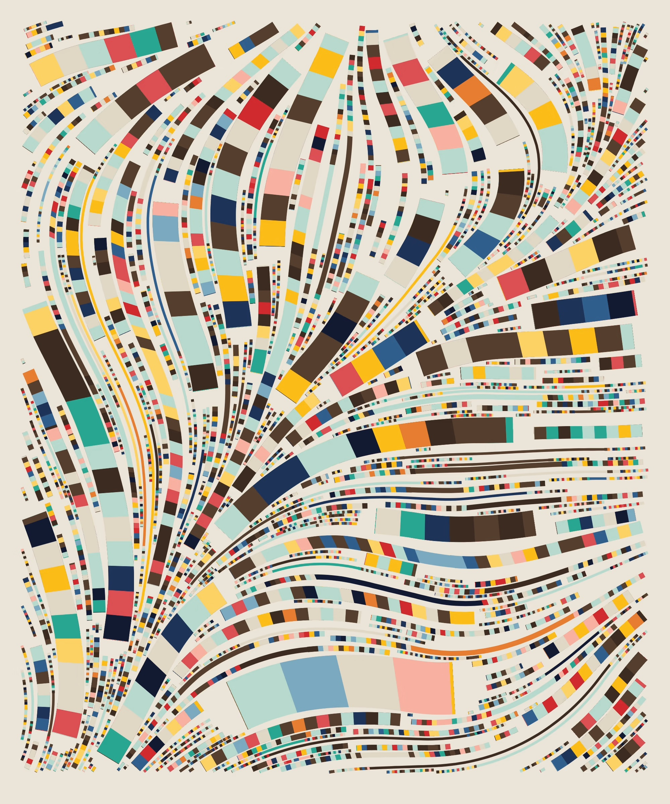

Fidenza #313 — Tyler Hobbs，全系列 1024 件

用線條與色塊組成，同一支生成器跑出上千種結構。豐富的視覺語言讓它成為 Art Blocks 上最受推崇的系列之一。

--

## Ringers

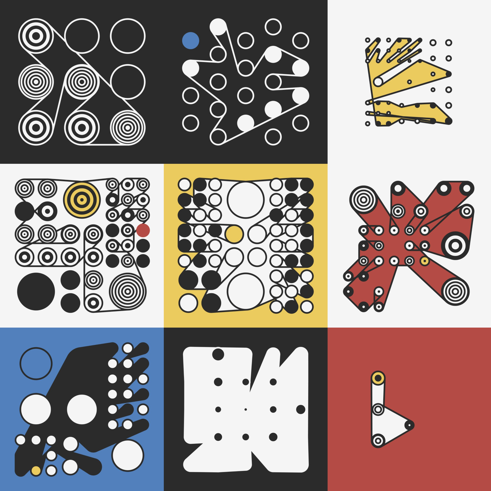

Ringers — Dmitri Cherniak

繩子繞過樁，長出既有機又幾何的形狀。開頭那隻「鵝」就是這個系列的第 879 號。

--

## 台灣的位置

目前成功登上 Art Blocks 的台灣藝術家有**王新仁、吳哲宇、林經堯、林逸文**。

--

## fxhash

2021 年 11 月在 Tezos 鏈上啟動，創立者是藝術家 ciphrd，理念是**無策展、人人皆可參與**。

Art Blocks 與 SuperRare 這類策展平台要排隊數個月，還不一定排得到。fxhash 直接讓你鑄造。

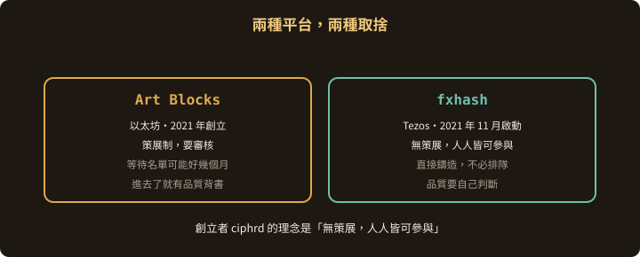

--

## 開放的代價

門檻低，詐騙者也容易進來。

社群因此補上檢舉、審核、標記與鑄造鎖定等機制，讓它維持在一個相對安全的交易環境。

> 這是所有開放平台都會遇到的同一個題目：
> 開放與品質，很難同時要。

--

## 開放的代價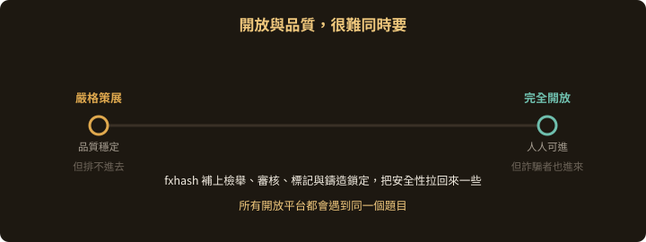

--

## 市場現況

自 2021 年的熱潮之後，生成藝術市場有起有落，也一直被 PFP 與 play-to-earn 專案的聲量蓋過。

但 CryptoPunks、Fidenza、Autoglyphs、Chromie Squiggle 這些最重要的 NFT 專案，**底層全都是生成式的**。

--

## Chromie Squiggle #0

Snowfro（Erick Calderon）— Art Blocks 的第一個系列

---

## 和傳統藝術比，差在哪

| | 傳統藝術 | 生成式藝術 |
|---|---|---|
| 藝術家控制的 | 每一筆 | 產生每一筆的規則 |
| 結果 | 創作前就想清楚 | 執行前不完全可知 |
| 作品數量 | 一件 | 一整個族群 |
| 完成之後 | 固定不變 | 可能隨互動、時間而變 |

--

## 兩個對照組

**達文西《蒙娜麗莎》**：主題、構圖、調色，每個細節都是他有意識地決定並親手畫出來的。

**羅丹《沉思者》**：姿勢、肌肉的紋理，同樣是刻意雕出來的。

作品一旦完成就固定了。解讀可以很多樣，但那件東西本身不會再變。

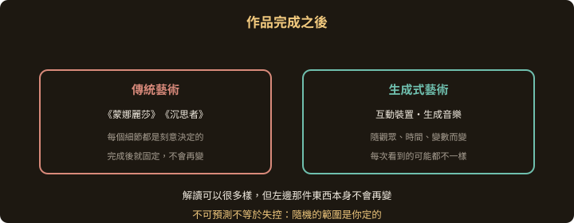

--

## 不可預測不等於失控

規則是你寫的，隨機的範圍也是你定的。

你決定的是「哪些地方讓它自由、自由到什麼程度」。這件事本身就需要判斷力，而且比畫好一筆更難練。

---

## 這一章要記得的

1. 生成式藝術的作者身分落在**規則**上，不在單張輸出上
2. 隨機性進入藝術遠早於電腦，1950 年代的當代藝術已經在做
3. 電腦時代的先驅受限於繪圖機，限制反過來長成了風格
4. NFT 平台改變的是**銷售與鑄造的方式**，不是創作的方式

Note:
下一章開始進技術：演算法、資料結構、隨機、以及神經網路。這些是後面能自己寫出生成器的基礎。
