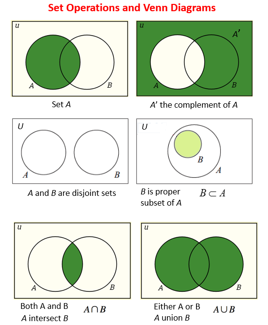

<!-- .slide: class="title" -->
# 生成式藝術的技術基礎

## 演算法、資料結構，以及神經網路

第 2 章

Note:
這章是全書唯一一次把電腦科學的底層概念一次講完。目的是讓你在後面讀別人的生成器程式碼時，知道每個名詞在指什麼，不是要把你訓練成工程師。

---

## 演算法就是食譜

食譜寫的是：要哪些材料、按什麼順序、用什麼方式處理。

演算法也一樣：要哪些輸入、按什麼順序、用什麼規則運算。

> 差別只在食譜的執行者是人，演算法的執行者是電腦。
> 電腦不會自己加鹽，你沒寫的它一定不做。

--

## 生成式藝術的核心是一支「可重複但不重現」的程式

藝術家設定一組參數與規則，規則導引創作過程：形狀怎麼選、顏色怎麼變、要不要回應觀眾的動作。

規則固定，但每次執行的結果都不一樣。

--

## Casey Reas《Process 20》

Process 20, 2014 — 自製軟體（黑白、無聲），尺寸與方向皆可變

一組簡單規則操縱形狀與顏色的變化，再混入隨機元素。同一組規則，每次跑出來都不同。

--

## Refik Anadol

ZHA x RAS, 2022, Architecting the Metaverse Animation

用機器學習處理大量資料。**這裡的不確定性來自資料本身，不是亂數。**

--

## 三種不確定性的來源

| 來源 | 例子 |
|---|---|
| 亂數 | Fidenza、Ringers 的鏈上雜湊 |
| 觀眾 | Lozano-Hemmer《光的身影》，影子與投影結合 |
| 時間 | Brian Eno 的生成音樂，永遠不會用同樣的方式播兩次 |

---

## 演算法無所不在

- **GPS 導航** — Dijkstra 演算法算出兩點間最短路徑
- **網路購物** — 推薦系統依照瀏覽與購買紀錄挑商品
- **基因研究** — 生物學家用演算法解析基因資料
- **天文觀測** — 處理來自深空的訊號

學演算法的用處不只在寫程式，它會改變你拆解問題的方式。

---

## 底層的數學與邏輯

--

## 四塊數學

集合運算 — 陣列、鏈結串列、堆疊、樹的共同基礎

--

## 四塊數學（續）

1. **集合與資料結構** — 理解陣列、鏈結串列、堆疊、樹怎麼運作
2. **函數與極限** — 分析演算法的時間與空間複雜度要用
3. **機率與統計** — 隨機演算法、機器學習的基礎
4. **線性代數與微積分** — 進階演算法，尤其是機器學習

--

## 三塊邏輯

1. **命題邏輯** — 真假值，以及「與、或、非」怎麼組合它們
2. **條件與迴圈** — 用 `if` 分支、用 `while` 與 `for` 重複
3. **證明技巧** — 直接證明、反證法、歸納法，用來確認演算法真的對

---

## 六種資料結構

| 結構 | 特性 | 常見用途 |
|---|---|---|
| 陣列 Array | 用索引直接取值 | 排序、搜尋 |
| 堆疊 Stack | 後進先出 LIFO | 括號配對、復原操作 |
| 佇列 Queue | 先進先出 FIFO | 資料流、緩衝 |
| 鏈結串列 LinkedList | 插入刪除快 | 頻繁增刪的集合 |
| 樹 Tree | 階層、一對多 | 二元搜尋樹、堆積 |
| 圖 Graph | 節點加邊，任意關係 | 網路路由、社群網路 |

--

## 為什麼藝術家要知道這些

資料結構決定了資料怎麼被組織，而組織方式決定了程式跑多快。

一個粒子系統要跑一萬顆粒子還是一百萬顆，差別往往就在這裡。

---

## 演算法分析：兩種成本

**時間複雜度** — 執行要花多久。`O(n)` 表示與輸入大小成正比，`O(n²)` 表示與平方成正比。

**空間複雜度** — 執行要佔多少記憶體，一樣用大 O 表示。

--

## 兩者經常要取捨

多存一些中間結果，計算會變快，但記憶體吃更多。

> 生成式藝術很常撞到這條線：
> 想加細節，畫面就掉幀。這時候要動的是演算法，不是電腦。

---

## 排序與搜尋

--

## 兩種排序

**泡沫排序** — 反覆掃過陣列，比較相鄰兩個元素，需要就交換。寫起來最簡單，但複雜度 `O(n²)`，資料一多就慢。

**快速排序** — 分治法。挑一個基準元素，把陣列分成比它小與比它大的兩堆，再各自快速排序。複雜度 `O(n log n)`。

--

## 二分搜尋

前提：資料**必須已經排好序**。

1. 從中間的元素開始比
2. 剛好相等就結束
3. 目標比較小，往左半邊找
4. 目標比較大，往右半邊找

複雜度 `O(log n)`。一百萬筆資料，最多找 20 次。

---

## 圖形演算法

--

## DFS 與 BFS

**深度優先搜尋（DFS）** — 沿著一條路走到底，走不動了才退回來換一條。用堆疊記錄待訪問的節點。

**廣度優先搜尋（BFS）** — 先看完所有離起點最近的節點，再往外一圈。用佇列記錄。

BFS 常用來解最短路徑，或判斷兩個節點之間到底通不通。

--

## Dijkstra

每條邊給一個權重，可以代表距離、成本或時間。

用優先佇列不斷挑出權重最小的邊，直到抵達終點或確定走不到。

> 你每次開導航，跑的就是這支演算法。

---

## 動態規劃

把一個大問題拆成一系列小問題，把小問題的答案存進表格，避免重複計算。

適用於具備**最佳子結構**（大問題的最佳解包含小問題的最佳解）與**重疊子問題**（同一個小問題被算很多次）的情況。

--

## 三個經典題目

- **背包問題** — 固定容量的背包，每件物品有重量與價值，怎麼裝總價值最高
- **最長共同子序列（LCS）** — `ABCD` 與 `ACDF` 的最長共同子序列是 `ACD`
- **最短路徑** — Dijkstra、Floyd-Warshall

---

## 機器學習的三種演算法

| 演算法 | 做什麼 | 怎麼運作 |
|---|---|---|
| 決策樹 | 分類 | 每個節點問一個問題，分支是答案，葉子是結論 |
| 神經網路 | 學複雜的非線性關係 | 多層神經元互相連接 |
| 支持向量機 SVM | 分類與迴歸 | 找一條決策邊界，讓不同類別的間距最大 |

三者的目標相同：從資料裡學出模式，然後預測。

---

## 演算法在生活裡

- **搜尋引擎** — 資訊檢索加排序，再混進你過去的搜尋行為
- **導航系統** — 圖形演算法找最短或最快路線
- **推薦系統** — 亞馬遜的商品、Netflix 的片單
- **社群媒體** — 決定你的動態牆上出現什麼
- **醫療** — 疾病預測、診斷、個人化療程

---

## 四個未來趨勢

1. **量子計算** — Shor 的質因數分解、Grover 的搜尋，解傳統電腦極難的問題
2. **生成式藝術** — GAN 生成的作品已經在藝術市場賣出驚人的價格
3. **自動化決策** — 自動交易、自駕車、臨床決策支援
4. **強化學習** — 讓機器從錯誤中學，找出最佳策略

---

## 神經網路

--

## 靈感來自人腦

人腦有上億個互相連接的神經元，以複雜的方式收送訊息。

神經網路同樣由許多小單元組成，每個單元接收輸入、處理、再傳給下一層。單元之間的連接強度叫**權重**，會在學習過程中被調整。

--

## 人腦與電腦，差在哪

| | 人腦 | 電腦 |
|---|---|---|
| 組成 | 約 860 億個神經元 | 處理器、記憶體 |
| 訊號 | 化學物質 | 電子訊號 |
| 處理方式 | 大量並行 | 極快，但偏向循序 |
| 學習 | 自己從經驗中學 | 要人寫程式教它 |
| 損壞 | 能自我修復、自我組織 | 需要人維修 |

--

## 一個神經元怎麼運作

1. **突觸**接收其他神經元傳來的化學訊息，轉成電訊號
2. 電訊號進入**細胞體**處理
3. 累積強度超過閾值，神經元被激發，產生新的電訊號
4. 新訊號沿著**軸突**傳出去，透過突觸交給下一個神經元

人腦裡每個神經元可能連著上千個其他神經元。

--

## 人工神經網路的三層

**輸入層** — 起點。處理圖片時，每個節點可能代表一個像素。

**隱藏層** — 內部層。接收前一層所有節點的輸出，加權求和，再通過激活函數（ReLU、sigmoid）轉換。

**輸出層** — 終點。節點數等於你要預測的類別數。

--

## 一個具體的例子

辨識手寫數字：

- 輸入層 **784** 個節點（28 × 28 像素）
- 兩個隱藏層，各 **256** 個節點
- 輸出層 **10** 個節點，對應數字 0 到 9

這就是一個基本的全連接前饋神經網路。

--

## 學習的五個步驟

1. **初始化** — 隨機給定所有權重與偏置
2. **前向傳播** — 資料從輸入層流到輸出層，每層各自計算
3. **計算損失** — 預測與正確答案的差距，用均方誤差或交叉熵衡量
4. **反向傳播** — 從輸出層往回算，得出每個權重對損失的貢獻（梯度）
5. **更新參數** — 用梯度下降或 Adam 依梯度調整，步伐大小由學習率控制

重複，直到表現夠好或不再進步。

---

## 深度學習

--

## 和傳統機器學習差在哪

傳統機器學習需要**人工挑選並萃取特徵**。

深度學習直接吃原始資料，**自己找出有用的特徵**。代價是要更多層、更多參數，也就要更多算力與資料。

--

## 已經做到的事

**影像** — 臉部辨識、物件偵測、影像分割

**語言** — 語音辨識、機器翻譯、情感分析

**其他** — 玩家行為分析、疾病預測與診斷

---

## 生成模型：讓電腦自己創作

目標是學會資料的真實分布，然後**生出新的、與真實資料相似但並不存在的樣本**。

它不只學特徵，還要理解資料的內在結構與彼此的關係。

--

## GAN：兩個網路互相對抗

**生成器** — 從一團隨機雜訊開始，試著做出以假亂真的樣本。

**鑑別器** — 試著分辨哪些是真的、哪些是生成器捏造的。

兩者反覆對抗，生成器逐漸學會騙過鑑別器。

> 這是一個沒有標準答案的訓練方式：
> 老師和學生同時在進步。

--

## Portrait of Edmond Belamy

2018 年佳士得，43 萬美元

世界上第一幅被拍賣的人工智慧藝術作品。

---

## 未來的可能性

精準醫療、個人化教育、智慧家庭、自駕車、智慧城市。

在藝術領域，生成模型已經能做出和人類藝術家相提並論的作品。

--

## 但技術不是全部

要在這個世界裡活得好，光懂技術怎麼運作還不夠。

你還要理解它對生活的影響，以及可能帶來的倫理與社會問題。**需要的是跨領域的能力**，數學與電腦科學之外，還有藝術、社會學與倫理學。

---

## 這一章要記得的

1. 演算法是食譜，你寫什麼它做什麼，沒寫的一定不做
2. 資料結構決定效率，效率決定你的作品能長到多複雜
3. 不確定性有三種來源：亂數、觀眾、時間
4. 神經網路是一種**學出來的**規則，和你手寫的規則本質不同

Note:
下一章離開技術，看這些東西實際被用在哪些領域。
