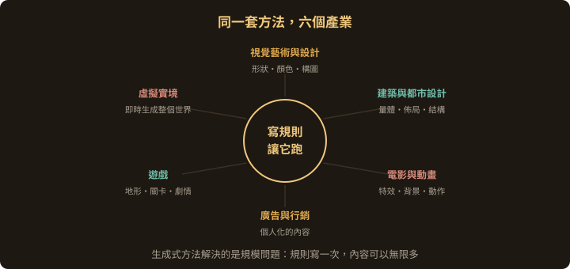
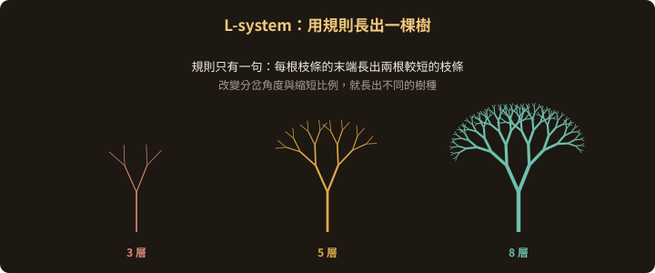
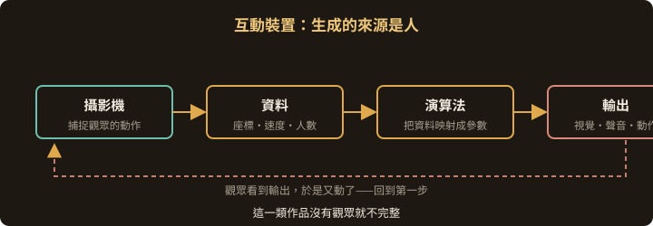
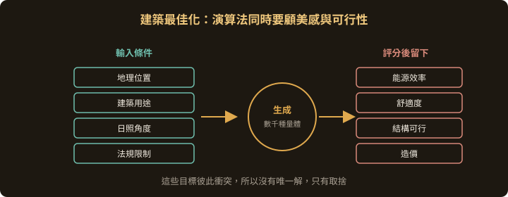
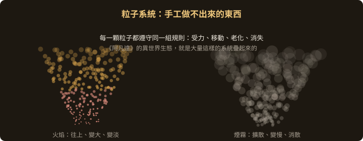
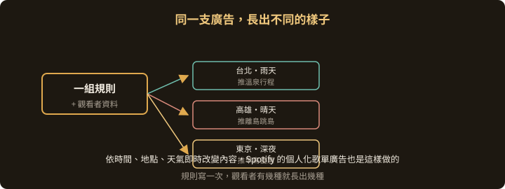
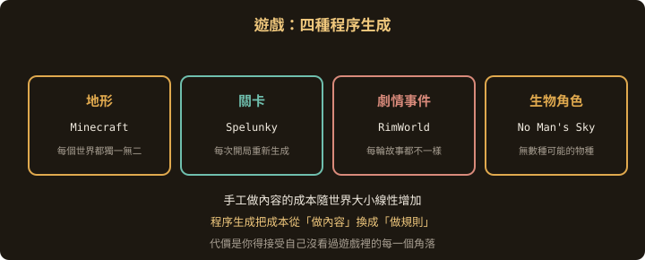
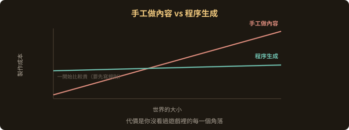

<!-- .slide: class="title" -->
# 生成式藝術的應用領域

## 它已經在哪裡運作

第 3 章

Note:
這章是一次巡覽。要看的是同一套「寫規則、讓它跑」的方法，在六個完全不同的產業裡長成什麼樣子，個別案例記不住沒關係。

---

## 六個領域，同一套方法

| 領域 | 生成的是什麼 |
|---|---|
| 視覺藝術與設計 | 形狀、顏色、構圖 |
| 建築與都市設計 | 量體、佈局、結構 |
| 電影與動畫 | 特效、背景、動作 |
| 廣告與行銷 | 個人化的內容 |
| 遊戲 | 地形、關卡、劇情、角色 |
| 虛擬實境 | 即時生成的整個世界 |

---

## 視覺藝術與設計

--

## 數位繪畫

用演算法產生繪畫的元素：顏色、形狀、線條。

這些元素依照特定規則與參數變動，例如用隨機運算或機率分布，決定每一筆的顏色與位置。

--

## 三維建模

自動生成複雜的模型與結構，用在建築設計、產品設計、遊戲角色。

**L-system** 是一種基於規則的系統，用來模擬自然界的成長過程，可以長出樹木或珊瑚這類結構。

同一條規則，改層數就長出不同的樹

--

## 動態影像

用演算法生成會變化的視覺效果，變化的依據可以是音樂的節奏、人的動作，或任何一組輸入資料。

音樂視覺化就是最常見的一種。

--

## 互動裝置

裝置依照觀眾的行為，生成變化的視覺、聲音或動作。

例如用攝影機捕捉觀眾的移動，再拿這些資料去控制畫面或聲音。

> 這一類作品沒有觀眾就不完整。
> 生成的來源換成了人。

--

## 互動裝置

---

## 建築與都市設計

--

## 最佳化建築設計

演算法依照地理位置、建築用途與環境因素（例如日照角度），去最佳化建築的形狀與佈局。

目標是能源效率與舒適度，兩者通常互相衝突，需要取捨。

--

## 都市規劃

結合大量資料與生成式方法，模擬不同的發展策略，比較哪一種規劃決策比較適合這座城市。

--

## 生成建築結構

建築師 **Marc Fornes** 的事務所 **Theverymany** 用自己開發的演算法，做出流線形而且具備結構性的建築。

> 這裡的演算法不只是造形工具，
> 它同時要負責讓那個造形站得住。

---

## 電影與動畫

--

## 視覺效果

手工做不出來的效果交給演算法：複雜的粒子系統（煙霧、火焰）、流體模擬。

《阿凡達》的異世界景觀與生態系統，大量使用了生成式技術。

--

## 背景元素

大型場景裡的樹木、建築、甚至人群，自動填滿。

《魔戒》系列的大戰場面用一套叫 **Massive** 的軟體，模擬出每一個獨立士兵的行為。

--

## 動畫設計

用程序生成的骨骼與肌肉系統驅動角色的動作，讓動畫更接近真實的力學。

---

## 廣告與行銷

--

## 個人化廣告

依照每個使用者的興趣與購買習慣生成不同的廣告。

Spotify 的個人化歌單廣告就是這樣做的，依照你的音樂喜好推薦新歌與專輯。

--

## 動態創意

廣告內容依照時間、地點或天氣即時改變。

一家旅行社可以讓同一支廣告，對不同城市的觀看者顯示不同的目的地與優惠。

--

## 內容生成

用自然語言生成（NLG）技術，從一組關鍵字或一段大綱長出一整篇文章、貼文。

---

## 遊戲

--

## 四種程序生成

| 生成的東西 | 代表作 |
|---|---|
| 地形 | Minecraft，每個世界都獨一無二 |
| 關卡 | Spelunky，每次開局重新生成 |
| 劇情事件 | RimWorld，每輪故事都不一樣 |
| 生物角色 | No Man's Sky，無數種可能的物種 |

--

## 為什麼遊戲特別需要它

手工做內容的成本，隨著世界的大小線性增加。

程序生成把成本從「做內容」換成「做規則」。規則寫一次，世界可以無限大。

> 代價是你得接受自己沒看過遊戲裡的每一個角落。

--

## 為什麼遊戲特別需要它

---

## 虛擬實境

--

## 即時生成的環境

玩家每進入一個新區域，演算法就即時長出新的地形、建築與生物。

整個世界在視覺與空間上變得沒有邊界。

--

## 視覺與聲音藝術

VR 本身就是一種創作媒材。互動式 VR 裝置裡的視覺與聲音，可以隨著觀眾的動作與環境變化即時生成。

--

## 教育與訓練

依照學習者的狀況動態調整虛擬環境。

醫學訓練的模擬裡，演算法可以生成各種不同的病理情況，讓學生練習臨床應變。

---

## 這一章要記得的

1. 同一套方法在六個產業裡各自長出不同的樣子
2. 生成式方法解決的是**規模**問題：規則寫一次，內容可以無限多
3. 互動類作品的不確定性來自人，不是亂數
4. 最佳化類的應用裡，演算法要同時負責美感與可行性

Note:
下一章開始談工具：你要用什麼把這些規則寫出來。
