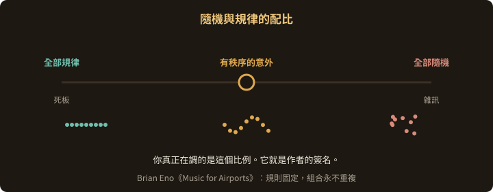
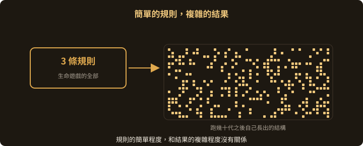
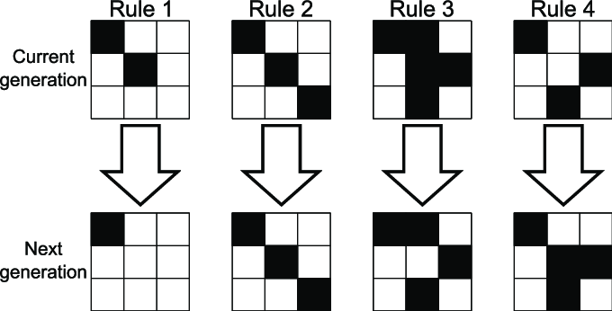
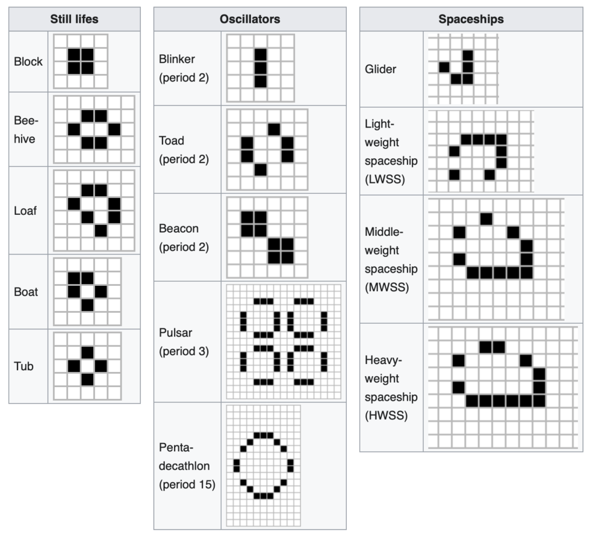
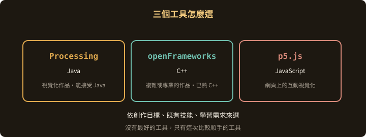
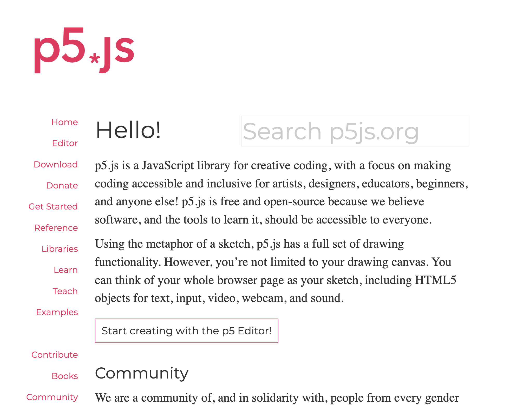
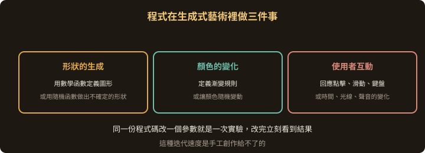
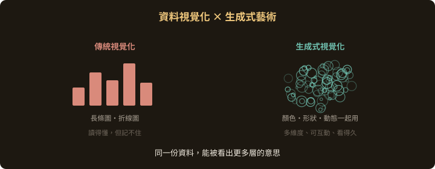

<!-- .slide: class="title" -->
# 生成式藝術的工具和技術

## 兩個原則，三個工具

第 4 章

Note:
這章先講兩個貫穿整門課的原則：隨機性與規律性的配比，以及從簡單到複雜。原則講完才談工具，因為工具會換，原則不會。

---

## 原則一：隨機性與規律性

生成式藝術裡有兩種對立卻又必須並存的元素。

藝術家不預先規劃每個細節，而是設計一組基本規則，再讓這些規則在一定的隨機範圍內變化，長出無法預知但仍有秩序的作品。

--

## 配比才是作者的簽名

全部規律，作品死板。

全部隨機，作品變成雜訊。

> 你真正在調的，
> 是這兩者之間的那個比例。

--

## 配比才是作者的簽名

--

## Brian Eno《Music for Airports》

他設計的是一組音樂片段的播放規則，然後讓片段在一定的隨機性下不斷重複與組合。

結果是永遠不會重複的音樂變化。作品是那組規則，不是任何一次播放。

---

## 原則二：從簡單到複雜

一組簡單的規則，可以生成極度複雜而豐富的結果。

**規則的簡單程度，和結果的複雜程度沒有關係。**

--

## 生命遊戲

Conway's Game of Life — 三條規則

--

<!-- .slide: class="compact" -->
## 三條規則能長出什麼

英國數學家 John Conway 只寫了三條規則，格子裡卻長出各種複雜而美麗的圖案。

有些圖案甚至會自我複製、自我變化，看起來像有生命。

第 8 章會親手把它實作出來

---

## 三個工具

| 工具 | 語言 | 適合誰 |
|---|---|---|
| **Processing** | Java | 想做視覺化作品、能接受 Java |
| **openFrameworks** | C++ | 已經熟 C++，要做複雜或專業的作品 |
| **p5.js** | JavaScript | 想做網頁上的互動視覺化 |

--

## Processing

以 Java 為基礎的開源程式環境，專門為藝術家、設計師、研究者與初學者設計。

平台簡單好上手，可以快速做出視覺化圖像、動畫與互動元素。

--

## openFrameworks

以 C++ 為基礎的開源工具包。平台強大而且彈性大，可以做視覺化作品、互動裝置、實體裝置與實驗性專案。

代價是 C++ 本身的門檻。

--

## p5.js

以 JavaScript 為基礎的開源程式環境，靈感來自 Processing，把同樣的概念搬到網頁與 JavaScript 的世界。

這門課接下來都用它

--

## 怎麼選

1. **創作目標** — 你想做什麼樣的作品，需要哪些功能或效果
2. **既有技能** — 你熟哪種語言，有哪些程式或藝術經驗
3. **學習需求** — 你希望藉這件作品學會什麼

> 沒有最好的工具，只有這次比較順手的工具。

---

## 程式在生成式藝術裡扮演什麼角色

透過程式，藝術家定義並控制創作的規則、過程與輸出。

--

## 三件程式能做的事

**形狀的生成** — 用數學函數定義圖形，或用隨機函數創造不確定的形狀，再重複與變化它們

**顏色的變化** — 定義從一種顏色到另一種顏色的漸變規則，或讓顏色隨機變動

**使用者互動** — 讓作品回應點擊、滑動、鍵盤輸入，或時間、光線、聲音這些環境變化

--

## 程式也是實驗的工具

同一份程式碼改一個參數就是一次實驗，改完立刻能看到結果。

這種迭代速度是手工創作給不了的，它讓「探索新的視覺效果與新的創作方法」變成日常。

---

## 資料視覺化與生成式藝術

資料視覺化把抽象的資料變成看得懂的圖像，生成式藝術用程式碼生成畫面。兩者結合有三個好處。

--

## 創新性

超越長條圖與折線圖這些傳統形式，做出有藝術感的視覺效果，提高吸引力與記憶點。

--

## 表現力

用顏色、形狀、動態去表現資料的多維度與多層次關係。

同一份資料，能被看出更多層的意思。

--

## 動態與互動

讓視覺化隨時間或使用者的操作而變化，觀眾從看的人變成參與的人。

--

## 三個方向

**資料視覺化藝術** — 把氣候變遷、都市化這類社會問題的資料，做成動態互動的展示

**互動資料視覺化** — 讓使用者自己操作，探索一組複雜的經濟或社群網路資料

**動態資料視覺化** — 呈現風暴、海潮這類自然現象，或化學反應、生物演化這類科學過程

---

## 這一章要記得的

1. 隨機與規律的**配比**，是作者風格所在
2. 簡單的規則可以長出複雜的結果，兩者沒有必然關係
3. 工具依創作目標、既有技能、學習需求來選
4. 程式不只是產出工具，更是實驗工具

Note:
下一章開始動手，從 p5.js 的安裝與第一支程式開始。
