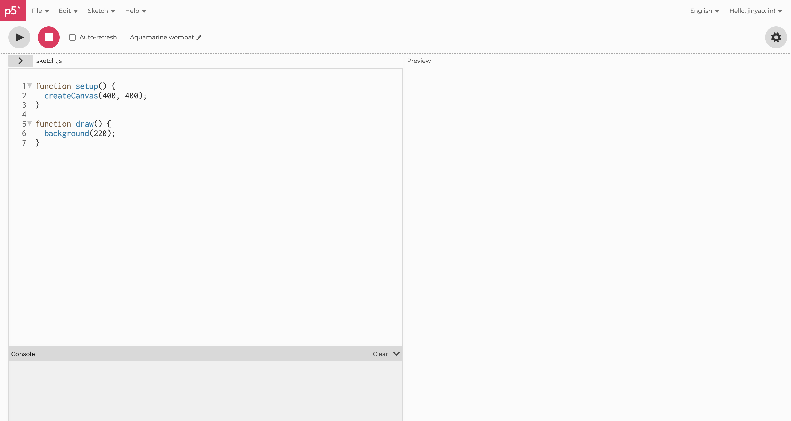
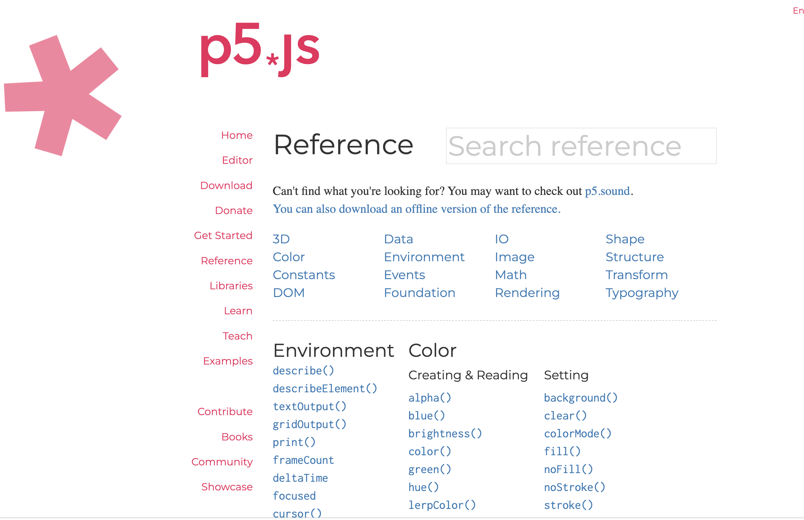

<!-- .slide: class="title" -->
# p5.js 與生成式藝術

## 環境、畫布、座標系

第 5 章

Note:
這章把工具準備好。裝環境的部分不必背，會查就好；真正要記住的是座標系統與 setup/draw 這兩件事，後面每一支程式都建立在上面。

---

## p5.js 是什麼

一個開放原始碼的 JavaScript 函式庫，專門為視覺與生成式藝術設計。

由 **Lauren McCarthy** 創建，**Processing Foundation** 維護。它把複雜的程式碼包起來，讓你在瀏覽器裡用 JavaScript 畫 2D 與 3D 圖形、做互動與動畫。

--

## 為什麼選它

1. **好學** — 語法簡潔，初學者可以很快開始畫圖與做動畫
2. **視覺導向** — 寫程式的同時就看得到即時的輸出
3. **社群** — 大量教學、範例與資源
4. **跨平台** — 基於 JavaScript，任何有瀏覽器的裝置都能跑，不必裝外掛
5. **可擴充** — 能和其他 JavaScript 函式庫、HTML、CSS、WebGL 一起用

---

## 準備環境

p5.js 靠瀏覽器執行，所以需要一個網頁伺服器來放程式。

--

## 方法一：Python 內建的 HTTP Server

終端機切換到你的網站資料夾，然後執行：

```bash
python -m http.server        # Python 3.x
python -m SimpleHTTPServer   # Python 2.x
```

瀏覽器打開 `http://localhost:8000`。

--

## 方法二：Node.js 的 http-server

先全域安裝：

```bash
npm install --global http-server
```

切換到網站資料夾，執行 `http-server`，然後打開 `http://localhost:8080`。

--

## HTML 檔長什麼樣

```html
<!DOCTYPE html>
<html>
  <head>
    <title>My p5.js Project</title>
    <script src="https://cdnjs.cloudflare.com/ajax/libs/p5.js/1.4.0/p5.js"></script>
    <script src="sketch.js"></script>
  </head>
  <body>
    <main>
    </main>
  </body>
</html>
```

一個 `<script>` 載入 p5.js 函式庫，另一個載入你的程式。

---

## 線上編輯器

不想在本機裝東西，就用官方的線上編輯器。

--

## 從官網進去


<p class="figcap">p5js.org — 上方導覽列點 Editor</p>

--

## 編輯器介面



<p class="figcap">左邊寫程式，右邊即時看結果</p>

預設就有 `setup()` 與 `draw()` 兩個函式等著你填。

---

## 兩個一定會有的函式

| 函式 | 執行時機 | 用來做什麼 |
|---|---|---|
| `setup()` | 程式開始時**執行一次** | 建立畫布、初始設定 |
| `draw()` | setup 之後**每秒約 60 次** | 繪製與更新畫面 |

> 一次性的事寫在 setup，
> 會動的事寫在 draw。

---

## 五個基本概念

--

## 畫布 Canvas

所有繪圖都發生在一塊二維的畫布上，用 `createCanvas()` 設定它的大小。

--

## 座標系統

原點 `(0, 0)` 在**左上角**，x 向右為正，**y 向下為正**。

這和數學課的座標系不一樣，但在電腦圖形裡是通例。

> y 軸向下是初學者最常撞到的坑：
> 想把東西往上移，要**減** y，不是加。

--

## 形狀與顏色

`ellipse()` 畫橢圓、`rect()` 畫矩形，顏色用 `fill()` 與 `stroke()` 設定。

--

## 動畫與互動

`draw()` 每秒被呼叫約 60 次，動畫就是靠它。

另外還有一整套處理鍵盤、滑鼠與觸控的函式。

--

## 變數與函式

用變數存資料，用函式組織與重複使用程式碼。

這部分和其他程式語言完全一樣。

---

## 常用函式速查

--

## 畫布與顏色

| 函式 | 作用 |
|---|---|
| `createCanvas(w, h)` | 建立畫布 |
| `background(color)` | 設定背景色 |
| `fill(color)` / `noFill()` | 填色 / 不填色 |
| `stroke(color)` / `noStroke()` | 線條顏色 / 不畫線 |
| `strokeWeight(w)` | 線條粗細 |

--

## 基本形狀

| 函式 | 作用 |
|---|---|
| `line(x1,y1,x2,y2)` | 直線 |
| `rect(x,y,w,h)` | 矩形，`(x,y)` 是左上角 |
| `circle(x,y,d)` | 圓，`(x,y)` 是圓心 |
| `ellipse(x,y,w,h)` | 橢圓，`(x,y)` 是中心 |
| `triangle(x1,y1,x2,y2,x3,y3)` | 三角形 |
| `quad(...)` | 四邊形 |

--

## 自訂形狀與曲線

| 函式 | 作用 |
|---|---|
| `beginShape()` / `endShape()` | 包住一個自訂形狀 |
| `vertex(x, y)` | 加一個頂點 |
| `curveVertex(x, y)` | 加一個曲線頂點 |
| `bezier(...)` | 貝茲曲線 |

`beginShape()` 與 `endShape()` 之間放 `vertex()`，就能畫出任意多邊形。

--

## 查文件才是常態



<p class="figcap">p5js.org 的 Reference 頁面列出所有物件與函式</p>

沒有人背得起來全部。**會查，比記得住更重要。**

---

## 這一章要記得的

1. `setup()` 跑一次，`draw()` 每秒跑六十次
2. 原點在左上角，**y 向下為正**
3. 環境有兩條路：本機起一個 Web Server，或直接用線上編輯器
4. 函式查 Reference 就好，不用背

Note:
下一章開始真的寫程式，從最基本的繪圖一路做到會動的作品。
