<!-- .slide: class="title" -->
# p5.js 的程式開發

## 從一個圓點到一件 fxhash 作品

第 6 章

Note:
這章從最小的範例開始，一路做到一件實際發表過的生成式作品。中間每一個範例都只加一件事，讀的時候注意「這一步比上一步多了什麼」。

---

## 最小的一支程式

```javascript
function setup() {
  createCanvas(400, 400);   // 建立 400×400 的畫布
}

function draw() {
  background(220);          // 每幀先塗掉整張畫布
  ellipse(mouseX, mouseY, 50, 50);   // 在滑鼠位置畫一個圓
}
```

`mouseX` 與 `mouseY` 是 p5.js 自動幫你追蹤的滑鼠座標。

--

## 結果

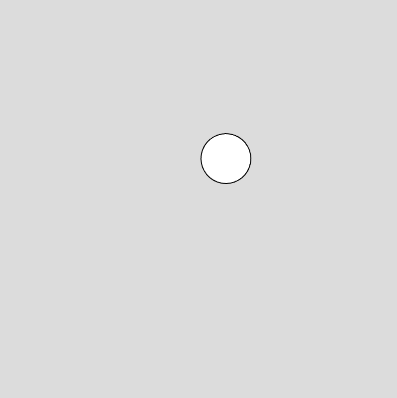

<p class="figcap">範例 6-1 — 球隨著滑鼠移動，不斷更新位置並重畫</p>

--

## 為什麼它看起來只有一顆球

因為 `draw()` 每一幀都先呼叫 `background(220)`，把上一幀畫的全部塗掉。

**這一行決定了作品是「動畫」還是「累積的軌跡」**，後面會用到。

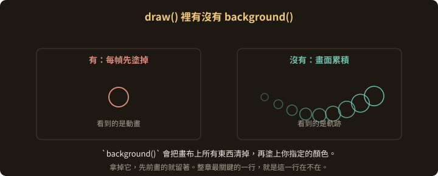

---

## p5.js 的執行流程

1. **初始化** — 函式庫載入，全域變數與函式建立
2. **`preload()`** — 載入圖片、音訊、JSON。**它沒跑完，後面都不會開始**
3. **`setup()`** — 執行一次，建立畫布、設定初始值
4. **`draw()`** — 之後不斷被呼叫，預設每秒約 60 次，可用 `frameRate()` 調整
5. **事件處理** — `mousePressed()`、`keyReleased()` 等，獨立於 draw 的迴圈之外
6. **自訂函式** — 你自己寫的，隨時呼叫

---

## 加入隨機

```javascript
function setup() {
  createCanvas(400, 400);
  frameRate(1);              // 每秒只更新一次
}

function draw() {
  background(220);
  translate(width / 2, height / 2);          // 原點移到畫布中央
  fill(random(255), random(255), random(255));
  ellipse(0, 0, random(100));                // 隨機大小的圓
  fill(255);
}
```

--

## 三個新東西

| 函式 | 做什麼 |
|---|---|
| `frameRate(1)` | 把每秒 60 幀降成 1 幀 |
| `translate(x, y)` | 把座標系的原點移到別的位置 |
| `random(n)` | 產生 0 到 n 之間的隨機值 |

--

## 結果

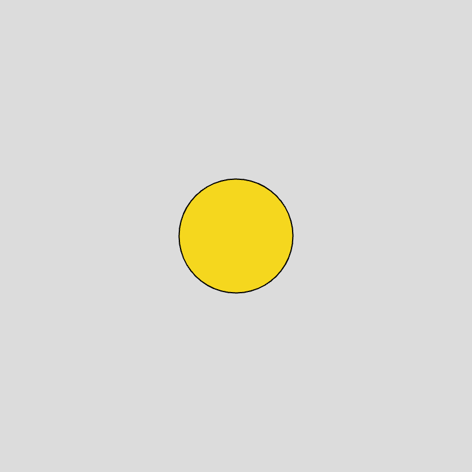

<p class="figcap">範例 6-2 — 每秒換一個顏色與大小</p>

--

## 背景也交給隨機

```javascript
background(random(255), random(255), random(255));
```

三個參數分別是 RGB 三個通道，各自取 0 到 255 的隨機值。

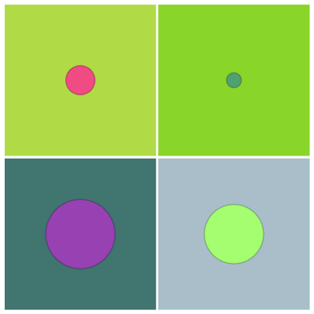

<p class="figcap">改一行，整張畫布跟著換色</p>

---

## 用基本形狀組出一張臉

```javascript
function draw() {
  background(220);
  fill(200);
  rectMode(CENTER);                          // rect 的前兩個參數改成中心點
  rect(width/2, height/2, 200, 300, 20);     // 頭，圓角 20

  fill(0);
  let eyeSize = random(30, 40);              // 眼睛大小隨機
  ellipse(width/2 - 50, height/2 - 50, eyeSize);
  ellipse(width/2 + 50, height/2 - 50, eyeSize);

  fill(150);
  triangle(width/2, height/2-20, width/2-10, height/2+20, width/2+10, height/2+20);

  fill(255, 0, 0);
  arc(width/2, height/2 + 70, 80, 30, 0, PI);   // 嘴巴，半圓弧
}
```

--

<!-- .slide: class="compact" -->
## 結果

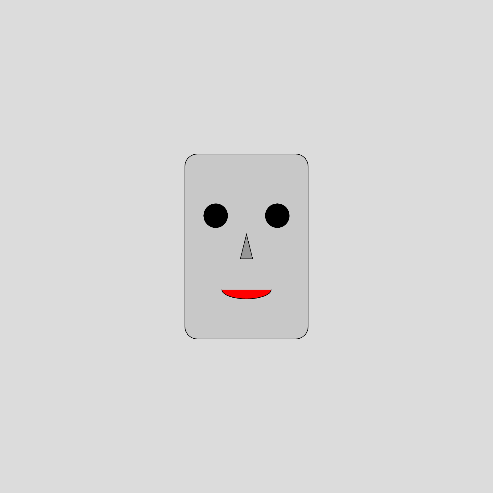

<p class="figcap">範例 6-3 — 只有眼睛大小是隨機的，整張臉的表情就變了</p>

> 這是生成式藝術最小的示範：
> 一個參數的隨機，換來整體感覺的改變。

---

## 靜態作品：Distortion City #0

2021 年發表在 fxhash 的作品。用圓的數學公式，加上頻率的改變，做出在圓周上變化的圖形。

--

## 核心那幾行

```javascript
for (let i = 0; i < 100; i++) {
  let index = (i / 100) * 6.28;          // 把 i 攤到 0 ~ 2π
  let r = 100 + cos(index * 10) * 20;    // 半徑跟著 cos 起伏
  points[i] = [cos(index) * r, sin(index) * r, 0];
}
```

`cos(index * 10)` 裡的 **10 就是頻率**。改這個數字，圓周上的起伏次數就變了。

--

## 然後把點連起來

```javascript
stroke(rndcolor1, rndcolor2, rndcolor3);
strokeWeight(3);
for (let i = 0; i < 100; i++) {
  line(points[i][0],      points[i][1],      points[i][2],
       points[(i+1)%100][0], points[(i+1)%100][1], points[(i+1)%100][2]);
}
```

`% 100` 讓最後一點接回第一點，形成封閉曲線。

--

## 結果

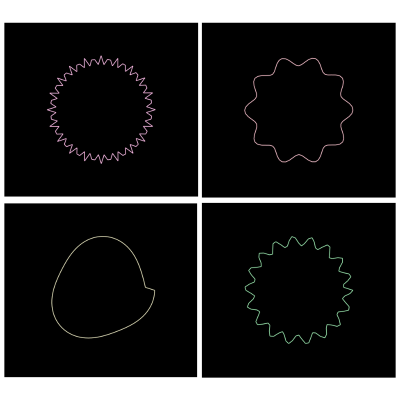

<p class="figcap">範例 6-4 — 改變圓周半徑的變化方式，就長出完全不同的圖形</p>

--

## 靜態作品不需要 draw()

整段程式寫在 `setup()` 裡，畫完就不動了。

要留著 `draw()` 也行，在裡面呼叫 `noLoop()`：

```javascript
function draw() {
  noLoop();
}
```

---

## 不清背景：讓筆觸累積

拿掉 `draw()` 裡的 `background()`，畫布上先前的東西就會留著。

```javascript
function setup() {
  createCanvas(800, 600);
  background(220);            // 只在開頭清一次
}

function draw() {
  fill(0);
  noStroke();
  ellipse(mouseX, mouseY, 10, 10);
}
```

--

## 再讓顏色與大小隨機

```javascript
function draw() {
  fill(random(255), random(255), random(255));
  noStroke();
  ellipse(mouseX, mouseY, random(10, 50), random(10, 50));
}
```

--

## 結果

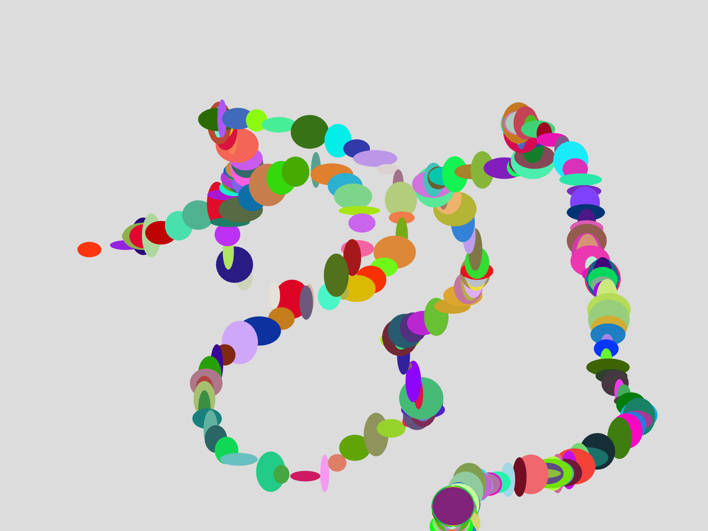

<p class="figcap">範例 6-5 — 滑鼠的移動軌跡變成一支筆</p>

還可以再往下推：讓顏色隨時間或滑鼠速度變化，或把圓形換成別的形狀。

---

## 用時間線增加複雜度

--

## Perlin Noise

`noise()` 產生的是**平滑而連續**的隨機序列，並不是一般意義的亂數。

相鄰的取樣點之間變化很小，所以拿它來控制位置或顏色，動起來會自然，不會抖。

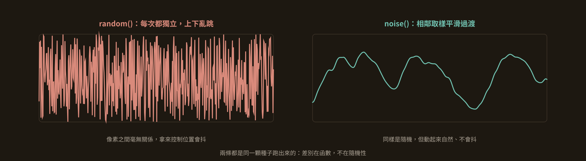

<p class="figcap">實際跑出來的兩條曲線，同一顆種子</p>

--

## 讓時間推著它走

```javascript
let t = 0;

function draw() {
  fill(random(255), random(255), random(255));
  noStroke();
  let x = noise(t) * width;        // x 由 noise 決定
  let y = noise(t + 5) * height;   // y 取另一段，避免和 x 同步
  ellipse(x, y, random(10, 50), random(10, 50));
  t += 0.01;                       // 時間每幀往前一點
}
```

--

## 結果

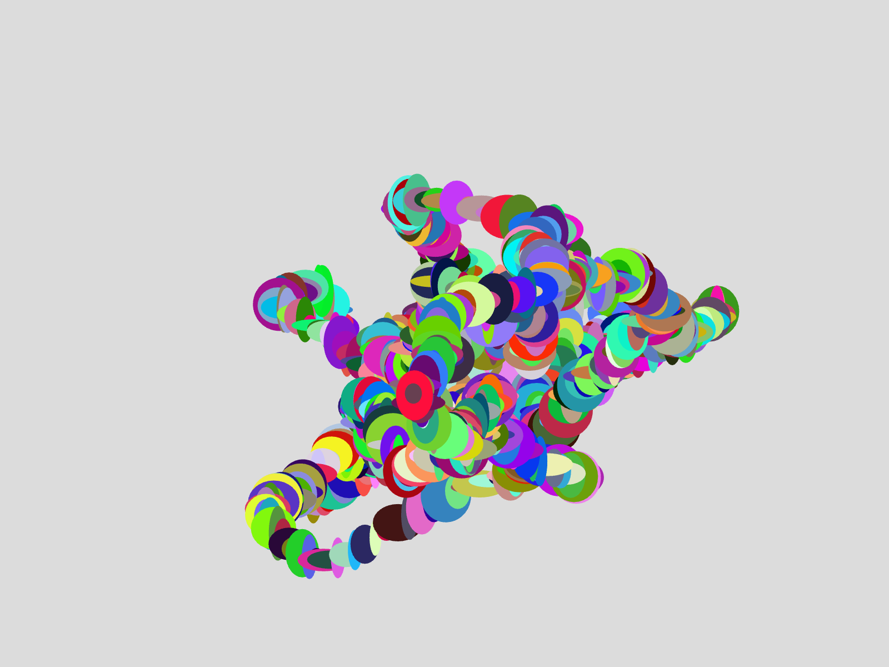

<p class="figcap">範例 6-6 — Perlin Noise 帶出來的運動路徑</p>

`t` 每幀增加，等於在 noise 函數上往前取樣，圖形就有了看似隨機卻仍有規律的變化。

--

## 讓它自己停下來

```javascript
if (t > 20) {
  noLoop();
}
```

`t` 每次呼叫 `draw()` 都增加，超過 20 就停止更新。

---

## Perlin Noise 的實際應用

--

## 百岳計畫「秘境」

<div class="imgrow">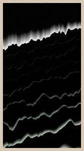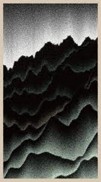</div>

<p class="figcap">林經堯，百岳計畫「秘境」，2022</p>

--

## 百岳計畫「植被」

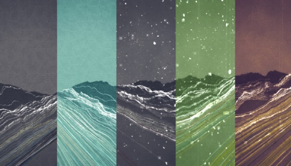

<p class="figcap">林逸文，百岳計畫「植被」</p>

兩件作品都用 Perlin Noise 當主要的運動線條，構成山脈的筆觸。

---

## 完整案例：Sunrise Sunset

發表於 fxhash。從這裡開始，程式不再是一個檔案，而是一個結構。

--

## 主程式的骨架

```javascript
function setup() {
  canvasSize = (windowWidth > windowHeight) ? windowHeight : windowWidth;
  canvas = createCanvas(canvasSize, canvasSize);   // 永遠是正方形
  pixelDensity(displayDensity());
  colorMode(HSB, 360, 100, 100);                   // 改用 HSB 色彩模式
  background(variety.bgcolor);
}
```

--

## draw() 就是一張分層的畫

```javascript
function draw() {
  noLoop();                       // 只畫一次
  translate(canvasSize/2, canvasSize/2);

  sky();                          // 天空
  sun();                          // 太陽
  for (var i = 0; i < 10; i++) {  // 十朵雲
    cloud((fxrand()-0.5)*canvasSize, fxrand()*-canvasSize/3 - canvasSize/6);
  }
  sunreflectionarray();           // 海面反光
  ocean();                        // 海
  // 再依 object_type 畫船／鯨魚／海豚／島
}
```

--

## 剪影用 switch 分流

```javascript
switch (object_type) {
  case 0: boat();     break;
  case 1: whale();    break;
  case 2: dolphin();  break;
  case 3: dolphins(); break;
  case 4: island();   break;
}
```

一支程式，五種可能的主角。

--

## 天空是兩萬四千條短線

```javascript
function sky() {
  strokeWeight(canvasSize * 0.0001);
  for (var i = 0; i < 24000; i++) {
    let px = (R.random_dec() - 0.5) * canvasSize;
    let py = Math.floor((1 - pow(R.random_dec(), 0.25)) * canvasSize/2) * -1;
    let sz = R.random_num(40, 80);
    let bright = R.random_num(-20, 20) + variety.sky[2];
    stroke(variety.sky[0], variety.sky[1], bright);
    line(px - sz/2, py, px + sz/2, py);
  }
}
```

--

## 那個 `pow(random, 0.25)` 是關鍵

如果直接用 `random()`，短線會平均散佈。

套一個 0.25 次方之後，分布被拉往地平線那一側，天空自然出現由密到疏的漸層。

> 想控制「東西聚在哪裡」，
> 要調的是隨機值的分布。


--

## 那個 `pow(random, 0.25)` 是關鍵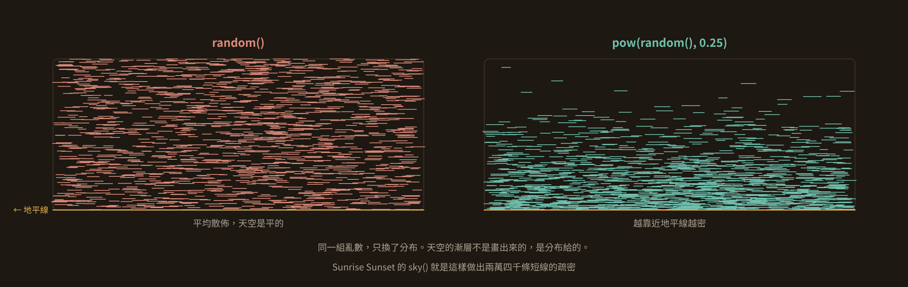

<p class="figcap">兩張都是真的跑 1400 條短線畫出來的</p>

--

## 海面反光用 noise 做波紋

```javascript
function sunreflectionarray() {
  sunarray = [];
  for (var i = 0; i <= canvasSize; i++) {
    sunarray[i] = [];
    noiseoffset = noise(i / 3) - 0.5;                 // 平滑的左右偏移
    px = 0 + noiseoffset * 80;
    length = canvasSize/6 - sin(i/canvasSize * PI/2) * canvasSize/6;  // 越遠越窄
    sunarray[i][1] = px - length/2;                   // 左邊界
    sunarray[i][2] = px + length/2;                   // 右邊界
  }
}
```

這個函式**只算資料不畫圖**，算好的陣列交給 `ocean()` 用。

--

## 剪影：船

```javascript
function boat() {
  let px = R.random_num(-50, 50);
  push();
  scale(canvasSize / 800);        // 依畫布大小等比縮放
  translate(px, 0);
  scale(0.4);
  stroke(variety.silhouette);
  fill(variety.silhouette);
  rect(-20, -5, 40, 5);           // 船身
  line(0, 0, 0, -50);             // 桅杆
  triangle(0, -50, 0, -8, 20, -10);   // 主帆
  line(0, -50, -20, -5);
  triangle(-20, -7, 0, -8, -8, -28);  // 前帆
  pop();
}
```

--

## push() 與 pop()

`push()` 把目前的座標系與樣式存起來，`pop()` 還原。

中間怎麼 `translate`、`rotate`、`scale` 都不會影響到外面。**畫每一個獨立物件都應該包在這一對裡面。**

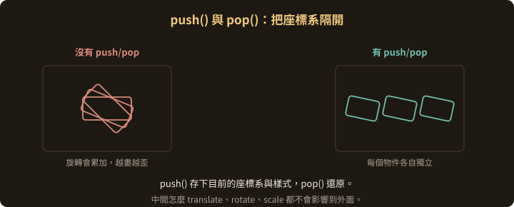

--

## 最後加上顆粒與外框

```javascript
var texture = fxcanvas.texture(canvas.elt);
fxcanvas.draw(texture);
fxcanvas.noise(0.4).ink(0.15).update();      // 疊上雜訊與墨感
drawingContext.drawImage(fxcanvas, -canvasSize/2, -canvasSize/2, canvasSize, canvasSize);

noFill();
stroke(0, 0, 0);
strokeWeight(canvasSize * 0.05);
rectMode(CENTER);
rect(0, 0, canvasSize, canvasSize);          // 黑色外框

fxpreview();                                  // 通知 fxhash 可以截圖了
```

--

## 成果


<p class="figcap">Sunrise Sunset — 林經堯，fxhash</p>

--

## 同一支程式的不同輸出


--

## 同一支程式的不同輸出


--

## 同一支程式的不同輸出


> 四張圖，同一份程式碼。
> **變的只有那個隨機種子。**

---

## 亂數的機制

--

## 三種取隨機值的方式

| 函式 | 特性 |
|---|---|
| `random()` | 均勻分布。`random(5)` 給 0～5，`random(10,20)` 給 10～20 |
| `randomGaussian()` | 常態分布，可指定平均值與標準差 |
| `noise()` | Perlin Noise，回傳 0～1，**相鄰取樣點之間平滑過渡** |

`noise()` 嚴格說不是亂數函數，但它是做出有機變化最好用的工具。

--

## 亂數種子

亂數生成器並不產生真正的隨機值，它產生的是一長串看起來隨機的序列。**種子就是這個序列的起點。**

種子相同，序列就相同。換一台機器、換一個時間執行，結果照樣一模一樣。

--

## 在 p5.js 裡怎麼設

```javascript
randomSeed(99);    // 之後每次 random() 都給出同一串序列
noiseSeed(99);     // 同理，影響 noise()
```

不傳參數呼叫 `randomSeed()`，它會拿當前時間之類的值當新種子，回到真正的隨機。

--

## 為什麼生成式作品非要有種子

因為收藏家買到的那一張，必須**每次打開都長一樣**。

沒有種子，同一枚 NFT 每次重新整理就變一張圖，那它就不是一件作品。

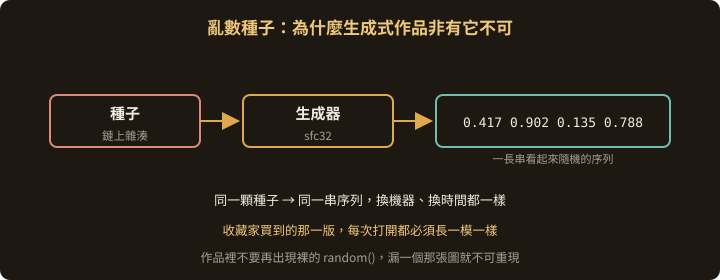

---

## Random 物件與 fxhash

--

## 為什麼要自己包一層

在 NFT 的機制裡，所有亂數必須對應到鏈上的雜湊值。

透過那個雜湊值，程式每次執行都能產生同一組亂數。

--

## Random.js

```javascript
class Random {
  constructor(fxhash) { this.fxhash = fxhash; }

  random_dec()        { return fxrand(); }            // 0（含）到 1（不含）
  random_num(a, b)    { return a + (b - a) * this.random_dec(); }
  random_int(a, b)    { return Math.floor(this.random_num(a, b + 1)); }
  random_bool(p)      { /* 有 p 的機率為 true */ }
}
```

--

## 用法

```javascript
let R = new Random();
// 之後一律用 R.random_dec()、R.random_num(-50, 50) 取值
```

物件建構時取用 fxhash 的值當參考，所以整支程式的每一次取值都跟著那個雜湊走，亂數維持一致。

> 規則是：**作品裡不要再出現裸的 `random()`**。
> 漏掉一個，那張圖就不可重現。

---

## 這一章要記得的

1. `draw()` 裡有沒有 `background()`，決定作品是動畫還是累積的軌跡
2. 想控制東西聚在哪裡，要調的是**隨機值的分布**
3. `push()` 與 `pop()` 把每個物件的座標系隔開
4. 生成式作品的亂數必須綁定種子，否則不可重現

Note:
下一章拆解一件完整作品 METAPHYSICS 的程式碼，看這些觀念怎麼組成一個大結構。
