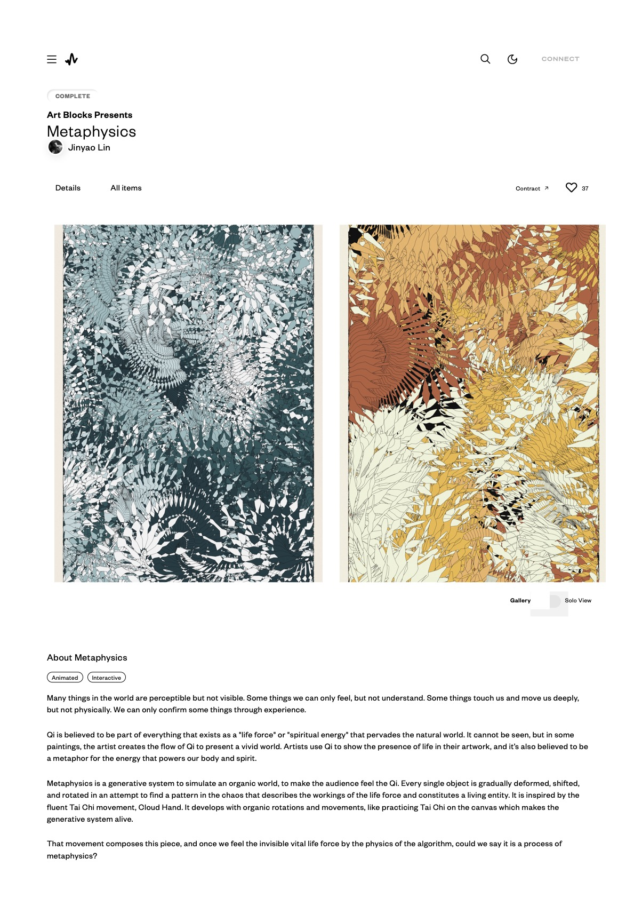

<!-- .slide: class="title" -->
# METAPHYSICS 的程式分析

## 拆開一件 Art Blocks 作品

第 7 章

Note:
前面幾章的觀念，在這一章要組成一個完整的大結構。要看清楚的是那兩個類別怎麼分工，就撐起了整件作品，程式碼本身不必背。

---

## 作品資料

**Metaphysics（形而上）**

- 2022 年 12 月 8 日發表於 **Art Blocks**
- 總共 **200 版**
- **24 種顏色**，多種不同的生成邏輯

<p class="vidlinks">▶ <a href="https://www.artblocks.io/collections/presents/projects/0x99a9b7c1116f9ceeb1652de04d5969cce509b069/382?section=all%20items">在 Art Blocks 看全部 200 版的生成結果</a></p>

--

## 作品



<p class="figcap">Metaphysics — 林經堯</p>

---

## 作品自述

> 這世界上有很多事物我們可以感知，卻無法看見。有些事情我們只能感受，卻不能理解。**只有透過經驗，我們才能確認某些事物的存在。**

--

## 氣

> 氣被認為是存在於所有事物中的一部分，作為一種充滿自然世界的「生命力」或「精神能量」。它無法被看見，但在某些畫作中，藝術家創造了氣的流動以展現一個生動的世界。

--

## 形而上是一套生成系統

> 每個物件都在嘗試找尋混沌中的規律，逐漸變形、移動和旋轉，這描述了生命力的運作並構成了一個生命實體。**這源於流暢的太極動作——雲手的啟發。**

--

## 留下的問題

> 當我們通過演算法的物理特性感受到這種無形的生命力時，我們是否可以說這是一種形而上的過程？

---

## 整件作品只有兩個類別

| 類別 | 負責什麼 |
|---|---|
| `leaf` | 一片葉子的形狀與外觀 |
| `spine` | 一條路徑的生長，並帶著它的葉子走 |

一個管**長什麼樣**，一個管**往哪裡去**。整張畫面就是這兩件事的重複。

---

## leaf：葉子

--

## 建構函式收的東西

```javascript
class leaf {
  constructor(idx, height, width, position, rot, scalelevel, seed) {
    this.idx = idx;                 // 索引
    this.height = height;           // 高
    this.width = width;             // 寬
    this.position = position;       // 位置
    this.rot = rot;                 // 旋轉角度
    this.scalelevel = scalelevel;   // 縮放等級
    this.iter = 0;                  // 迭代次數
    this.strokecolor;               // 邊緣顏色
    this.fillcolor;                 // 填充顏色
  }
```

其餘都是單純的 setter：`setPosition()`、`setColor()`、`setRotation()`、`setScale()`、`setIter()`。

--

## 畫一片葉子：40 個頂點

```javascript
tempcnv.beginShape();
for (var j = 0; j < 40; j++) {
  let vertex_id = j < 20 ? j : 39 - j;    // 0→19 再 19→0
  let leaf_r_l  = j < 20 ? 0 : 1;         // 左半邊 / 右半邊
  let k         = j < 20 ? -1 : knifeleaf; // 兩側的寬度係數不同
  ...
}
tempcnv.endShape(CLOSE);
```

前 20 個點沿著葉子的一側往上，後 20 個點沿著另一側走回來，收尾閉合。

--

## 寬度交給 noise

```javascript
no = (noise(1, this.iter/20 + this.idx + vertex_id/(this.height*brushdist)) - 0.5)
     * this.width * k * leafscale;

let px = no * sin(vertex_id / 20 * PI) * 10;
let py = -vertex_id / 20 * this.height * leafscale;
```

--

## 那個 `sin()` 在做什麼

`vertex_id / 20 * PI` 把 0～19 攤成 0～π，`sin()` 在兩端是 0、中間是 1。

**於是葉子的頭尾自動收尖，中段最寬。** 葉形由這條正弦曲線決定，沒有人去描它的輪廓。

> noise 給起伏，sin 給輪廓。
> 兩個函數疊起來就是一片葉子。

--

## 從區域座標換到畫布座標

```javascript
realpos = createVector(px, py)
  .add([0, pixeltoratio(1)])
  .mult(this.scalelevel)     // 縮放
  .rotate(this.rot)          // 旋轉
  .add(this.position);       // 平移

if (checkborder(realpos.x, realpos.y)) {
  tempcnv.vertex(realpos.x, realpos.y);
}
```

順序是**縮放、旋轉、平移**，換順序結果就不一樣。

--

## iter 讓每次都不同

物件每被執行一次，`iter` 就加 1。

這個值進到 `noise()` 裡，所以葉子每次被畫出來都有些許差異。**同一片葉子在生長過程中一直在微微變形。**

--

## Metaphysics #0


<p class="figcap">Metaphysics #0 — 林經堯</p>

---

## spine：主枝幹

--

## 它同時是路徑，也是葉子的載具

```javascript
class spine {
  constructor(idx, pos, vec, len, life) {
    this.pos = pos;      this.vec = vec;    // 位置與方向向量
    this.len = len;      this.life = life;  // 長度與壽命
    this.iter = 0;                          // 迭代次數
    this.lastpx = pos.x; this.lastpy = pos.y;  // 上一個點，用來連線
    this.dead = false;
    // 每條 spine 建構時就配一片自己的葉子
    this.leaf = new leaf(idx, R.random_dec()*30 + 90, broad,
                         createVector(0,0), 0, 0, R.random_dec()*10000);
  }
```

--

## 有生死，才有畫面的疏密

`life` 是壽命，`dead` 是死亡旗標。

出界或壽命用完就標記為死亡，主程式停止畫它。**畫面的疏密由一群物件各自的生滅決定，沒有人去排它。**

--

## 每一步怎麼走

```javascript
let no = (noise(this.idx/10, this.iter/400) - 0.5) * 0.5;
let newvec = p5.Vector.fromAngle(
  this.vec.heading() + no * PI * spine_angle_range,
  this.iter * pixeltoratio(1)
);
let px = this.pos.x + newvec.x;
let py = this.pos.y + newvec.y;
```

--

## 這一段是整件作品的關鍵

程式把 noise 轉成**角度的增量**，累加到目前的朝向上，而不是直接拿它當位置。

```javascript
this.vec.heading() + no * PI * spine_angle_range
//     ↑ 目前的方向      ↑ 這一步要轉多少
```

--

## 差別在哪

| 做法 | 結果 |
|---|---|
| noise → **位置** | 物件飄移，方向感很弱 |
| noise → **角度增量** | 轉向會累積，出現慣性 |

轉動時會加速，要反轉之前會先減速。

> 這就是雲手：
> **重心不會瞬間換邊，它是轉過去的。**

--

## 畫線與碰撞檢查

```javascript
tempcnv.strokeWeight(0.1 * pixeltoratio(1) * leafscale);
if (checkborder(px, py) && checkborder(this.lastpx, this.lastpy)) {
  tempcnv.line(px, py, this.lastpx, this.lastpy);
}
this.lastpx = px;
this.lastpy = py;
```

兩端都要在界內才畫，否則會出現橫跨畫面的錯誤線段。

--

## Metaphysics #89


<p class="figcap">Metaphysics #89 — 林經堯</p>

整個畫面就由這兩個簡單的邏輯建構起來。

---

## Random：可重現的隨機

--

## 為什麼不能用 p5 的 random()

Art Blocks 的每一版都對應鏈上一個雜湊值。

同一版作品不論誰打開、什麼時候打開，都必須長得**一模一樣**。

--

## sfc32，128 位元種子

```javascript
let sfc32 = function(uint128Hex) {
  let a = parseInt(uint128Hex.substr(0,  8), 16);
  let b = parseInt(uint128Hex.substr(8,  8), 16);
  let c = parseInt(uint128Hex.substr(16, 8), 16);
  let d = parseInt(uint128Hex.substr(24, 8), 16);
  return function() { /* 一次迭代 */ return (t >>> 0) / 4294967296; };
};
```

把 128 位元的十六進位雜湊，切成四個 32 位元整數當作內部狀態。

--

## 兩個生成器交替使用

```javascript
this.prngA = new sfc32(myhash.substr(2,  32));
this.prngB = new sfc32(myhash.substr(34, 32));

random_dec() {
  this.useA = !this.useA;
  return this.useA ? this.prngA() : this.prngB();
}
```

同一個雜湊切出兩段，各自初始化一個生成器，每次取值輪流用。

--

## 先燒掉一百萬次

```javascript
for (let i = 0; i < 1e6; i += 2) {
  this.prngA();
  this.prngB();
}
```

偽隨機生成器剛初始化時，前面幾個輸出和種子的相關性還很高。

先空轉一百萬次把這段丟掉，之後取到的值才夠均勻。

--

## 上層的取值介面

```javascript
random_num(a, b)      // [a, b) 之間的浮點數
random_int(a, b)      // [a, b] 之間的整數
random_choice(list)   // 從清單裡隨機挑一個
chancedice(list)      // 依權重挑一個
randomVector(...)     // 隨機向量，範圍以畫布大小為單位
```

`randomVector()` 用畫布比例而不是絕對像素，**所以換解析度不會跑版**。

---

## 主程式

--

## setup()

```javascript
let hash = tokenData.hash;      // 鏈上傳進來的雜湊
let R = new Random(hash);       // 整支程式的亂數都從這裡出

function setup() {
  if (/Android|webOS|iPhone|iPad|iPod|BlackBerry/i.test(navigator.userAgent)) {
    mypixelDensity = displayDensity();          // 行動裝置用一倍
  } else {
    mypixelDensity = displayDensity() * density; // 桌機用兩倍
  }
  cnv = createCanvas(canvasSize * 0.7, canvasSize, WEBGL);
}
```

畫布是 0.7：1 的直式比例，用 WEBGL 模式。

--

## draw() 分成兩個階段

```javascript
function draw() {
  if (stage == 1) {
    // 檢查所有 spine：出界或壽命結束的標記為死亡
    // 還活著的，繼續畫
  } else if (stage == 2) {
    // 清空特效畫布，把特效畫布疊回主畫布
  }
}
```

**階段一長東西，階段二做後製。** 兩件事分開，邏輯才不會纏在一起。

--

## 其他五個函式

| 函式 | 作用 |
|---|---|
| `setcanvasdata()` | 建一個 700×1000 的二維陣列，全部初始化為 0，**用來做碰撞測試** |
| `initGraphics(isWEBGL)` | 依參數建立 2D 或 3D 的繪圖物件 |
| `resetCanvas()` | 呼叫 `initGraphics()` 三次，建立三張畫布 |
| `prepare()` | 設定背景色，把特效套到整張畫布 |
| `initValue()` | 初始化所有會影響繪圖結果的參數，大多來自亂數 |

--

## 三張畫布在做什麼

`tempcnv`、`backgroundcnv` 與特效畫布各司其職。

分層的好處是**每一層可以獨立重畫或套效果**，不必動到其他層。前面 leaf 與 spine 畫的所有東西，都畫在 `tempcnv` 上。

--

## 那個 700×1000 的陣列

畫面上物件很多，彼此重疊會糊掉。

把畫布切成格子、記錄哪裡已經被佔用，新的物件要落點時先查一下。**這是讓密集畫面仍然看得出結構的常見手法。**

---

## 回頭看整件作品

1. `leaf` 用 **noise 加 sin** 長出一片會呼吸的葉子
2. `spine` 把 **noise 轉成角度增量**，走出有慣性的路徑
3. 每條 spine 帶一片葉子，有生有死
4. `Random` 綁住鏈上雜湊，保證 200 版每版都可重現
5. 主程式分兩階段、分三張畫布，並用格子陣列避免糊在一起

--

## 完整程式碼

章節裡附有全部一千四百多行的原始碼。

最該反覆讀的是前面那兩個類別，其餘大多是參數與流程的安排。

Note:
下一章換個方向，看幾個經典的生成式演算法，並親手實作。
