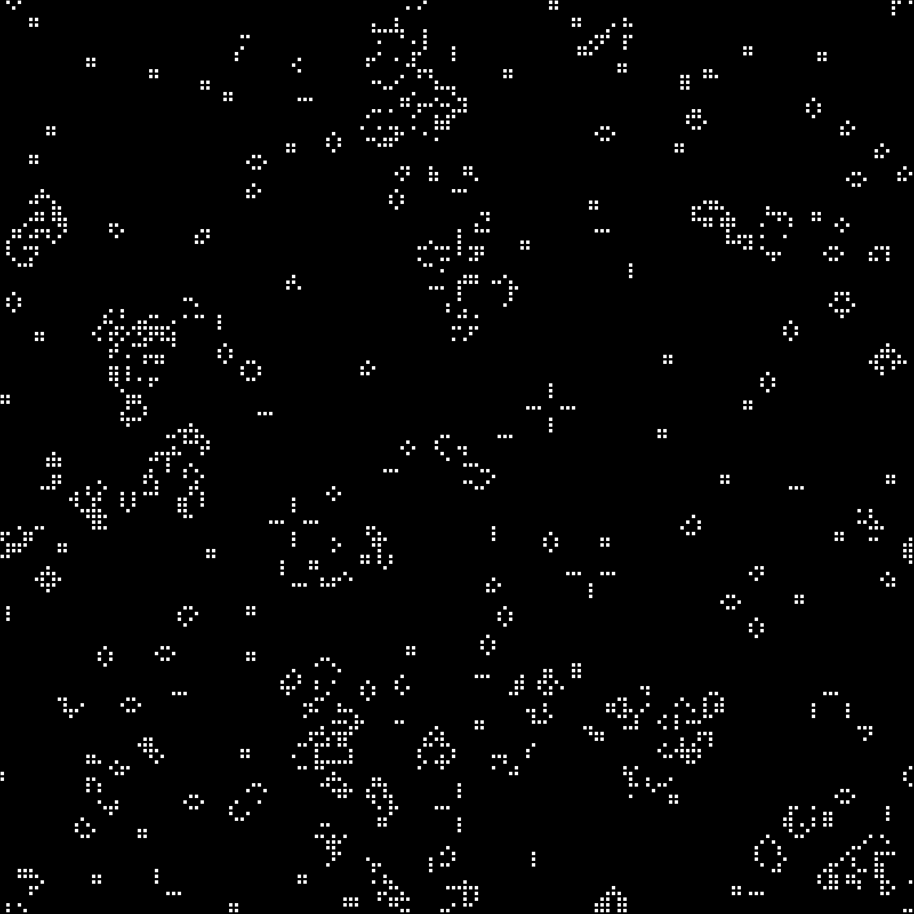
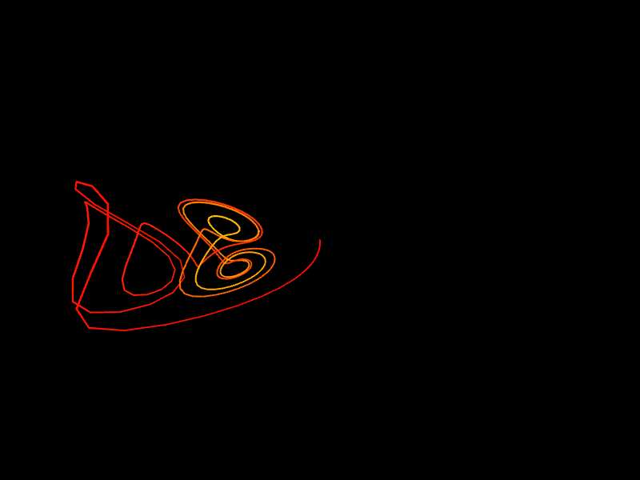
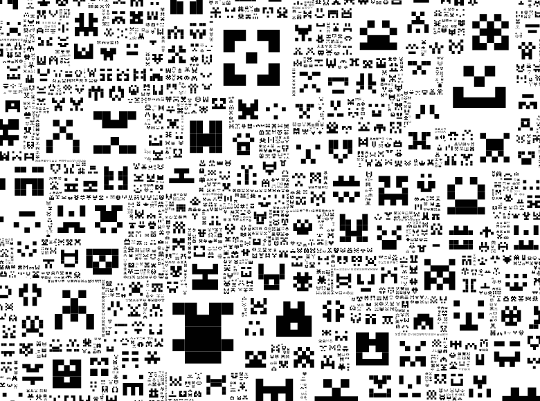
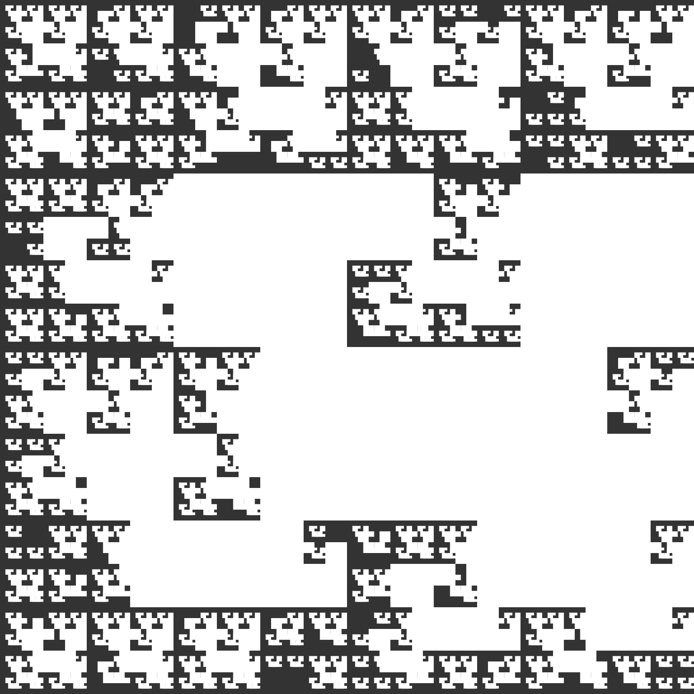
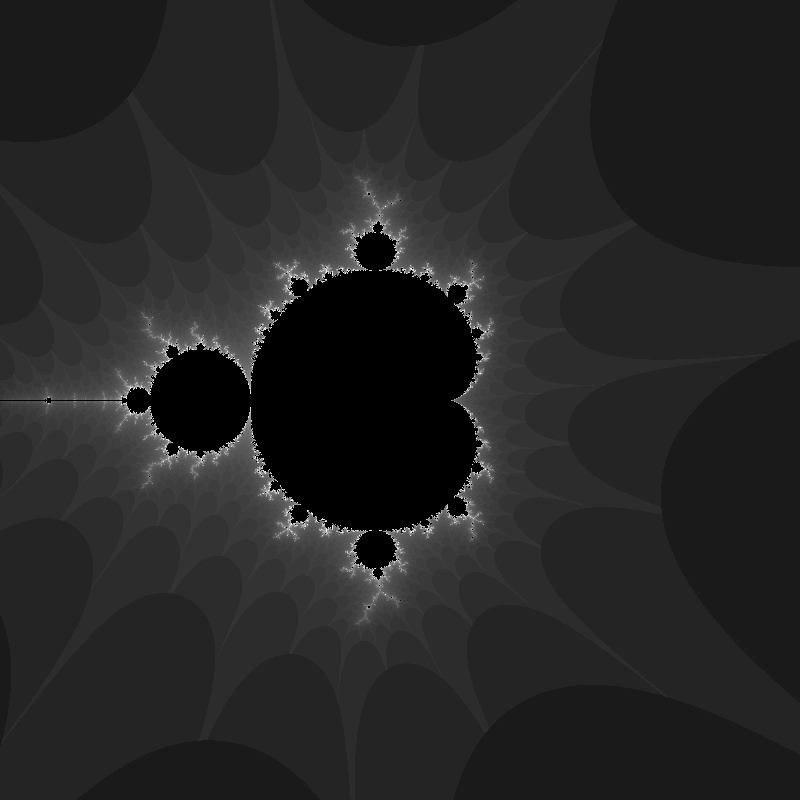
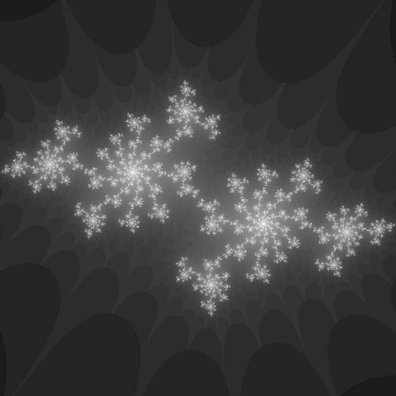
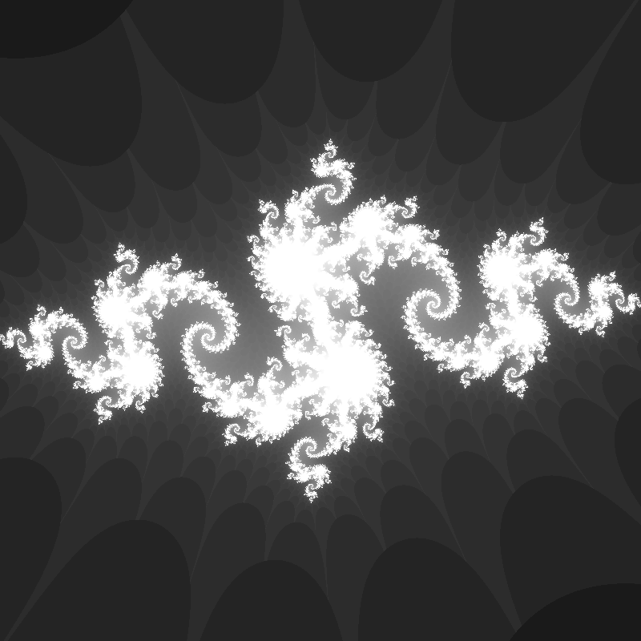
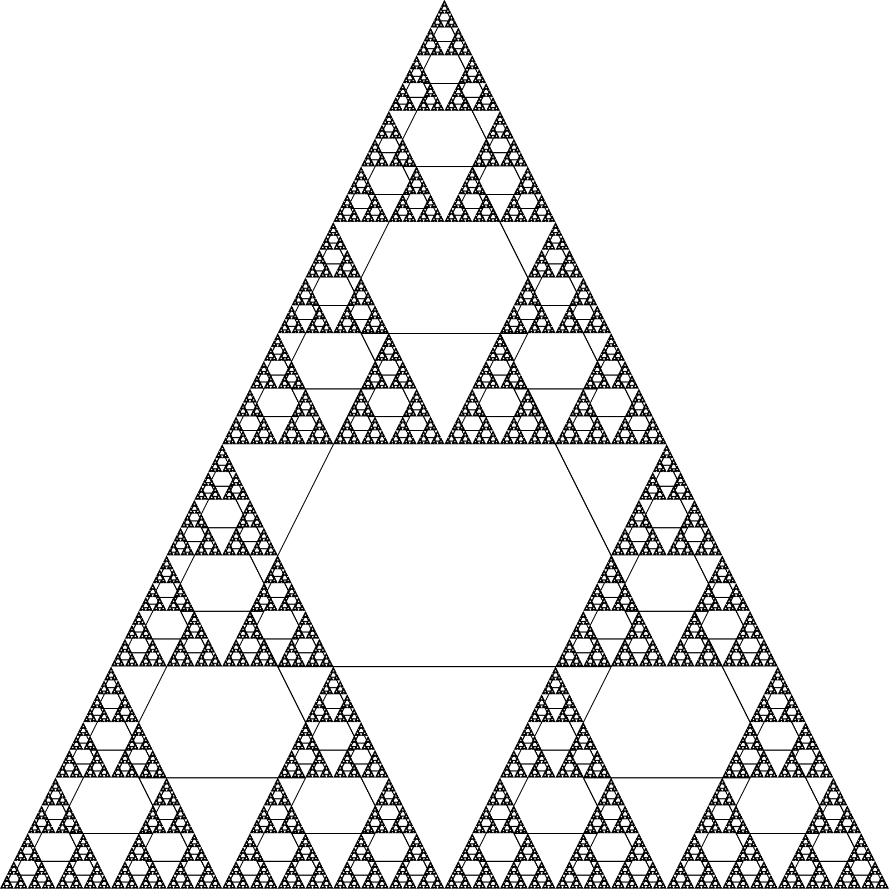
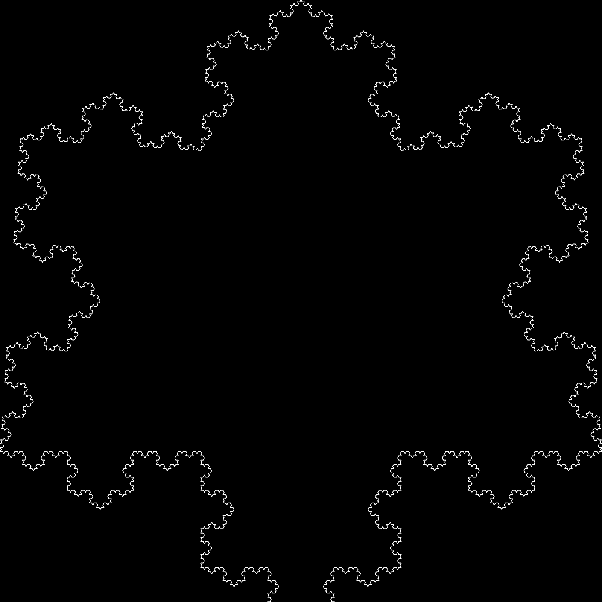
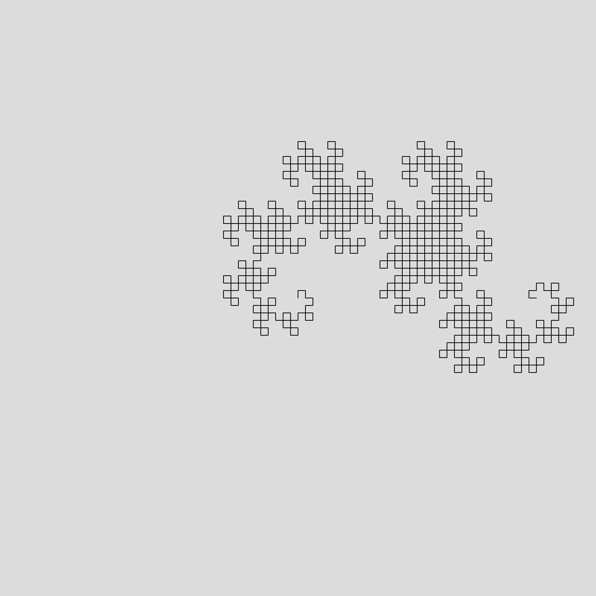

<!-- .slide: class="title" -->
# 經典生成式藝術的探索

## 九個演算法，親手做過一遍

第 8 章

Note:
這章向幾件經典作品致敬，並用 p5.js 把它們實作出來。九個例子背後其實只有三種方法：細胞自動機、遞迴、以及迭代函數系統。看出這三類，就不必個別記憶。

---

## 九個例子，三種方法

| 方法 | 例子 |
|---|---|
| **細胞自動機** | 生命遊戲 |
| **微分方程迭代** | Lorenz Attractor |
| **遞迴** | Invader Fractal、Sierpinski、Koch、Dragon Curve |
| **逐像素判定** | Mandelbrot Set、Julia Set |
| **迭代函數系統** | Barnsley Fern |

---

## 生命遊戲

John Conway 於 1970 年提出的**零玩家遊戲**。無窮的二維方格，每格是一個細胞，生死只看鄰居的數量。

--

<!-- .slide: class="compact" -->
## 四條規則


- 有 **2 或 3 個**活鄰居 → 活到下一代
- 有 **4 個以上**活鄰居 → 因為過密而死
- 有 **1 個或沒有**活鄰居 → 因為孤獨而死
- 空格剛好有 **3 個**活鄰居 → 新細胞出生

--

## 主迴圈

```javascript
let next = make2DArray(cols, rows);
for (let i = 0; i < cols; i++) {
  for (let j = 0; j < rows; j++) {
    let state = grid[i][j];
    let neighbors = countNeighbors(grid, i, j);

    if (state == 0 && neighbors == 3)                      next[i][j] = 1;
    else if (state == 1 && (neighbors < 2 || neighbors > 3)) next[i][j] = 0;
    else                                                    next[i][j] = state;
  }
}
grid = next;      // 整代一次換掉
```

--

## 為什麼要用 next 這個新陣列

如果直接改 `grid`，先算好的格子會影響到後算的格子。

**整代必須同時更新。** 這是所有細胞自動機都要注意的地方。

--

## 數鄰居的技巧

```javascript
function countNeighbors(grid, x, y) {
  let sum = 0;
  for (let i = -1; i < 2; i++) {
    for (let j = -1; j < 2; j++) {
      let col = (x + i + cols) % cols;     // 邊界繞回另一側
      let row = (y + j + rows) % rows;
      sum += grid[col][row];
    }
  }
  sum -= grid[x][y];    // 把自己扣掉
  return sum;
}
```

`+ cols` 再取餘數，是為了讓 `-1` 也能正確繞回最後一格。

--

## 結果



<p class="figcap">隨機初始化的網格，跑幾代之後自己長出結構</p>

會出現能移動的「滑翔機」，也會出現能製造其他結構的「工廠」。

---

## Beautiful Chaos

Nathan Selikoff 的具象數學系列，用的是混沌理論裡的 **Lorenz Attractor**。

--

## 作品


<p class="figcap">Beautiful Chaos — Nathan Selikoff</p>

--

## Lorenz Attractor

Edward Norton Lorenz 在 1963 年研究氣象模型時發現的行為，由三個微分方程描述：

```javascript
dx/dt = a * (y - z)
dy/dt = x * (b - z) - y
dz/dt = x * y - c * z
```

原始模型取 `a = 10`、`b = 28`、`c = 8/3`。換數值就會得到不同的行為。

--

## 寫成程式

```javascript
let dt = 0.01;
let dx = a * (y - x) * dt;
let dy = (x * (b - z) - y) * dt;
let dz = (x * y - c * z) * dt;

x += dx;  y += dy;  z += dz;
points.push(createVector(x, y, z));

if (points.length > 500) points.shift();   // 只留最近 500 點
```

`dt` 是時間步長。把微分方程換成「每次前進一小步」，就能用迴圈算。

--

## 用色相畫出時間

```javascript
colorMode(HSB);
beginShape();
let hu = 0;
for (let v of points) {
  stroke(hu, 255, 255);
  vertex(v.x, v.y, v.z);
  hu += 0.1;
  if (hu > 255) hu = 0;
}
endShape();
```

色相隨著點的順序遞增，於是**顏色本身就標示了時間的方向**。

--

<!-- .slide: class="compact" -->
## 蝴蝶效應

這組方程是非線性的，初始條件的微小差異會讓遠期行為劇變。

視覺化出來的形狀，剛好像一對蝴蝶的翅膀。



<p class="figcap">Lorenz Attractor 的執行結果</p>

---

## Invader Fractal

Jared Tarbell 在 Complexification.net 上展示的經典作品之一。

--

## 原作



<p class="figcap">Invader Fractal — Jared Tarbell</p>

--

## 遞迴加機率

```javascript
function drawInvader(x, y, side) {
  if (side >= 10) {                    // 終止條件
    if (random(1) < 0.8) {             // 八成機率才畫
      push();
      translate(x, y);
      rect(-side/2, -side/2, side/2, side/2);   // 身體
      rect( side/2, -side/2, side/2, side/2);
      rect(0, -side/2, side/4, side/4);         // 眼睛
      rect(0,  side/4, side,   side/4);         // 腳
      pop();
    }
    let newSize = side / 2;
    drawInvader(x - newSize, y - newSize, newSize);   // 左上
    drawInvader(x + newSize, y - newSize, newSize);   // 右上
    drawInvader(x - newSize, y + newSize, newSize);   // 左下
    drawInvader(x + newSize, y + newSize, newSize);   // 右下
  }
}
```

--

## 那個 0.8 是整件作品的靈魂

沒有它，每一格都會畫，圖形變成規律的棋盤。

有了它，**每次執行都缺一些、留一些**，圖案自己長出疏密。

> 遞迴給結構，機率給個性。

--

## 結果



<p class="figcap">邊長小於 10 就停止遞迴，避免無限展開</p>

---

## Mandelbrot Set

法國數學家 Benoit Mandelbrot 於 1980 年代提出。

--

## 定義

在複平面取一點 `c`，令 `z₀ = 0`，反覆計算：

**z_n = z_{n-1}² + c**

如果這個序列的模**不會**跑向無窮，就說 `c` 屬於 Mandelbrot 集。

--

## 複數平方怎麼寫

`z = a + bi`，那麼 `z² = (a² − b²) + 2ab·i`：

```javascript
let aa = a * a - b * b;    // 實部
let bb = 2 * a * b;        // 虛部
a = aa + ca;               // 加上 c
b = bb + cb;
```

不必引進複數函式庫，兩行就夠。

--

## 逐像素判定

```javascript
let a = map(x, 0, width,  -2, 2);   // 螢幕座標 → 複平面
let b = map(y, 0, height, -2, 2);
let n = 0, maxIterations = 100;

while (n < maxIterations) {
  // ...迭代...
  if (abs(a + b) > 16) break;       // 逃逸了
  n++;
}
```

跑滿 100 次還沒逃逸，就當作屬於這個集合。

--

## 用逃逸速度上色

```javascript
let bright = map(n, 0, maxIterations, 0, 1);
bright = map(sqrt(bright), 0, 1, 0, 255);   // 開根號，讓暗部層次拉開
if (n === maxIterations) bright = 0;        // 屬於集合 → 黑色

let pix = (x + y * width) * 4;
pixels[pix + 0] = bright;   // R
pixels[pix + 1] = bright;   // G
pixels[pix + 2] = bright;   // B
pixels[pix + 3] = 255;      // A
```

**邊界的顏色來自「這個點跑多久才逃走」。** 圖案的細節全在那一圈。

--

## loadPixels 與 updatePixels

`loadPixels()` 把畫布上所有像素讀進 `pixels[]` 陣列。

每個像素佔 **4 個位置**（R、G、B、A），所以陣列長度是像素數的四倍，遍歷時步長要用 4。

改完一定要呼叫 `updatePixels()` 寫回去，否則畫面不會變。

--

## 結果



<p class="figcap">自相似：放大任何一塊，都會看到與整體相似的形狀</p>

---

## Julia Set

和 Mandelbrot 用**同一條公式**，只是誰固定、誰變動對調了。

--

## 一個字的差別

| | 每個像素決定的是 | 固定的是 |
|---|---|---|
| Mandelbrot | `c` | `z₀ = 0` |
| Julia | `z₀` | `c` |

```javascript
let cX = -0.70176;   // c 是寫死的常數
let cY = -0.3842;
...
a = aa + cX;         // 這裡不再是 ca，而是固定的 cX
b = bb + cY;
```

--

## 結果



<p class="figcap">cX = -0.70176, cY = -0.3842</p>

--

<!-- .slide: class="compact" -->
## 換一組常數，換一個世界



<p class="figcap">cX = -0.8, cY = 0.156</p>

> 兩個數字，整張圖完全不同。
> 這就是為什麼參數本身值得慢慢調。

---

## Sierpinski Triangle

波蘭數學家 Wacław Sierpiński 在 20 世紀初提出。

--

## 構成方式

從一個等邊三角形開始，切成四個等大的小三角形，**去掉中間那一個**，再對剩下三個重複同樣的步驟。

無窮次之後就得到 Sierpinski 三角形。

--

## 邊界無窮長，面積卻有限

每一次操作，周長變長、面積變小。

推到極限，周長發散、面積收斂到 0。**這是分形最反直覺的地方之一。**

--

## 遞迴實作

```javascript
function sierpinski(x, y, d) {
  if (d < 1) return;                    // 終止條件

  triangle(x, y - d/2, x - d/2, y + d/2, x + d/2, y + d/2);

  sierpinski(x,       y - d/2, d/2);    // 上
  sierpinski(x - d/2, y + d/2, d/2);    // 左下
  sierpinski(x + d/2, y + d/2, d/2);    // 右下
}
```

改 `d / 2` 這個值，就會得到不同層級的圖形。

--

## 寫遞迴要注意四件事

1. **一定要有終止條件** — 沒有的話程式會一路跑到資源耗盡
2. **遞迴很吃資源** — 每次呼叫都要配記憶體，太深會堆疊溢位
3. **避免重複計算** — 用記憶化或動態規劃存起來
4. **想清楚怎麼拆問題** — 遞迴的本質是把大問題拆成同形狀的小問題

--

## 結果



<p class="figcap">遞迴的深度由終止條件決定</p>

---

## Koch Snowflake

瑞典數學家 Helge von Koch 於 1904 年提出。

--

## 構成方式

從等邊三角形開始，把每一邊分成三等分，在**中間那一段**上長出一個等邊三角形，然後拿掉中間那一段。

在新的線段上重複，無窮次下去。

--

## 一條線變四條

```javascript
function drawKoch(x1, y1, x2, y2, n) {
  if (n == 0) { line(x1, y1, x2, y2); return; }

  let dx = x2 - x1,  dy = y2 - y1;
  let x3 = x1 + dx/3,          y3 = y1 + dy/3;              // 三分之一處
  let x4 = x1 + dx/2 - dy/(2*sqrt(3));                      // 尖端
  let y4 = y1 + dy/2 + dx/(2*sqrt(3));
  let x5 = x1 + 2*dx/3,        y5 = y1 + 2*dy/3;            // 三分之二處

  drawKoch(x1, y1, x3, y3, n-1);
  drawKoch(x3, y3, x4, y4, n-1);
  drawKoch(x4, y4, x5, y5, n-1);
  drawKoch(x5, y5, x2, y2, n-1);
}
```

--

## 那個 sqrt(3) 從哪來

等邊三角形的高是邊長的 **√3 / 2**。

`dy/(2*sqrt(3))` 就是把中段的三分之一長度換算成尖端該突出多遠。**幾何算好了，程式只是抄下來。**

--

<!-- .slide: class="compact" -->
## 三條邊各跑一次

```javascript
drawKoch(width/-2, height/4,  width/2,  height/4,  iterations);
drawKoch(width/2,  height/4,  0,       -height/2,  iterations);
drawKoch(0,       -height/2,  width/-2, height/4,  iterations);
```



<p class="figcap">周長無窮大，面積有限</p>

雪花的形狀、海岸線的形狀，都可以用它來模擬。

---

## Dragon Curve

1960 年代由 John Heighway、Bruce Banks 與 Barry Martin 提出。

--

## 它是摺出來的

三個人用紙帶打孔機摺紙時偶然發現：把紙帶對摺很多次再展開，讓每個摺痕都成直角，展開的形狀就是龍曲線。

摺的次數越多，曲線越複雜，**而且永遠不會自我交叉**。

> 《侏羅紀公園》裡用龍曲線來說明混沌理論。

--

## 用 L-system 生成

**L-system（Lindenmayer 系統）** 是描述植物生長與分形結構的形式語法。從一個起始字串出發，反覆套用替換規則。

```javascript
let dragon = "FX";          // 起始字串

function generate() {
  nextDragon = "";
  for (let c of dragon) {
    switch (c) {
      case "X": nextDragon += "X+YF+"; break;   // X → X+YF+
      case "Y": nextDragon += "-FX-Y"; break;   // Y → -FX-Y
      default:  nextDragon += c;       break;
    }
  }
  dragon = nextDragon;
}
```

--

## 再把字串讀成畫圖指令

```javascript
for (let c of dragon) {
  switch (c) {
    case "F": line(0, 0, 0, -10); translate(0, -10); break;  // 前進
    case "+": rotate(90);  break;                            // 左轉
    case "-": rotate(-90); break;                            // 右轉
  }
}
```

`X` 與 `Y` 只是**生成用的符號**，畫圖時不對應任何動作。

--

## 兩個步驟分得很乾淨

```javascript
function draw() {
  for (let i = 0; i < 10; i++) generate();   // 先長出字串
  drawDragon();                              // 再照著字串畫
}
```

**規則與呈現分離**，是 L-system 最該學起來的一點。同一組字串換一套畫法，就是另一件作品。

--

## 結果



<p class="figcap">迭代 10 次的龍曲線</p>

---

## Barnsley Fern

英國數學家 Michael Barnsley 在 1980 年代提出，收錄於他的著作《Fractals Everywhere》。

--

## 四個線性變換，各有機率

```javascript
let r = random(1);
if (r < 0.01) {          // 1%：莖
  nextX = 0;
  nextY = 0.16 * y;
} else if (r < 0.86) {   // 85%：主葉，整體往上長
  nextX =  0.85*x + 0.04*y;
  nextY = -0.04*x + 0.85*y + 1.6;
} else if (r < 0.93) {   // 7%：左邊的小葉
  nextX = 0.2*x - 0.26*y;
  nextY = 0.23*x + 0.22*y + 1.6;
} else {                 // 7%：右邊的小葉
  nextX = -0.15*x + 0.28*y;
  nextY =  0.26*x + 0.24*y + 0.44;
}
```

--

## 一次只畫一個點

```javascript
function draw() {
  for (let i = 0; i < 100; i++) {   // 每幀畫 100 點
    drawPoint();
    nextPoint();
  }
}

function drawPoint() {
  stroke(34, 139, 34);
  let px = map(x, -2.1820, 2.6558, 0, width);   // 把數學座標對到畫布
  let py = map(y, 0, 9.9983, height, 0);        // y 反向，因為畫布向下為正
  point(px, py);
}
```

--

## 這叫迭代函數系統

沒有任何一行程式在「畫一片葉子」。

程式只是不斷跳點，**蕨葉的形狀是那四個機率自己浮現出來的**。

> 1% 的機率負責莖，85% 負責整株往上長，
> 剩下 14% 生出兩側的小葉。

--

## 結果


<p class="figcap">Barnsley 也做過分形影像壓縮，用於衛星影像</p>

---

## 這一章要記得的

1. 細胞自動機要**整代同時更新**，不能邊算邊改
2. 遞迴一定要有終止條件，而且要留意堆疊深度
3. 遞迴給結構，**機率給個性**，兩者合起來才有生成的味道
4. L-system 把規則與呈現分開，同一組字串可以換很多種畫法
5. 形狀不一定要畫出來，它可以從機率裡浮現

Note:
九個例子做完，你手上已經有一整套可以組合的零件。接下來就是把它們接起來，寫自己的東西。
